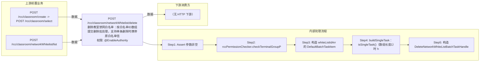

# POST /rcc/classroom/networkWhitelist/delete

> 删除教室禁网白名单：按白名单ID数组提交删除批处理，支持单条删除时携带原白名单信息 ｜ @EnableAuthority ｜ async_batch

## 依赖关系全景图

## 接口基本信息

| 项目 | 内容 |
|---|---|
| URL | /rcc/classroom/networkWhitelist/delete |
| Controller | RccClassroomManageController |
| 方法名 | editNetworkWhiteList |
| 权限注解 | @EnableAuthority |
| 执行方式 | async_batch |
| 业务含义 | 删除教室禁网白名单：按白名单ID数组提交删除批处理，支持单条删除时携带原白名单信息 |

## 入参详情

### DeleteNetworkWhiteListRequest

| 参数名 | 类型 | 必填 | 约束 | 说明 |
|---|---|---|---|---|
| classroomId | UUID | 是 | @NotNull 非空 | 教室ID |
| whiteListIdArr | UUID[] | 是 | @NotEmpty 非空 | 待删除的禁网白名单ID列表 |

## 出参详情

| 返回类型 | DefaultWebResponse（data=BatchTaskSubmitResult） |
|---|---|

| 字段 | 类型 | 说明 |
|---|---|---|
| taskId | UUID | 删除白名单批处理任务ID |
| taskName | String | 任务名称（删除白名单批任务） |
| taskDesc | String | 任务描述（删除白名单批任务） |

## 上游前置业务

### 前置1：POST /rcc/classroom/create -> POST /rcc/classroom/select

create 为异步批任务，响应为 BatchTaskSubmitResult 不直接返回 ID；实际经 select 按名称查询 content[0].classroomId（由 field_map 契约映射）

### 前置2：POST /rcc/classroom/networkWhitelist/list

待删除白名单ID（NetworkWhiteListDTO.id）（由 field_map 契约映射）
## 内部处理流程

### 批量处理器：DeleteNetworkWhiteListBatchTaskHandler

| 步骤 | 说明 |
|---|---|
| 1 | processItem：getNetworkWhitelist(networkId) 预取 → deleteNetworkWhiteList(networkId, classroomId)，记录成功/失败审计 |
| 2 | onFinish：reForbidNetwork(classroomId)；单条任务返回删除结果 key，多条按成功/失败返回 RCDC_RCC_SEAT_OPERATE_NETWORK_DELETE_RESULT |

### 处理流程

1. Assert 参数非空
2. rccPermissionChecker.checkTerminalGroupPermissionByClassroomId(单教室) 校验权限
3. 构造 whiteListIdArr 的 DefaultBatchTaskItem 迭代器
4. buildSingleTask：isSingleTask()（数组长度1）时 handler.setEnableSingleTask(true) 并预取该白名单 DTO
5. 构造 DeleteNetworkWhiteListBatchTaskHandler，enableParallel 提交批处理

## 下游消费方

（本接口数据主要被自身/关联接口消费，或经 SPI 通知）
## 接口参数约束分析

| 层级 | 参数 | 规则 | 失败结果 |
|---|---|---|---|
| request | classroomId | @NotNull 非空 | webmvc 参数校验异常 |
| request | whiteListIdArr | @NotEmpty 非空 | webmvc 参数校验异常 |
| business | classroomId | 管理员需具备该教室终端组数据权限 | rccPermissionChecker 抛出权限异常 |

## 参数取值策略

| 参数 | 策略 | 说明 |
|---|---|---|
| classroomId | user_input/from_query | 按业务构造 |
| whiteListIdArr | user_input/from_query | 按业务构造 |

## 成功/失败断言基准

### 成功场景

| 场景 | 断言点 |
|---|---|
| 白名单存在且删除成功 | $.status=="SUCCESS"；$.content.taskId 非空（批处理任务已提交） |

### 失败场景

| 场景 | 触发条件 | 断言点 |
|---|---|---|
| 白名单不存在 | whiteListIdArr 含已删除/无效ID | $.status=="SUCCESS"；轮询终态对应项 batchTaskItemStatus==FAILURE |
| 无权限 | 教室不在权限范围 | status==ERROR；msgKey==RCDC_SAPCE_DATA_PERMISSION_DENIED |

## 环境清理机制

| 接口 | 说明 |
|---|---|
| 本接口创建的资源 | 通过对应 delete 接口清理 |

## 前置状态和幂等性标注

| 维度 | 结论 |
|---|---|
| 幂等性 | medium |
| 说明 | 删除不存在的白名单会失败；重复提交相同ID第二次无目标可删 |
