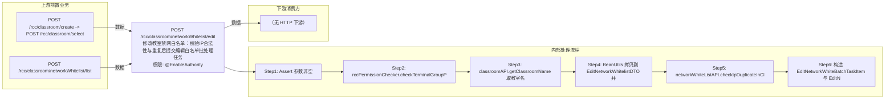

# POST /rcc/classroom/networkWhitelist/edit

> 修改教室禁网白名单：校验IP合法性与重复后提交编辑白名单批处理任务 ｜ @EnableAuthority ｜ async_batch

## 依赖关系全景图

## 接口基本信息

| 项目 | 内容 |
|---|---|
| URL | /rcc/classroom/networkWhitelist/edit |
| Controller | RccClassroomManageController |
| 方法名 | editNetworkWhiteList |
| 权限注解 | @EnableAuthority |
| 执行方式 | async_batch |
| 业务含义 | 修改教室禁网白名单：校验IP合法性与重复后提交编辑白名单批处理任务 |

## 入参详情

### EditNetworkWhiteListRequest

| 参数名 | 类型 | 必填 | 约束 | 说明 |
|---|---|---|---|---|
| classroomId | UUID | 是 | @NotNull 非空 | 教室ID |
| whiteListId | UUID | 是 | @NotNull 非空 | 禁网白名单ID |
| startIp | String | 是 | @NotNull 非空（内部校验IPv4） | 起始IP |
| endIp | String | 是 | @NotNull 非空（内部校验IPv4） | 结束IP |

## 出参详情

| 返回类型 | DefaultWebResponse（data=BatchTaskSubmitResult） |
|---|---|

| 字段 | 类型 | 说明 |
|---|---|---|
| taskId | UUID | 编辑白名单批处理任务ID |
| taskName | String | 任务名称（编辑白名单批任务） |
| taskDesc | String | 任务描述（编辑白名单批任务） |

## 上游前置业务

### 前置1：POST /rcc/classroom/create -> POST /rcc/classroom/select

create 为异步批任务，响应为 BatchTaskSubmitResult 不直接返回 ID；实际经 select 按名称查询 content[0].classroomId（由 field_map 契约映射）

### 前置2：POST /rcc/classroom/networkWhitelist/list

待编辑白名单ID（NetworkWhiteListDTO.id）（由 field_map 契约映射）
## 内部处理流程

### 批量处理器：EditNetworkWhiteListBatchTaskHandler

| 步骤 | 说明 |
|---|---|
| 1 | processItem：getNetworkWhitelist(networkId) 预取 → editNetworkWhitelist(request) + reForbidNetwork(classroomId)，记录成功/失败审计 |
| 2 | onFinish：返回 RCDC_RCC_SEAT_OPERATE_NETWORK_EDIT_SUC/FAIL |

### 处理流程

1. Assert 参数非空
2. rccPermissionChecker.checkTerminalGroupPermissionByClassroomId(单教室) 校验权限
3. classroomAPI.getClassroomName 取教室名
4. BeanUtils 拷贝到 EditNetworkWhitelistDTO 并 checkNetworkValid() 校验IP
5. networkWhiteListAPI.checkIpDuplicateInClassroomForManageNetworkWhitelist 查重
6. 构造 EditNetworkWhiteBatchTaskItem 与 EditNetworkWhiteListBatchTaskHandler，enableParallel 提交批处理

## 下游消费方

（本接口数据主要被自身/关联接口消费，或经 SPI 通知）
## 接口参数约束分析

| 层级 | 参数 | 规则 | 失败结果 |
|---|---|---|---|
| request | classroomId/whiteListId/startIp/endIp | @NotNull 非空 | webmvc 参数校验异常 |
| request | startIp/endIp | checkNetworkValid 校验合法IPv4与起止区间 | IP格式非法抛异常 |
| business | startIp/endIp | 新IP区间不能与教室其他白名单重复 | checkIpDuplicate 抛异常 |

## 参数取值策略

| 参数 | 策略 | 说明 |
|---|---|---|
| classroomId | user_input/from_query | 按业务构造 |
| whiteListId | user_input/from_query | 按业务构造 |
| startIp | user_input/from_query | 按业务构造 |
| endIp | user_input/from_query | 按业务构造 |

## 成功/失败断言基准

### 成功场景

| 场景 | 断言点 |
|---|---|
| IP合法且不重复 | $.status=="SUCCESS"；$.content.taskId 非空（批处理任务已提交） |

### 失败场景

| 场景 | 触发条件 | 断言点 |
|---|---|---|
| IP格式非法 | startIp/endIp 非IPv4或start>end | status==ERROR（checkNetworkValid 抛 IP 格式/网段校验异常，如 RCDC_RCC_NETWORK_WHITELIST_START_IP_NET_INVALID） |
| IP区间重复 | 新区间与其他白名单相交 | status==ERROR；msgKey==RCDC_RCC_NETWORK_WHITELIST_ERR |
| 白名单不存在 | whiteListId 无效 | $.status=="SUCCESS"；轮询终态对应项 batchTaskItemStatus==FAILURE |

## 环境清理机制

| 接口 | 说明 |
|---|---|
| 本接口创建的资源 | 通过对应 delete 接口清理 |

## 前置状态和幂等性标注

| 维度 | 结论 |
|---|---|
| 幂等性 | low |
| 说明 | 无版本控制，重复提交同参数会重复执行编辑+重下发；IP查重仅拦截已存在记录 |
