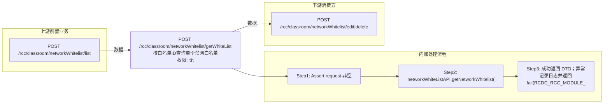

# POST /rcc/classroom/networkWhitelist/getWhiteList

> 按白名单ID查询单个禁网白名单 ｜ 无特殊权限 ｜ sync

## 依赖关系全景图

## 接口基本信息

| 项目 | 内容 |
|---|---|
| URL | /rcc/classroom/networkWhitelist/getWhiteList |
| Controller | RccClassroomManageController |
| 方法名 | getWhiteList |
| 权限注解 | 无 |
| 执行方式 | sync |
| 业务含义 | 按白名单ID查询单个禁网白名单 |

## 入参详情

### GetSingleNetworkWhiteListRequest

| 参数名 | 类型 | 必填 | 约束 | 说明 |
|---|---|---|---|---|
| whiteListId | UUID | 是 | @NotNull 非空 | 禁网白名单ID |

## 出参详情

| 返回类型 | DefaultWebResponse<NetworkWhiteListDTO> |
|---|---|

| 字段 | 类型 | 说明 |
|---|---|---|
| id | UUID | 白名单ID |
| startIp | String | 起始IP |
| endIp | String | 结束IP |

## 上游前置业务

### 前置1：POST /rcc/classroom/networkWhitelist/list

禁网白名单ID（NetworkWhiteListDTO.id）（由 field_map 契约映射）
## 内部处理流程

### 处理流程

1. Assert request 非空
2. networkWhiteListAPI.getNetworkWhitelist(whiteListId) 查询
3. 成功返回 DTO；异常记录日志并返回 fail(RCDC_RCC_MODULE_OPERATE_FAIL)

## 下游消费方

### 消费1：POST /rcc/classroom/networkWhitelist/edit|delete

出参 NetworkWhiteListDTO.id 回显白名单ID（由 field_map 契约映射）
## 接口参数约束分析

| 层级 | 参数 | 规则 | 失败结果 |
|---|---|---|---|
| request | whiteListId | @NotNull 非空 | webmvc 参数校验异常 |

## 参数取值策略

| 参数 | 策略 | 说明 |
|---|---|---|
| whiteListId | user_input/from_query | 按业务构造 |

## 成功/失败断言基准

### 成功场景

| 场景 | 断言点 |
|---|---|
| 白名单存在 | $.status=="SUCCESS"；$.content.id 非空 |

### 失败场景

| 场景 | 触发条件 | 断言点 |
|---|---|---|
| 白名单不存在 | whiteListId 无效/已删除 | status==ERROR；msgKey==RCDC_RCC_MODULE_OPERATE_FAIL（附底层异常信息） |

## 环境清理机制

| 接口 | 说明 |
|---|---|
| 本接口创建的资源 | 通过对应 delete 接口清理 |

## 前置状态和幂等性标注

| 维度 | 结论 |
|---|---|
| 幂等性 | high |
| 说明 | 纯查询接口 |
