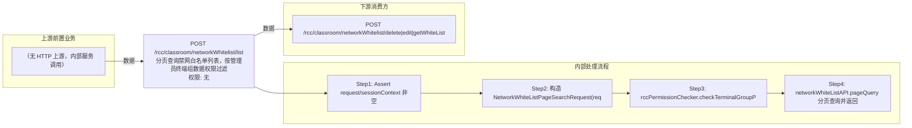

# POST /rcc/classroom/networkWhitelist/list

> 分页查询禁网白名单列表，按管理员终端组数据权限过滤 ｜ 无特殊权限 ｜ sync

## 依赖关系全景图

## 接口基本信息

| 项目 | 内容 |
|---|---|
| URL | /rcc/classroom/networkWhitelist/list |
| Controller | RccClassroomManageController |
| 方法名 | getNetworkWhiteList |
| 权限注解 | 无 |
| 执行方式 | sync |
| 业务含义 | 分页查询禁网白名单列表，按管理员终端组数据权限过滤 |

## 入参详情

### PageWebRequest

| 参数名 | 类型 | 必填 | 约束 | 说明 |
|---|---|---|---|---|
| page | Integer | 否 | 分页参数 | 页码 |
| limit | Integer | 否 | 分页参数 | 每页条数 |
| matchArr | Match[] | 否 | 查询条件 | 匹配条件（含教室/IP等过滤） |

## 出参详情

| 返回类型 | DefaultWebResponse（data=DefaultPageResponse<NetworkWhiteListDTO>） |
|---|---|

| 字段 | 类型 | 说明 |
|---|---|---|
| itemArr | NetworkWhiteListDTO[] | 白名单列表（元素字段见下） |
| total | Long | 总数 |
| id | UUID | 白名单ID |
| startIp | String | 起始IP |
| endIp | String | 结束IP |

## 上游前置业务

（无上游数据依赖）
## 内部处理流程

### 处理流程

1. Assert request/sessionContext 非空
2. 构造 NetworkWhiteListPageSearchRequest(request)
3. rccPermissionChecker.checkTerminalGroupPermissionByQueryRequest(apiRequest, sessionContext) 权限过滤
4. networkWhiteListAPI.pageQuery 分页查询并返回

## 下游消费方

### 消费1：POST /rcc/classroom/networkWhitelist/delete|edit|getWhiteList

出参 NetworkWhiteListDTO.id，白名单 ID 的唯一查询来源（由 field_map 契约映射）
## 接口参数约束分析

| 层级 | 参数 | 规则 | 失败结果 |
|---|---|---|---|
| request | request/sessionContext | 非空 | webmvc 参数校验异常 |

## 参数取值策略

| 参数 | 策略 | 说明 |
|---|---|---|
| page | user_input/from_query | 按业务构造 |
| limit | user_input/from_query | 按业务构造 |
| matchArr | user_input/from_query | 按业务构造 |

## 成功/失败断言基准

### 成功场景

| 场景 | 断言点 |
|---|---|
| 正常查询 | $.status=="SUCCESS"；$.content.itemArr 非空；$.content.total 非空 |

### 失败场景

| 场景 | 触发条件 | 断言点 |
|---|---|---|
| 权限不足 | 无授权（checkTerminalGroupPermissionByQueryRequest 校验失败） | status==ERROR；msgKey==RCDC_SAPCE_DATA_PERMISSION_DENIED |

## 环境清理机制

| 接口 | 说明 |
|---|---|
| 本接口创建的资源 | 通过对应 delete 接口清理 |

## 前置状态和幂等性标注

| 维度 | 结论 |
|---|---|
| 幂等性 | high |
| 说明 | 纯查询接口 |
