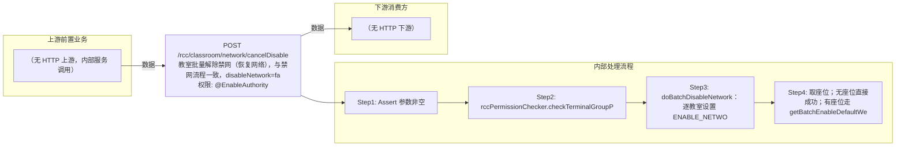

# POST /rcc/classroom/network/cancelDisable

> 教室批量解除禁网（恢复网络），与禁网流程一致，disableNetwork=false 时走启用网络批处理 ｜ @EnableAuthority ｜ async_batch

## 依赖关系全景图

## 接口基本信息

| 项目 | 内容 |
|---|---|
| URL | /rcc/classroom/network/cancelDisable |
| Controller | RccClassroomManageController |
| 方法名 | batchCancelDisableNetwork |
| 权限注解 | @EnableAuthority |
| 执行方式 | async_batch |
| 业务含义 | 教室批量解除禁网（恢复网络），与禁网流程一致，disableNetwork=false 时走启用网络批处理 |

## 入参详情

### BatchDisableNetworkRequest

| 参数名 | 类型 | 必填 | 约束 | 说明 |
|---|---|---|---|---|
| classroomIdArr | UUID[] | 是 | @NotEmpty 非空 | 教室ID列表 |
| disableNetwork | Boolean | 是 | @NotNull 非空 | false=解除禁网/启用网络 |

## 出参详情

| 返回类型 | DefaultWebResponse<BatchTaskSubmitResult|SuccessResultResponse> |
|---|---|

| 字段 | 类型 | 说明 |
|---|---|---|
| taskId | UUID | 启用网络批处理任务ID（无座位时为空） |

## 上游前置业务

> 本接口上游为服务端内部调用（非 HTTP 端点）：
> - 
## 内部处理流程

### 批量处理器：EnableSeatNetworkBatchTaskHandler

| 步骤 | 说明 |
|---|---|
| 1 | processItem 逐座位 seatAPI.disableSingleSeatNetwork(seatId, ENABLE_NETWORK) |
| 2 | onFinish 调 seatAPI.refreshDeskInfo 并返回结果 |

### 处理流程

1. Assert 参数非空
2. rccPermissionChecker.checkTerminalGroupPermissionByClassroomId 校验权限
3. doBatchDisableNetwork：逐教室设置 ENABLE_NETWORK + 通知CMR + 记录启用网络审计
4. 取座位；无座位直接成功；有座位走 getBatchEnableDefaultWebResponse 提交 EnableSeatNetworkBatchTaskHandler

## 下游消费方

（本接口数据主要被自身/关联接口消费，或经 SPI 通知）
## 接口参数约束分析

| 层级 | 参数 | 规则 | 失败结果 |
|---|---|---|---|
| request | classroomIdArr/disableNetwork | @NotEmpty/@NotNull | webmvc 参数校验异常 |
| business | classroomIdArr | 管理员需具备教室终端组数据权限 | rccPermissionChecker 抛出权限异常 |

## 参数取值策略

| 参数 | 策略 | 说明 |
|---|---|---|
| classroomIdArr | user_input/from_query | 按业务构造 |
| disableNetwork | user_input/from_query | 按业务构造 |

## 成功/失败断言基准

### 成功场景

| 场景 | 断言点 |
|---|---|
| 教室有座位 | $.status=="SUCCESS"；$.content.taskId 非空（批处理任务已提交） |

### 失败场景

| 场景 | 触发条件 | 断言点 |
|---|---|---|
| 无权限 | 教室不在权限范围 | status==ERROR；msgKey==RCDC_SAPCE_DATA_PERMISSION_DENIED |

## 环境清理机制

| 接口 | 说明 |
|---|---|
| 本接口创建的资源 | 通过对应 delete 接口清理 |

## 前置状态和幂等性标注

| 维度 | 结论 |
|---|---|
| 幂等性 | low |
| 说明 | 逐座位执行且无防重，重复提交重复下发启用指令；教室级状态重复设置幂等 |
