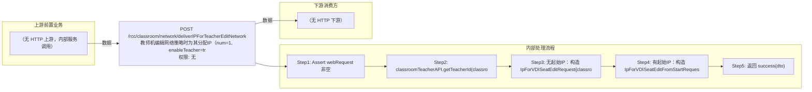

# POST /rcc/classroom/network/deliverIPForTeacherEditNetwork

> 教师机编辑网络策略时为其分配IP（num=1, enableTeacher=true），支持从指定起始IP预分配 ｜ 无特殊权限 ｜ sync

## 依赖关系全景图

## 接口基本信息

| 项目 | 内容 |
|---|---|
| URL | /rcc/classroom/network/deliverIPForTeacherEditNetwork |
| Controller | RccClassroomNetworkController |
| 方法名 | deliverIPForTeacherEditNetwork |
| 权限注解 | 无 |
| 执行方式 | sync |
| 业务含义 | 教师机编辑网络策略时为其分配IP（num=1, enableTeacher=true），支持从指定起始IP预分配 |

## 入参详情

### GetIpForVDITeacherEditNetworkWebRequest

| 参数名 | 类型 | 必填 | 约束 | 说明 |
|---|---|---|---|---|
| classroomId | UUID | 是 | @NotNull 非空 | 教室ID |
| clusterId | UUID | 是 | @NotNull 非空 | 计算集群ID |
| platformId | UUID | 是 | @NotNull 非空 | 云平台ID |
| vdiStartIP | String | 否 | @Nullable 可空，若填需 @IPv4Address | VDI网络开始IP |
| networkId | UUID | 否 | @Nullable 可空 | 网络策略ID |

## 出参详情

| 返回类型 | DefaultWebResponse<VDIDeliverIpInfoDTO> |
|---|---|

| 字段 | 类型 | 说明 |
|---|---|---|
| vdiStartIP | String | 分配起始IP |
| usedIPSegmentList | List<IpIntervalDTO> | 已使用IP段列表 |
| isOverflow | Boolean | IP是否溢出 |
| shortOfIp | Long | 缺少的IP数量 |

## 上游前置业务

> 本接口上游为服务端内部调用（非 HTTP 端点）：
> - 
## 内部处理流程

### 处理流程

1. Assert webRequest 非空
2. classroomTeacherAPI.getTeacherId(classroomId) 取教师ID
3. 无起始IP：构造 IpForVDISeatEditRequest{classroomId, networkId, num=1, seatIdArr=[teacherId], enableTeacher=true, clusterId, platformId} → getFreeIpIntervalForEditVDI
4. 有起始IP：构造 IpForVDISeatEditFromStartRequest 并 setVdiStartIP → getFreeIpIntervalForEditVDIFromStart 并回填
5. 返回 success(dto)

## 下游消费方

（本接口数据主要被自身/关联接口消费，或经 SPI 通知）
## 接口参数约束分析

| 层级 | 参数 | 规则 | 失败结果 |
|---|---|---|---|
| request | classroomId/clusterId/platformId | @NotNull 非空 | webmvc 参数校验异常 |
| request | vdiStartIP | 若填写必须是合法IPv4 | webmvc IPv4 格式校验异常 |

## 参数取值策略

| 参数 | 策略 | 说明 |
|---|---|---|
| classroomId | user_input/from_query | 按业务构造 |
| clusterId | user_input/from_query | 按业务构造 |
| platformId | user_input/from_query | 按业务构造 |
| vdiStartIP | user_input/from_query | 按业务构造 |
| networkId | user_input/from_query | 按业务构造 |

## 成功/失败断言基准

### 成功场景

| 场景 | 断言点 |
|---|---|
| 教室教师机存在且网络有效 | $.status=="SUCCESS"；$.content.vdiStartIP 非空 |

### 失败场景

| 场景 | 触发条件 | 断言点 |
|---|---|---|
| 教师不存在 | classroomTeacherAPI.getTeacherId 返回空/异常 | status==ERROR（BusinessException 抛出） |

## 环境清理机制

| 接口 | 说明 |
|---|---|
| 本接口创建的资源 | 通过对应 delete 接口清理 |

## 前置状态和幂等性标注

| 维度 | 结论 |
|---|---|
| 幂等性 | high |
| 说明 | 只读计算，不产生副作用 |
