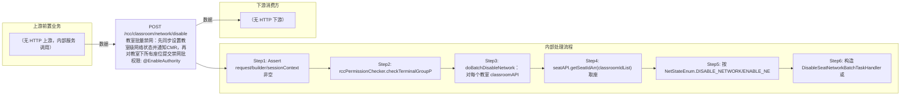

# POST /rcc/classroom/network/disable

> 教室批量禁网：先同步设置教室级网络状态并通知CMR，再对教室下所有座位提交禁网批处理任务 ｜ @EnableAuthority ｜ async_batch

## 依赖关系全景图

## 接口基本信息

| 项目 | 内容 |
|---|---|
| URL | /rcc/classroom/network/disable |
| Controller | RccClassroomManageController |
| 方法名 | batchDisableNetwork |
| 权限注解 | @EnableAuthority |
| 执行方式 | async_batch |
| 业务含义 | 教室批量禁网：先同步设置教室级网络状态并通知CMR，再对教室下所有座位提交禁网批处理任务 |

## 入参详情

### BatchDisableNetworkRequest

| 参数名 | 类型 | 必填 | 约束 | 说明 |
|---|---|---|---|---|
| classroomIdArr | UUID[] | 是 | @NotEmpty 非空 | 教室ID列表 |
| disableNetwork | Boolean | 是 | @NotNull 非空 | true=禁网，false=解禁/恢复网络 |

## 出参详情

| 返回类型 | DefaultWebResponse<BatchTaskSubmitResult|SuccessResultResponse> |
|---|---|

| 字段 | 类型 | 说明 |
|---|---|---|
| taskId | UUID | 无座位时为空，有座位时为禁网批处理任务ID |

## 上游前置业务

> 本接口上游为服务端内部调用（非 HTTP 端点）：
> - 
## 内部处理流程

### 批量处理器：DisableSeatNetworkBatchTaskHandler / EnableSeatNetworkBatchTaskHandler

| 步骤 | 说明 |
|---|---|
| 1 | processItem 逐座位 seatAPI.disableSingleSeatNetwork(seatId, DISABLE/ENABLE_NETWORK) 并记录成功/失败审计 |
| 2 | onFinish 调 seatAPI.refreshDeskInfo(classroomId) 刷新桌面信息，返回成功/失败/部分成功 |

### 处理流程

1. Assert request/builder/sessionContext 非空
2. rccPermissionChecker.checkTerminalGroupPermissionByClassroomId(classroomIdArr, sessionContext) 校验终端组权限
3. doBatchDisableNetwork：对每个教室 classroomAPI.disableClassroomNetwork(netStateEnum, classroomId) + cmrClientAPI.notifyClassroomInfoChange + 记录禁网/解禁审计日志
4. seatAPI.getSeatIdArr(classroomIdList) 取座位；空则直接返回 RCDC_RCC_MODULE_OPERATE_SUCCESS
5. 按 NetStateEnum.DISABLE_NETWORK/ENABLE_NETWORK 分别走 getBatchDisableDefaultWebResponse / getBatchEnableDefaultWebResponse
6. 构造 DisableSeatNetworkBatchTaskHandler 或 EnableSeatNetworkBatchTaskHandler，enableParallel + enablePerformanceMode(线程数) 提交批处理

## 下游消费方

（本接口数据主要被自身/关联接口消费，或经 SPI 通知）
## 接口参数约束分析

| 层级 | 参数 | 规则 | 失败结果 |
|---|---|---|---|
| request | classroomIdArr | @NotEmpty 非空 | webmvc 参数校验异常 |
| request | disableNetwork | @NotNull 非空 | webmvc 参数校验异常 |
| business | classroomIdArr | 管理员需具备所有目标教室的终端组数据权限 | rccPermissionChecker 抛出权限异常 |

## 参数取值策略

| 参数 | 策略 | 说明 |
|---|---|---|
| classroomIdArr | user_input/from_query | 按业务构造 |
| disableNetwork | user_input/from_query | 按业务构造 |

## 成功/失败断言基准

### 成功场景

| 场景 | 断言点 |
|---|---|
| 教室无座位 | $.status=="SUCCESS"；$.msgKey==RCDC_RCC_MODULE_OPERATE_SUCCESS |
| 教室有座位 | $.status=="SUCCESS"；$.content.taskId 非空（批处理任务已提交） |

### 失败场景

| 场景 | 触发条件 | 断言点 |
|---|---|---|
| 无终端组权限 | 任一教室不在管理员权限范围 | status==ERROR；msgKey==RCDC_SAPCE_DATA_PERMISSION_DENIED |
| 个别座位下发失败 | 座位终端离线 | $.status=="SUCCESS"；轮询终态任务结果 PARTIAL_SUCCESS/FAILURE |

## 环境清理机制

| 接口 | 说明 |
|---|---|
| 本接口创建的资源 | 通过对应 delete 接口清理 |

## 前置状态和幂等性标注

| 维度 | 结论 |
|---|---|
| 幂等性 | low |
| 说明 | 批处理逐座位执行且无防重，重复提交会重复下发禁网指令；教室级状态重复设置幂等 |
