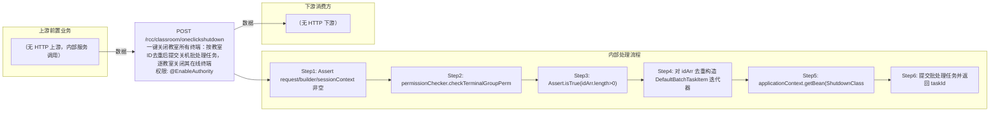

# POST /rcc/classroom/oneclickshutdown

> 一键关闭教室所有终端：按教室ID去重后提交关机批处理任务，逐教室关闭其在线终端 ｜ @EnableAuthority ｜ async_batch

## 依赖关系全景图

## 接口基本信息

| 项目 | 内容 |
|---|---|
| URL | /rcc/classroom/oneclickshutdown |
| Controller | RccClassroomTerminalController |
| 方法名 | shutdownTerminal |
| 权限注解 | @EnableAuthority |
| 执行方式 | async_batch |
| 业务含义 | 一键关闭教室所有终端：按教室ID去重后提交关机批处理任务，逐教室关闭其在线终端 |

## 入参详情

### IdArrWebRequest

| 参数名 | 类型 | 必填 | 约束 | 说明 |
|---|---|---|---|---|
| idArr | UUID[] | 是 | controller 断言非空（Assert.isTrue length>0） | 教室ID数组 |

## 出参详情

| 返回类型 | DefaultWebResponse<BatchTaskSubmitResult> |
|---|---|

| 字段 | 类型 | 说明 |
|---|---|---|
| taskId | UUID | 一键关机批处理任务ID |

## 上游前置业务

> 本接口上游为服务端内部调用（非 HTTP 端点）：
> - 
## 内部处理流程

### 批量处理器：ShutdownClassroomTerminalBatchTaskHandler

| 步骤 | 说明 |
|---|---|
| 1 | processItem：classroomAPI.getClassroomName → classroomTerminalAPI.getClassroomOnlineTerminalList(classroomId) |
| 2 | 逐个终端 shutdown：deployMode 为空抛 RCDC_RCC_CLOSE_TERMINAL_UNDEPLOY_FAIL；失败终端记录失败审计并计数 |
| 3 | 有失败则 item 返回 FAILURE，否则 SUCCESS，记录 RCDC_RCC_CLOSE_CLASSROOM_TERMINAL 审计 |
| 4 | onFinish 返回 RCDC_RCC_CLOSE_CLASSROOM_TERMINAL_FINISH 汇总 |

### 处理流程

1. Assert request/builder/sessionContext 非空
2. permissionChecker.checkTerminalGroupPermissionByClassroomId(idArr, sessionContext) 校验权限
3. Assert.isTrue(idArr.length>0)
4. 对 idArr 去重构造 DefaultBatchTaskItem 迭代器
5. applicationContext.getBean(ShutdownClassroomTerminalBatchTaskHandler.class, iterator) 取 prototype Handler
6. 提交批处理任务并返回 taskId

## 下游消费方

（本接口数据主要被自身/关联接口消费，或经 SPI 通知）
## 接口参数约束分析

| 层级 | 参数 | 规则 | 失败结果 |
|---|---|---|---|
| request | idArr | 非空且长度>0 | Assert 校验失败 |
| business | idArr | 管理员需具备所有目标教室终端组权限 | checkTerminalGroupPermissionByClassroomId 抛权限异常 |
| business | deployMode | 终端需已初始化部署才能关机 | rcdc_rcc_close_terminal_undeploy_fail |

## 参数取值策略

| 参数 | 策略 | 说明 |
|---|---|---|
| idArr | user_input/from_query | 按业务构造 |

## 成功/失败断言基准

### 成功场景

| 场景 | 断言点 |
|---|---|
| 教室全部在线终端关机成功 | $.status=="SUCCESS"；$.content.taskId 非空；轮询终态 batchTaskItemStatus==SUCCESS |

### 失败场景

| 场景 | 触发条件 | 断言点 |
|---|---|---|
| 部分终端关机失败 | 终端离线/未部署/关机指令失败 | $.status=="SUCCESS"；轮询终态对应项 batchTaskItemStatus==FAILURE |
| 无权限 | 教室不在管理员权限范围 | status==ERROR；msgKey==RCDC_SAPCE_DATA_PERMISSION_DENIED |

## 环境清理机制

| 接口 | 说明 |
|---|---|
| 本接口创建的资源 | 通过对应 delete 接口清理 |

## 前置状态和幂等性标注

| 维度 | 结论 |
|---|---|
| 幂等性 | medium |
| 说明 | 重复提交会对在线终端重复下发关机指令（离线终端不会重复处理），无防重状态 |
