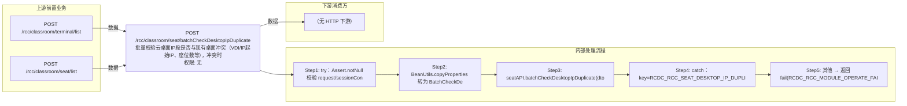

# POST /rcc/classroom/seat/batchCheckDesktopIpDuplicate

> 批量校验云桌面IP段是否与现有桌面冲突（VDI/IP起始IP、座位数等），冲突时以 hasDuplication=true 成功响应返回 ｜ 无特殊权限 ｜ 同步

## 依赖关系全景图

## 接口基本信息

| 项目 | 内容 |
|---|---|
| URL | /rcc/classroom/seat/batchCheckDesktopIpDuplicate |
| Controller | RccSeatConfigController |
| 方法名 | batchCheckDesktopIpDuplicate |
| 权限注解 | 无 |
| 执行方式 | 同步 |
| 业务含义 | 批量校验云桌面IP段是否与现有桌面冲突（VDI/IP起始IP、座位数等），冲突时以 hasDuplication=true 成功响应返回 |

## 入参详情

### BatchCheckDesktopIpRequest

| 参数名 | 类型 | 必填 | 约束 | 说明 |
|---|---|---|---|---|
| classroomId | UUID | 否 | @Nullable | 教室ID |
| seatIdArr | UUID[] | 否 | @Nullable | 座位ID列表（编辑场景排除） |
| studentModeArr | TerminalTypeEnum[] | 是 | @NotNull | 学生机工作模式 |
| vdiDesktopStartIp | String | 否 | @Nullable | VDI 云桌面起始IP |
| idvDesktopStartIp | String | 否 | @Nullable | IDV 云桌面起始IP |
| seatNum | Integer | 否 | @Nullable + @Range(min=1,max=1000) | 座位数量 |

## 出参详情

| 返回类型 | DefaultWebResponse（data=CheckDuplicateResponse） |
|---|---|

| 字段 | 类型 | 说明 |
|---|---|---|
| hasDuplication | Boolean | 是否冲突，默认false；冲突为true |

## 上游前置业务

### 前置1：POST /rcc/classroom/terminal/list

教室ID在创建教室(POST /rcc/classroom/create)后经教室终端列表查询获得（ViewClassroomInfoEntity.classroomId）（由 field_map 契约映射）

### 前置2：POST /rcc/classroom/seat/list

座位ID数组来自座位列表查询出参（SeatInfoDTO.id），座位由/rcc/classroom/seat/batchCreate创建（由 field_map 契约映射）
## 内部处理流程

### 处理流程

1. try：Assert.notNull 校验 request/sessionContext
2. BeanUtils.copyProperties 转为 BatchCheckDesktopIpDTO
3. seatAPI.batchCheckDesktopIpDuplicate(dto)，无异常返回 success(new CheckDuplicateResponse())（false）
4. catch：key=RCDC_RCC_SEAT_DESKTOP_IP_DUPLICATE → success(new CheckDuplicateResponse(true))
5. 其他 → 返回 fail(RCDC_RCC_MODULE_OPERATE_FAIL, e.getI18nMessage())

## 下游消费方

（本接口数据主要被自身/关联接口消费，或经 SPI 通知）
## 接口参数约束分析

| 层级 | 参数 | 规则 | 失败结果 |
|---|---|---|---|
| PARAM | studentModeArr | @NotNull | 为空参数校验失败 |
| PARAM | seatNum | @Range(min=1,max=1000) | 越界参数校验失败 |
| BIZ | vdiDesktopStartIp/idvDesktopStartIp | 起始IP生成的IP段不可与现有桌面冲突 | 冲突时响应 hasDuplication=true |

## 参数取值策略

| 参数 | 策略 | 说明 |
|---|---|---|
| classroomId | user_input/from_query | 按业务构造 |
| seatIdArr | user_input/from_query | 按业务构造 |
| studentModeArr | user_input/from_query | 按业务构造 |
| vdiDesktopStartIp | user_input/from_query | 按业务构造 |
| idvDesktopStartIp | user_input/from_query | 按业务构造 |
| seatNum | user_input/from_query | 按业务构造 |

## 成功/失败断言基准

### 成功场景

| 场景 | 断言点 |
|---|---|
| IP段可用 | $.status=="SUCCESS" 且 $.content.hasDuplication==false |

### 失败场景

| 场景 | 触发条件 | 断言点 |
|---|---|---|
| IP段与现有桌面冲突 | 抛 RCDC_RCC_SEAT_DESKTOP_IP_DUPLICATE | $.status=="SUCCESS" 且 $.content.hasDuplication==true（冲突以成功响应返回） |
| 其它异常 | 其它 BusinessException | $.status=="ERROR" 且 $.msgKey=="rcdc_rcc_module_operate_fail" |

## 环境清理机制

| 接口 | 说明 |
|---|---|
| 本接口创建的资源 | 通过对应 delete 接口清理 |

## 前置状态和幂等性标注

| 维度 | 结论 |
|---|---|
| 幂等性 | HIGH |
| 说明 | 纯校验查询，无副作用 |
