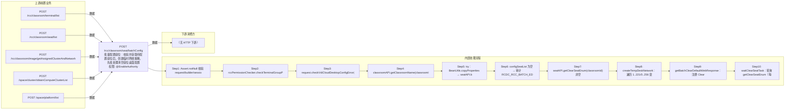

# POST /rcc/classroom/seat/batchConfig

> 批量配置座位：校验并获取待配置座位后，创建临时网络策略，先批处理清空座位桌面配置（轮询等待完成），再批处理按新配置重新下发；失败时规整VDI IP分配并记录审计 ｜ @EnableAuthority ｜ 混合：异步批处理任务（BatchTask，ClearSeatBatchTaskHandler 清空 + 同步轮询等待 + ConfigSeatBatchTaskHandler 配置，enableParallel）

## 依赖关系全景图

## 接口基本信息

| 项目 | 内容 |
|---|---|
| URL | /rcc/classroom/seat/batchConfig |
| Controller | RccSeatConfigController |
| 方法名 | batchConfigSeat |
| 权限注解 | @EnableAuthority |
| 执行方式 | 混合：异步批处理任务（BatchTask，ClearSeatBatchTaskHandler 清空 + 同步轮询等待 + ConfigSeatBatchTaskHandler 配置，enableParallel） |
| 业务含义 | 批量配置座位：校验并获取待配置座位后，创建临时网络策略，先批处理清空座位桌面配置（轮询等待完成），再批处理按新配置重新下发；失败时规整VDI IP分配并记录审计 |

## 入参详情

### BatchConfigSeatWebRequest

| 参数名 | 类型 | 必填 | 约束 | 说明 |
|---|---|---|---|---|
| classroomId | UUID | 是 | @NotNull | 教室ID |
| seatIdArr | UUID[] | 是 | @NotEmpty | 待配置的座位ID数组 |
| desktopPreName | String | 是 | @NotBlank + @Size(max=9) | 云桌面主机名前缀 |
| desktopNameStartNum | Integer | 是 | @NotNull + @Range(min=1,max=999) | 云桌面主机名起始值 |
| studentModeArr | TerminalTypeEnum[] | 是 | @NotNull | 学生机工作模式 |
| vdiDesktopStartIp | String | 否 | @Nullable + @IPv4Address | VDI 云桌面起始IP |
| networkId | UUID | 否 | @Nullable | VDI 网络策略ID |
| clusterId | UUID | 否 | @Nullable | 计算节点ID |
| platformId | UUID | 否 | @Nullable | 云平台ID |

## 出参详情

| 返回类型 | DefaultWebResponse（data=BatchTaskSubmitResult 或空成功） |
|---|---|

| 字段 | 类型 | 说明 |
|---|---|---|
| taskId | UUID | 配置桌面的批任务标识（无待配置座位时为纯成功响应） |
| taskStatus | String | 批任务初始状态 |

## 上游前置业务

### 前置1：POST /rcc/classroom/terminal/list

教室ID在创建教室(POST /rcc/classroom/create)后经教室终端列表查询获得（ViewClassroomInfoEntity.classroomId）（由 field_map 契约映射）

### 前置2：POST /rcc/classroom/seat/list

座位ID数组来自座位列表查询出参（SeatInfoDTO.id），座位由/rcc/classroom/seat/batchCreate创建（由 field_map 契约映射）

### 前置3：POST /rcc/classroom/image/getAssignedClusterAndNetwork

推断：VDI网络ID来源，字段名为推断（由 field_map 契约映射）

### 前置4：POST /space/cluster/obtainComputeClusterList

推断：计算集群ID来源，字段名为推断（由 field_map 契约映射）

### 前置5：POST /space/platform/list

推断：云平台ID来源，字段名为推断（由 field_map 契约映射）
## 内部处理流程

### 批量处理器：ClearSeatBatchTaskHandler（前置清空）→ ConfigSeatBatchTaskHandler（正式配置）

| 步骤 | 说明 |
|---|---|
| 1 | ClearSeatBatchTaskHandler.processItem：getSeatInfo 取桌面名 → seatAPI.clearSeatConfig(ClearSeatDTO{seatId, networkId}) → 成功 SUCCESS（RCDC_RCC_SEAT_OPERATE_DESKTOP_RESET_SINGLE_SUC_LOG）/失败 FAILURE（RESET_SINGLE_FAIL_LOG） |
| 2 | ConfigSeatBatchTaskHandler.processItem：idMap 取 ConfigSeatDTO → getSeatInfo 取桌面名 → seatAPI.configSeat(configSeatDTO) → 成功 SUCCESS（RCDC_RCC_SEAT_OPERATE_DESKTOP_EDIT_SINGLE_SUC_LOG）/失败 FAILURE（EDIT_SINGLE_FAIL_LOG） |

### 处理流程

1. Assert.notNull 校验 request/builder/sessionContext
2. rccPermissionChecker.checkTerminalGroupPermissionByClassroomId 校验权限
3. request.checkVdiCloudDesktopConfigError() 校验 VDI 配置成对
4. classroomAPI.getClassroomName(classroomId) 取教室名
5. try：BeanUtils.copyProperties → seatAPI.batchCheckSeatBeforeConfig → seatAPI.getConfigSeatList
6. configSeatList 为空 → 审计 RCDC_RCC_BATCH_EDIT_SEAT_SUCCESS_LOG 返回成功
7. seatAPI.getClearSeatEnum(classroomId) 非空 → 抛 RCDC_RCC_SEAT_BATCH_CONFIG_ERROR（教室已有清空/配置任务在进行）
8. createTempDeskNetwork：遍历 1..221/0..256 尝试生成临时IP段网络策略（getDeskNetwork→buildCbbCreateRequest→checkNetworkConflict→createDeskNetwork）
9. getBatchClearDefaultWebResponse：注册 ClearSeatBatchTaskHandler（addClearSeatEnum START）并启动清空任务
10. waitClearSeatTask：轮询 getClearSeatEnum（每 SLEEP=1000ms，上限 TRY_COUNT=120），null/FAIL 抛 RCDC_RCC_SEAT_BATCH_CONFIG_FAIL，超时抛 RCDC_RCC_SEAT_BATCH_CONFIG_TIME_OUT
11. getBatchConfigSeatDesktopDefaultWebResponse：构造 ConfigSeatBatchTaskHandler 并行下发配置
12. catch BusinessException：tidyClassroomVDIIp（含VDI模式时规整IP，失败审计 RCDC_RCC_VDI_IP_TIDY_FAIL_LOG）→ 审计 RCDC_RCC_BATCH_EDIT_SEAT_FAIL_LOG（超长截断）→ 返回 fail

## 下游消费方

（本接口数据主要被自身/关联接口消费，或经 SPI 通知）
## 接口参数约束分析

| 层级 | 参数 | 规则 | 失败结果 |
|---|---|---|---|
| PARAM | seatIdArr | @NotEmpty | 为空参数校验失败 |
| PARAM | desktopPreName | @NotBlank + @Size(max=9) | 为空/超长校验失败 |
| PARAM | desktopNameStartNum | @NotNull + @Range(1-999) | 越界校验失败 |
| PARAM | studentModeArr | @NotNull | 为空校验失败 |
| PARAM | vdiDesktopStartIp | @IPv4Address | 非法IP格式校验失败 |
| BIZ | VDI配置组 | VDI网络相关参数成对出现 | 不完整抛 RCDC_RCC_VDI_CLOUD_DESKTOP_CONFIG_ERROR |
| BIZ | classroomId | 教室不可同时进行清空/配置任务 | getClearSeatEnum 非空抛 RCDC_RCC_SEAT_BATCH_CONFIG_ERROR |
| BIZ | 清空任务状态 | 清空任务需在120s内完成 | 超时抛 RCDC_RCC_SEAT_BATCH_CONFIG_TIME_OUT；失败抛 RCDC_RCC_SEAT_BATCH_CONFIG_FAIL |
| BIZ | 临时网络策略 | 临时IP段/网关不可与现有网络策略冲突 | checkNetworkConflict 抛 RCDC_RCC_NETWORK_STRATEGY_IP_POOL / RCDC_RCC_NETWORK_STRATEGY_GATEWAY |

## 参数取值策略

| 参数 | 策略 | 说明 |
|---|---|---|
| classroomId | user_input/from_query | 按业务构造 |
| seatIdArr | user_input/from_query | 按业务构造 |
| desktopPreName | user_input/from_query | 按业务构造 |
| desktopNameStartNum | user_input/from_query | 按业务构造 |
| studentModeArr | user_input/from_query | 按业务构造 |
| vdiDesktopStartIp | user_input/from_query | 按业务构造 |
| networkId | user_input/from_query | 按业务构造 |
| clusterId | user_input/from_query | 按业务构造 |
| platformId | user_input/from_query | 按业务构造 |

## 成功/失败断言基准

### 成功场景

| 场景 | 断言点 |
|---|---|
| 教室无进行中任务且配置合法 | $.status=="SUCCESS" 且 $.content.taskId 非空；先清空再配置，全部成功审计 RCDC_RCC_BATCH_EDIT_SEAT_SUCCESS_LOG；轮询 content.taskId（2000ms 间隔）至终态 batchTaskItemStatus∈["SUCCESS"] |
| 无待配置座位 | $.status=="SUCCESS"（纯成功响应，content 为空）；审计 RCDC_RCC_BATCH_EDIT_SEAT_SUCCESS_LOG |

### 失败场景

| 场景 | 触发条件 | 断言点 |
|---|---|---|
| 教室正在清空座位 | getClearSeatEnum 非空 | $.status=="ERROR" 且 $.msgKey=="rcdc_rcc_seat_batch_config_error" |
| 清空任务超时 | waitClearSeatTask 超120s | $.status=="ERROR" 且 $.msgKey=="rcdc_rcc_seat_batch_config_time_out" |
| 清空任务失败 | clearSeatEnum 为 FAIL | $.status=="ERROR" 且 $.msgKey=="rcdc_rcc_seat_batch_config_fail" |
| 配置失败 | 批任务/前置校验抛错 | $.status=="ERROR" 且 $.msgKey=="rcdc_rcc_module_operate_fail"；审计 RCDC_RCC_BATCH_EDIT_SEAT_FAIL_LOG |

## 环境清理机制

| 接口 | 说明 |
|---|---|
| 无对应 HTTP 清理接口 | 批量配置失败时的VDI IP规整（tidyClassroomVDIIp）与清空状态标记（clearSeatEnum）均为服务端内部补偿逻辑，非 HTTP 端点 |

## 前置状态和幂等性标注

| 维度 | 结论 |
|---|---|
| 幂等性 | LOW |
| 说明 | 重复提交会再次触发整教室清空+重配流程；依赖教室清空状态机（RCDC_RCC_SEAT_BATCH_CONFIG_ERROR）避免并发，但无幂等键 |
