# POST /rcc/classroom/seat/batchCreate

> 批量创建教室座位：加全局资源锁校验并创建座位记录，按需为 VDI 座位创建云桌面（批任务），并更新网络白名单 ACL 与刷新桌面信息 ｜ @EnableAuthority ｜ 混合：同步加锁创建座位记录（batchCheckCreateSeat/batchCreateSeat）＋ 异步批处理任务（BatchTask，CreateSeatDesktopBatchTaskHandler，enableParallel）批量创建云桌面

## 依赖关系全景图

```mermaid
graph LR
    subgraph 上游前置业务
        A1["POST /rcc/classroom/terminal/list"]
        A2["POST /rcc/classroom/image/getAssignedClusterAndNetwork"]
        A3["POST /space/cluster/obtainComputeClusterList"]
        A4["POST /space/platform/list"]
    end
    B["POST /rcc/classroom/seat/batchCreate<br>批量创建教室座位：加全局资源锁校验并创建座位记录，按需为 VDI 座位创建云桌面<br>权限: @EnableAuthority"]
    A1 -->|数据| B
    A2 -->|数据| B
    A3 -->|数据| B
    A4 -->|数据| B
    subgraph 内部处理流程
        C1["Step1: Assert.notNull 校验 request/builder/sessio"]
        C2["Step2: rccPermissionChecker.checkTerminalGroupP"]
        C3["Step3: request.checkVdiCloudDesktopConfigError("]
        C4["Step4: classroomAPI.getClassroomDetailInfo 获取教室"]
        C5["Step5: LockableExecutor.executeWithTryLock(LOCK"]
        C6["Step6: 座位关联关系为空 → updateAclWhenChangeIp + refre"]
        C1 --> C2
        C7["Step7: seatAPI.getCreateSeatDesktopDTO 获取待创建桌面列"]
        C8["Step8: 否则 getBatchCreateSeatDesktopDefaultWebRe"]
        C9["Step9: catch BusinessException：审计 RCDC_RCC_BATC"]
        C6 --> C7
        C7 --> C8
        C8 --> C9
        C2 --> C3
        C3 --> C4
        C4 --> C5
        C5 --> C6
    end
    B --> C1
    subgraph 下游消费方
        D1["POST /rcc/classroom/seat/list、/rcc/classroom/seat/delete、/rcc/classroom/seat/edit、/rcc/classroom/seat/terminal/wake"]
    end
    B -->|数据| D1
```

## 接口基本信息

| 项目 | 内容 |
|---|---|
| URL | /rcc/classroom/seat/batchCreate |
| Controller | RccSeatConfigController |
| 方法名 | batchCreateSeat |
| 权限注解 | @EnableAuthority |
| 执行方式 | 混合：同步加锁创建座位记录（batchCheckCreateSeat/batchCreateSeat）＋ 异步批处理任务（BatchTask，CreateSeatDesktopBatchTaskHandler，enableParallel）批量创建云桌面 |
| 业务含义 | 批量创建教室座位：加全局资源锁校验并创建座位记录，按需为 VDI 座位创建云桌面（批任务），并更新网络白名单 ACL 与刷新桌面信息 |

## 入参详情

### BatchCreateSeatWebRequest

| 参数名 | 类型 | 必填 | 约束 | 说明 |
|---|---|---|---|---|
| classroomId | UUID | 是 | @NotNull | 教室ID |
| desktopPreName | String | 是 | @NotNull + @Size(max=5) | 云桌面主机名前缀 |
| desktopNameStartNum | Integer | 是 | @NotNull + @Range(min=1,max=999) | 云桌面主机名前缀起始值 |
| seatNum | Integer | 是 | @NotNull + @Range(min=1,max=999) | 待创建座位数量 |
| studentModeArr | TerminalTypeEnum[] | 是 | @NotEmpty | 学生机工作模式数组（VDI/IDV/VOI等） |
| vdiDesktopStartIp | String | 否 | @Nullable | VDI 云桌面起始IP |
| networkId | UUID | 否 | @Nullable | VDI 网络策略ID |
| clusterId | UUID | 否 | @Nullable | 计算节点ID |
| platformId | UUID | 否 | @Nullable | 云平台ID |

## 出参详情

| 返回类型 | DefaultWebResponse（data=BatchTaskSubmitResult 或空成功） |
|---|---|

| 字段 | 类型 | 说明 |
|---|---|---|
| taskId | UUID | 批处理任务ID（需创建桌面时），提交创建桌面的批任务标识 |
| taskStatus | String | 批任务初始状态 |

## 上游前置业务

### 前置1：POST /rcc/classroom/terminal/list

教室ID在创建教室(POST /rcc/classroom/create)后经教室终端列表查询获得（ViewClassroomInfoEntity.classroomId）（由 field_map 契约映射）

### 前置2：POST /rcc/classroom/image/getAssignedClusterAndNetwork

推断：VDI网络ID来源，字段名为推断（由 field_map 契约映射）

### 前置3：POST /space/cluster/obtainComputeClusterList

推断：计算集群ID来源，字段名为推断（由 field_map 契约映射）

### 前置4：POST /space/platform/list

推断：云平台ID来源，字段名为推断（由 field_map 契约映射）
## 内部处理流程

### 批量处理器：CreateSeatDesktopBatchTaskHandler

| 步骤 | 说明 |
|---|---|
| 1 | idMap 取 CreateSeatDesktopDTO，seatAPI.getSeatInfo 取桌面名 |
| 2 | seatAPI.createDesktop(createDesktopDTO) 创建云桌面 |
| 3 | 成功：auditLogAPI.recordLog(RCDC_RCC_SEAT_OPERATE_DESKTOP_CREATE_SINGLE_SUC_LOG) 返回 SUCCESS |
| 4 | BusinessException：recordLog(CREATE_SINGLE_FAIL_LOG) 返回 FAILURE |

### 处理流程

1. Assert.notNull 校验 request/builder/sessionContext
2. rccPermissionChecker.checkTerminalGroupPermissionByClassroomId(classroomId) 校验权限
3. request.checkVdiCloudDesktopConfigError() 校验 VDI 配置成对（RCDC_RCC_VDI_CLOUD_DESKTOP_CONFIG_ERROR）
4. classroomAPI.getClassroomDetailInfo 获取教室信息与教室名
5. LockableExecutor.executeWithTryLock(LOCK_TIME_TABLE_GLOBAL_CHECK_RESOURCE)：BeanUtils.copyProperties → seatAPI.batchCheckCreateSeat → seatAPI.batchCreateSeat
6. 座位关联关系为空 → updateAclWhenChangeIp + refreshDeskInfo + 审计 RCDC_RCC_BATCH_CREATE_SEAT_SUCCESS_LOG 返回成功
7. seatAPI.getCreateSeatDesktopDTO 获取待创建桌面列表，为空同样更新ACL/刷新后成功返回
8. 否则 getBatchCreateSeatDesktopDefaultWebResponse：构建 idMap 与迭代器，注册 CreateSeatDesktopBatchTaskHandler（注入 networkWhiteListAPI/platformDeskMgmtAPI/hasPublish）并行启动
9. catch BusinessException：审计 RCDC_RCC_BATCH_CREATE_SEAT_FAIL_LOG（超1024字符截断），返回 fail

## 下游消费方

### 消费1：POST /rcc/classroom/seat/list、/rcc/classroom/seat/delete、/rcc/classroom/seat/edit、/rcc/classroom/seat/terminal/wake

批量创建座位后经座位列表查询产出seatId，供删除/编辑/唤醒等消费（由 field_map 契约映射）
## 接口参数约束分析

| 层级 | 参数 | 规则 | 失败结果 |
|---|---|---|---|
| PARAM | desktopPreName | @NotNull + @Size(max=5) | 为空/超长参数校验失败（RCDC_RCC_SEAT_DESKTOP_PRENAME_*） |
| PARAM | seatNum | @NotNull + @Range(1-999) | 越界校验失败（RCDC_RCC_SEAT_NUM_MAX/RCDC_RCC_SEAT_NUM_NOT_NULL） |
| PARAM | desktopNameStartNum | @NotNull + @Range(1-999) | 越界校验失败（RCDC_RCC_SEAT_START_MAX_NUM_LIMIT） |
| PARAM | studentModeArr | @NotEmpty | 为空参数校验失败 |
| BIZ | VDI配置组 | vdiDesktopStartIp/networkId/clusterId/platformId 必须同时存在或同时为空 | 一方有另一方无抛 RCDC_RCC_VDI_CLOUD_DESKTOP_CONFIG_ERROR |
| BIZ | classroomId | 教室必须存在 | RCDC_RCC_SEAT_BATCH_CHECK_CLASSROOM_NOT_EXIST |
| BIZ | networkId/vdiDesktopStartIp | IP 必须在网络策略地址池内且数量足够 | RCDC_RCC_SEAT_BATCH_CHECK_NETWORK_NOT_EXIST / IP_NOT_IN_NETWORK / NETWORK_NOT_ENOUGH |
| CONCURRENCY | 全局资源锁 | LOCK_TIME_TABLE_GLOBAL_CHECK_RESOURCE 加锁创建 | 锁获取失败按 TIME_TABLE_RETRY_TIME 重试后抛错 |

## 参数取值策略

| 参数 | 策略 | 说明 |
|---|---|---|
| classroomId | user_input/from_query | 按业务构造 |
| desktopPreName | user_input/from_query | 按业务构造 |
| desktopNameStartNum | user_input/from_query | 按业务构造 |
| seatNum | user_input/from_query | 按业务构造 |
| studentModeArr | user_input/from_query | 按业务构造 |
| vdiDesktopStartIp | user_input/from_query | 按业务构造 |
| networkId | user_input/from_query | 按业务构造 |
| clusterId | user_input/from_query | 按业务构造 |
| platformId | user_input/from_query | 按业务构造 |

## 成功/失败断言基准

### 成功场景

| 场景 | 断言点 |
|---|---|
| 教室存在且IP/网络充足，无需创建桌面 | 同步返回成功，ACL 更新并刷新桌面信息，审计成功 |
| 需要创建桌面 | 返回批任务提交结果，批任务逐台创建云桌面 |

### 失败场景

| 场景 | 触发条件 | 断言点 |
|---|---|---|
| VDI配置不完整 | checkVdiCloudDesktopConfigError | 抛 RCDC_RCC_VDI_CLOUD_DESKTOP_CONFIG_ERROR |
| IP段与网络策略不匹配 | batchCheckCreateSeat 校验失败 | 抛 RCDC_RCC_SEAT_BATCH_CHECK_IP_NOT_IN_NETWORK 系列，审计失败返回 fail |
| 座位数量超过网络地址池 | seatNum 超池 | 抛 RCDC_RCC_SEAT_NUM_OVER_NETWORK_POOL / NETWORK_NOT_ENOUGH |

## 环境清理机制

| 接口 | 说明 |
|---|---|
| 本接口创建的资源 | 通过对应 delete 接口清理 |

## 前置状态和幂等性标注

| 维度 | 结论 |
|---|---|
| 幂等性 | LOW |
| 说明 | 重复提交会重复创建座位与桌面；无幂等键，依靠全局锁串行化但不去重 |
