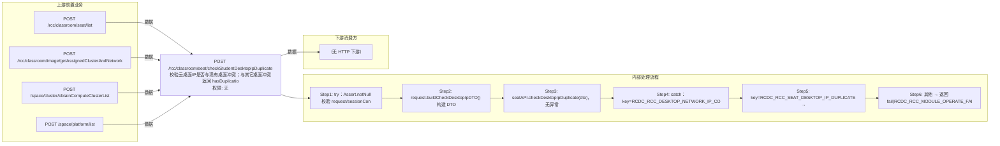

# POST /rcc/classroom/seat/checkStudentDesktopIpDuplicate

> 校验云桌面IP是否与现有桌面冲突；与其它桌面冲突返回 hasDuplication=true（附错误信息），与网络内未知资源冲突也返回冲突但成功响应 ｜ 无特殊权限 ｜ 同步

## 依赖关系全景图

## 接口基本信息

| 项目 | 内容 |
|---|---|
| URL | /rcc/classroom/seat/checkStudentDesktopIpDuplicate |
| Controller | RccSeatConfigController |
| 方法名 | checkStudentDesktopIpDuplicate |
| 权限注解 | 无 |
| 执行方式 | 同步 |
| 业务含义 | 校验云桌面IP是否与现有桌面冲突；与其它桌面冲突返回 hasDuplication=true（附错误信息），与网络内未知资源冲突也返回冲突但成功响应 |

## 入参详情

### CheckDesktopIpRequest

| 参数名 | 类型 | 必填 | 约束 | 说明 |
|---|---|---|---|---|
| seatId | UUID | 否 | @Nullable | 座位ID（编辑时排除自身） |
| studentModeArr | TerminalTypeEnum[] | 是 | @NotNull | 学生机工作模式 |
| vdiDesktopIp | String | 否 | @Nullable | VDI 云桌面IP |
| networkId | UUID | 否 | @Nullable | VDI 网络策略ID |
| clusterId | UUID | 否 | @Nullable | 计算节点ID |
| platformId | UUID | 否 | @Nullable | 云平台ID |

## 出参详情

| 返回类型 | DefaultWebResponse（data=CheckDuplicateResponse 或 ResponseHasDuplicateDTO） |
|---|---|

| 字段 | 类型 | 说明 |
|---|---|---|
| hasDuplication | Boolean | 是否冲突，false 无冲突 / true 有冲突 |
| errorMsg | String | 冲突提示信息（与桌面IP冲突时，仅 ResponseHasDuplicateDTO 场景返回） |

## 上游前置业务

### 前置1：POST /rcc/classroom/seat/list

座位ID来自座位列表查询出参（SeatInfoDTO.id），座位由/rcc/classroom/seat/batchCreate创建（由 field_map 契约映射）

### 前置2：POST /rcc/classroom/image/getAssignedClusterAndNetwork

推断：VDI网络ID来源，字段名为推断（由 field_map 契约映射）

### 前置3：POST /space/cluster/obtainComputeClusterList

推断：计算集群ID来源，字段名为推断（由 field_map 契约映射）

### 前置4：POST /space/platform/list

推断：云平台ID来源，字段名为推断（由 field_map 契约映射）
## 内部处理流程

### 处理流程

1. try：Assert.notNull 校验 request/sessionContext
2. request.buildCheckDesktopIpDTO() 构造 DTO
3. seatAPI.checkDesktopIpDuplicate(dto)，无异常返回 success(new CheckDuplicateResponse())（false）
4. catch：key=RCDC_RCC_DESKTOP_NETWORK_IP_CONFLICT_WITH_DESKTOP → 构造 ResponseHasDuplicateDTO{hasDuplication=true, errorMsg=e.getI18nMessage()} 返回 success
5. key=RCDC_RCC_SEAT_DESKTOP_IP_DUPLICATE → 返回 success(new CheckDuplicateResponse(true))
6. 其他 → 返回 fail(RCDC_RCC_MODULE_OPERATE_FAIL)

## 下游消费方

（本接口数据主要被自身/关联接口消费，或经 SPI 通知）
## 接口参数约束分析

| 层级 | 参数 | 规则 | 失败结果 |
|---|---|---|---|
| PARAM | studentModeArr | @NotNull | 为空参数校验失败 |
| BIZ | vdiDesktopIp | IP 不可与已有桌面/网络内资源冲突 | 冲突以 hasDuplication=true 成功响应返回，不视为接口错误 |

## 参数取值策略

| 参数 | 策略 | 说明 |
|---|---|---|
| seatId | user_input/from_query | 按业务构造 |
| studentModeArr | user_input/from_query | 按业务构造 |
| vdiDesktopIp | user_input/from_query | 按业务构造 |
| networkId | user_input/from_query | 按业务构造 |
| clusterId | user_input/from_query | 按业务构造 |
| platformId | user_input/from_query | 按业务构造 |

## 成功/失败断言基准

### 成功场景

| 场景 | 断言点 |
|---|---|
| IP 可用 | $.status=="SUCCESS" 且 $.content.hasDuplication==false |

### 失败场景

| 场景 | 触发条件 | 断言点 |
|---|---|---|
| IP 与现有桌面冲突 | 抛 RCDC_RCC_DESKTOP_NETWORK_IP_CONFLICT_WITH_DESKTOP | $.status=="SUCCESS" 且 $.content.hasDuplication==true 且 $.content.errorMsg 非空 |
| IP 与未知资源冲突（座位IP重复） | 抛 RCDC_RCC_SEAT_DESKTOP_IP_DUPLICATE | $.status=="SUCCESS" 且 $.content.hasDuplication==true |
| 其它校验异常 | 其它 BusinessException | $.status=="ERROR" 且 $.msgKey=="rcdc_rcc_module_operate_fail" |

## 环境清理机制

| 接口 | 说明 |
|---|---|
| 本接口创建的资源 | 通过对应 delete 接口清理 |

## 前置状态和幂等性标注

| 维度 | 结论 |
|---|---|
| 幂等性 | HIGH |
| 说明 | 纯校验查询，无副作用 |
