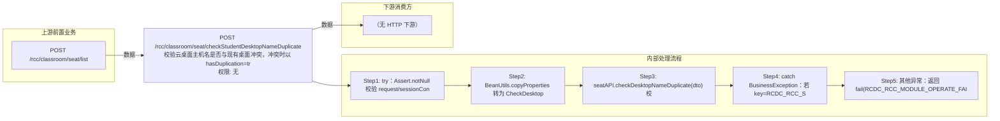

# POST /rcc/classroom/seat/checkStudentDesktopNameDuplicate

> 校验云桌面主机名是否与现有桌面冲突，冲突时以 hasDuplication=true 成功响应返回（而非错误码） ｜ 无特殊权限 ｜ 同步

## 依赖关系全景图

## 接口基本信息

| 项目 | 内容 |
|---|---|
| URL | /rcc/classroom/seat/checkStudentDesktopNameDuplicate |
| Controller | RccSeatConfigController |
| 方法名 | checkStudentDesktopNameDuplicate |
| 权限注解 | 无 |
| 执行方式 | 同步 |
| 业务含义 | 校验云桌面主机名是否与现有桌面冲突，冲突时以 hasDuplication=true 成功响应返回（而非错误码） |

## 入参详情

### CheckDesktopNameRequest

| 参数名 | 类型 | 必填 | 约束 | 说明 |
|---|---|---|---|---|
| seatId | UUID | 否 | @Nullable | 座位ID（编辑时排除自身） |
| desktopName | String | 是 | @NotNull + @Size(min=1,max=14) | 云桌面主机名 |

## 出参详情

| 返回类型 | DefaultWebResponse（data=CheckDuplicateResponse） |
|---|---|

| 字段 | 类型 | 说明 |
|---|---|---|
| hasDuplication | Boolean | 是否冲突，默认false；冲突为true |

## 上游前置业务

### 前置1：POST /rcc/classroom/seat/list

座位ID来自座位列表查询出参（SeatInfoDTO.id），座位由/rcc/classroom/seat/batchCreate创建（由 field_map 契约映射）
## 内部处理流程

### 处理流程

1. try：Assert.notNull 校验 request/sessionContext
2. BeanUtils.copyProperties 转为 CheckDesktopNameDTO
3. seatAPI.checkDesktopNameDuplicate(dto) 校验，无异常返回 success(new CheckDuplicateResponse())（false）
4. catch BusinessException：若 key=RCDC_RCC_SEAT_DESKTOP_NAME_DUPLICATE 返回 success(new CheckDuplicateResponse(true))
5. 其他异常：返回 fail(RCDC_RCC_MODULE_OPERATE_FAIL, e.getI18nMessage())

## 下游消费方

（本接口数据主要被自身/关联接口消费，或经 SPI 通知）
## 接口参数约束分析

| 层级 | 参数 | 规则 | 失败结果 |
|---|---|---|---|
| PARAM | desktopName | @NotNull + @Size(min=1,max=14) | 为空/超长参数校验失败 |
| BIZ | desktopName | 不可与已有桌面主机名重复 | 冲突时响应 hasDuplication=true（业务上视为成功响应） |

## 参数取值策略

| 参数 | 策略 | 说明 |
|---|---|---|
| seatId | user_input/from_query | 按业务构造 |
| desktopName | user_input/from_query | 按业务构造 |

## 成功/失败断言基准

### 成功场景

| 场景 | 断言点 |
|---|---|
| 主机名可用 | $.status=="SUCCESS" 且 $.content.hasDuplication==false |

### 失败场景

| 场景 | 触发条件 | 断言点 |
|---|---|---|
| 主机名已存在 | checkDesktopNameDuplicate 抛 RCDC_RCC_SEAT_DESKTOP_NAME_DUPLICATE | $.status=="SUCCESS" 且 $.content.hasDuplication==true |
| 非冲突类异常 | 其它业务异常 | $.status=="ERROR" 且 $.msgKey=="rcdc_rcc_module_operate_fail" |

## 环境清理机制

| 接口 | 说明 |
|---|---|
| 本接口创建的资源 | 通过对应 delete 接口清理 |

## 前置状态和幂等性标注

| 维度 | 结论 |
|---|---|
| 幂等性 | HIGH |
| 说明 | 纯校验查询，无副作用 |
