# POST /rcc/classroom/seat/create

> 创建单个座位：校验 VDI 配置与权限后，生成随机座位ID并提交批任务异步创建座位（含云桌面） ｜ @EnableAuthority ｜ 异步批处理任务（BatchTask，CreateSeatBatchTaskHandler，enableParallel 单任务项）

## 依赖关系全景图

```mermaid
graph LR
    subgraph 上游前置业务
        A1["POST /rcc/classroom/terminal/list"]
        A2["POST /rcc/classroom/image/getAssignedClusterAndNetwork"]
        A3["POST /space/cluster/obtainComputeClusterList"]
        A4["POST /space/platform/list"]
    end
    B["POST /rcc/classroom/seat/create<br>创建单个座位：校验 VDI 配置与权限后，生成随机座位ID并提交批任务异步创建座<br>权限: @EnableAuthority"]
    A1 -->|数据| B
    A2 -->|数据| B
    A3 -->|数据| B
    A4 -->|数据| B
    subgraph 内部处理流程
        C1["Step1: Assert.notNull 校验 request/builder/sessio"]
        C2["Step2: rccPermissionChecker.checkTerminalGroupP"]
        C3["Step3: request.checkVdiCloudDesktopConfigError("]
        C4["Step4: classroomAPI.getClassroomName(classroomI"]
        C5["Step5: BeanUtils.copyProperties 转为 CreateSeatDT"]
        C6["Step6: 构造 CreateSeatBatchTaskItem 与 CreateSeatB"]
        C1 --> C2
        C7["Step7: builder.setTaskName(RCDC_RCC_SEAT_OPERAT"]
        C8["Step8: 返回 DefaultWebResponse.success(result)"]
        C6 --> C7
        C7 --> C8
        C2 --> C3
        C3 --> C4
        C4 --> C5
        C5 --> C6
    end
    B --> C1
    subgraph 下游消费方
        D1["POST /rcc/classroom/seat/list、/rcc/classroom/seat/edit、/rcc/classroom/seat/delete"]
    end
    B -->|数据| D1
```

## 接口基本信息

| 项目 | 内容 |
|---|---|
| URL | /rcc/classroom/seat/create |
| Controller | RccSeatConfigController |
| 方法名 | createSeat |
| 权限注解 | @EnableAuthority |
| 执行方式 | 异步批处理任务（BatchTask，CreateSeatBatchTaskHandler，enableParallel 单任务项） |
| 业务含义 | 创建单个座位：校验 VDI 配置与权限后，生成随机座位ID并提交批任务异步创建座位（含云桌面） |

## 入参详情

### CreateSeatWebRequest

| 参数名 | 类型 | 必填 | 约束 | 说明 |
|---|---|---|---|---|
| classroomId | UUID | 是 | @NotNull | 教室ID |
| desktopName | String | 是 | @NotNull + @Size(max=8) | 云桌面主机名 |
| studentModeArr | TerminalTypeEnum[] | 是 | @NotEmpty | 学生机工作模式数组 |
| vdiDesktopIp | String | 否 | @Nullable | VDI 云桌面IP |
| networkId | UUID | 否 | @Nullable | VDI 网络策略ID |
| clusterId | UUID | 否 | @Nullable | 计算节点ID |
| platformId | UUID | 否 | @Nullable | 云平台ID |
| idvDesktopIp | String | 否 | @Nullable | IDV 云桌面IP |
| idvDesktopMask | String | 否 | @Nullable | IDV 云桌面掩码 |
| idvDesktopGateway | String | 否 | @Nullable | IDV 云桌面网关 |
| idvDesktopDns | String | 否 | @Nullable | IDV 云桌面DNS |

## 出参详情

| 返回类型 | DefaultWebResponse（data=BatchTaskSubmitResult） |
|---|---|

| 字段 | 类型 | 说明 |
|---|---|---|
| taskId | UUID | 提交成功的批处理任务标识 |
| taskStatus | String | 批任务初始状态 |

## 上游前置业务

### 前置1：POST /rcc/classroom/terminal/list

教室ID在创建教室(POST /rcc/classroom/create)后经教室终端列表查询获得（ViewClassroomInfoEntity.classroomId）（由 field_map 契约映射）

### 前置2：POST /rcc/classroom/image/getAssignedClusterAndNetwork

推断：VDI网络ID来源，字段名为推断（由 field_map 契约映射）

### 前置3：POST /space/cluster/obtainComputeClusterList

推断：计算集群ID来源，字段名为推断（由 field_map 契约映射）

### 前置4：POST /space/platform/list

推断：云平台ID来源，字段名为推断（由 field_map 契约映射）
## 内部处理流程

### 批量处理器：CreateSeatBatchTaskHandler

| 步骤 | 说明 |
|---|---|
| 1 | 从 CreateSeatBatchTaskItem 取 CreateSeatDTO |
| 2 | seatAPI.createSeat(createSeatDTO) 创建座位 |
| 3 | 成功：auditLogAPI.recordLog(RCDC_RCC_SEAT_OPERATE_CREATE_SINGLE_SUC_LOG) 返回 SUCCESS |
| 4 | BusinessException：recordLog(CREATE_SINGLE_FAIL_LOG) 返回 FAILURE |

### 处理流程

1. Assert.notNull 校验 request/builder/sessionContext
2. rccPermissionChecker.checkTerminalGroupPermissionByClassroomId 校验权限
3. request.checkVdiCloudDesktopConfigError() 校验 VDI 配置成对
4. classroomAPI.getClassroomName(classroomId) 取教室名
5. BeanUtils.copyProperties 转为 CreateSeatDTO 并 set id=UUID.randomUUID()
6. 构造 CreateSeatBatchTaskItem 与 CreateSeatBatchTaskHandler（注入 networkWhiteListAPI/classroomName）
7. builder.setTaskName(RCDC_RCC_SEAT_OPERATE_CREATE_SINGLE_TASK_NAME).enableParallel().registerHandler().start()
8. 返回 DefaultWebResponse.success(result)

## 下游消费方

### 消费1：POST /rcc/classroom/seat/list、/rcc/classroom/seat/edit、/rcc/classroom/seat/delete

单个创建座位产出座位ID（服务端生成），经座位列表查询可见（由 field_map 契约映射）
## 接口参数约束分析

| 层级 | 参数 | 规则 | 失败结果 |
|---|---|---|---|
| PARAM | desktopName | @NotNull + @Size(max=8) | 为空/超长参数校验失败（RCDC_RCC_SEAT_DESKTOP_NAME_INVALID/NAME_LENGTH_INALID） |
| PARAM | studentModeArr | @NotEmpty | 为空参数校验失败 |
| BIZ | VDI配置组 | vdiDesktopIp/networkId/clusterId/platformId 成对出现 | 不完整抛 RCDC_RCC_VDI_CLOUD_DESKTOP_CONFIG_ERROR |
| BIZ | classroomId | 教室必须存在 | 教室不存在时创建失败 |
| BIZ | desktopName | 主机名不可与现有桌面重复 | RCDC_RCC_SEAT_DESKTOP_NAME_DUPLICATE |

## 参数取值策略

| 参数 | 策略 | 说明 |
|---|---|---|
| classroomId | user_input/from_query | 按业务构造 |
| desktopName | user_input/from_query | 按业务构造 |
| studentModeArr | user_input/from_query | 按业务构造 |
| vdiDesktopIp | user_input/from_query | 按业务构造 |
| networkId | user_input/from_query | 按业务构造 |
| clusterId | user_input/from_query | 按业务构造 |
| platformId | user_input/from_query | 按业务构造 |
| idvDesktopIp | user_input/from_query | 按业务构造 |
| idvDesktopMask | user_input/from_query | 按业务构造 |
| idvDesktopGateway | user_input/from_query | 按业务构造 |
| idvDesktopDns | user_input/from_query | 按业务构造 |

## 成功/失败断言基准

### 成功场景

| 场景 | 断言点 |
|---|---|
| 传入有效教室与合法配置 | $.status=="SUCCESS" 且 $.content.taskId 非空；批任务创建座位并审计成功；轮询 content.taskId（2000ms 间隔）至终态 batchTaskItemStatus∈["SUCCESS"] |

### 失败场景

| 场景 | 触发条件 | 断言点 |
|---|---|---|
| 主机名重复 | createSeat 批任务内抛冲突错误 | $.status=="SUCCESS" 且 $.content.taskId 非空；轮询 content.taskId 至终态 batchTaskItemStatus==FAILURE（审计 RCDC_RCC_SEAT_OPERATE_SEAT_CREATE_SINGLE_FAIL_LOG） |
| VDI配置不完整 | checkVdiCloudDesktopConfigError | $.status=="ERROR" 且 $.msgKey=="rcdc_rcc_vdi_cloud_desktop_config_error" |

## 环境清理机制

| 接口 | 说明 |
|---|---|
| 本接口创建的资源 | 通过对应 delete 接口清理 |

## 前置状态和幂等性标注

| 维度 | 结论 |
|---|---|
| 幂等性 | LOW |
| 说明 | 重复提交会创建多个座位（每次生成随机ID，无去重） |
