# POST /rcc/classroom/seat/delete

> 删除教室座位：先校验教室状态与座位桌面状态允许删除，归还VDI IP段，再批处理逐台删除座位（可选仅删数据库记录）；涉及亲和性/网络白名单清理 ｜ @EnableAuthority ｜ 异步批处理任务（BatchTask，DeleteSeatBatchTaskHandler，enableParallel 并行）

## 依赖关系全景图

```mermaid
graph LR
    subgraph 上游前置业务
        A1["POST /rcc/classroom/terminal/list"]
        A2["POST /rcc/classroom/seat/list"]
    end
    B["POST /rcc/classroom/seat/delete<br>删除教室座位：先校验教室状态与座位桌面状态允许删除，归还VDI IP段，再批处理<br>权限: @EnableAuthority"]
    A1 -->|数据| B
    A2 -->|数据| B
    subgraph 内部处理流程
        C1["Step1: Assert.notNull 校验 request/builder/sessio"]
        C2["Step2: rccPermissionChecker.checkTerminalGroupP"]
        C3["Step3: classroomAPI.getClassroomName(classroomI"]
        C4["Step4: try：seatAPI.checkCanDeleteSeat(classroom"]
        C5["Step5: 构造 DefaultBatchTaskItem 迭代器（RCDC_RCC_SEA"]
        C6["Step6: seatAPI.findVdiIpListBySeatIdArr 查VDI IP"]
        C1 --> C2
        C7["Step7: 构造 DeleteSeatBatchTaskHandler 并注入 rccAff"]
        C8["Step8: builder.setTaskName(RCDC_RCC_SEAT_OPERAT"]
        C9["Step9: catch BusinessException：审计 RCDC_RCC_DELE"]
        C6 --> C7
        C7 --> C8
        C8 --> C9
        C2 --> C3
        C3 --> C4
        C4 --> C5
        C5 --> C6
    end
    B --> C1
    subgraph 下游消费方
        D1["（无 HTTP 下游）"]
    end
    B -->|数据| D1
```

## 接口基本信息

| 项目 | 内容 |
|---|---|
| URL | /rcc/classroom/seat/delete |
| Controller | RccSeatConfigController |
| 方法名 | deleteSeat |
| 权限注解 | @EnableAuthority |
| 执行方式 | 异步批处理任务（BatchTask，DeleteSeatBatchTaskHandler，enableParallel 并行） |
| 业务含义 | 删除教室座位：先校验教室状态与座位桌面状态允许删除，归还VDI IP段，再批处理逐台删除座位（可选仅删数据库记录）；涉及亲和性/网络白名单清理 |

## 入参详情

### DeleteSeatRequest

| 参数名 | 类型 | 必填 | 约束 | 说明 |
|---|---|---|---|---|
| classroomId | UUID | 是 | @NotNull | 教室ID |
| seatIdArr | UUID[] | 是 | @NotEmpty | 待删除的座位ID数组 |
| shouldOnlyDeleteDataFromDb | Boolean | 否 | @Nullable | 是否仅从数据库删除数据（跳过云桌面销毁等） |

## 出参详情

| 返回类型 | DefaultWebResponse（data=BatchTaskSubmitResult） |
|---|---|

| 字段 | 类型 | 说明 |
|---|---|---|
| taskId | UUID | 提交成功的批处理任务标识 |
| taskStatus | String | 批任务初始状态 |

## 上游前置业务

### 前置1：POST /rcc/classroom/terminal/list

教室ID在创建教室(POST /rcc/classroom/create)后经教室终端列表查询获得（ViewClassroomInfoEntity.classroomId）（由 field_map 契约映射）

### 前置2：POST /rcc/classroom/seat/list

座位ID数组来自座位列表查询出参（SeatInfoDTO.id），座位由/rcc/classroom/seat/batchCreate创建（由 field_map 契约映射）
## 内部处理流程

### 批量处理器：DeleteSeatBatchTaskHandler

| 步骤 | 说明 |
|---|---|
| 1 | seatAPI.getSeatInfo(seatId) 取桌面名 |
| 2 | seatAPI.addDeleteSeatSet(seatId) 标记删除集合（防并发） |
| 3 | shouldOnlyDeleteDataFromDb=true → seatAPI.deleteSeatFromDb；否则 seatAPI.deleteSeat |
| 4 | 座位存在 vdiDesktopIp 则加入 deleteVDIIpList（后续归还IP） |
| 5 | seatAPI.removeDeleteSeatSet(seatId) 移除标记 |
| 6 | 成功：auditLogAPI.recordLog(SEAT_DELETE_SINGLE_SUC_LOG / FORCE_DELETE_SINGLE_SUC_LOG) 返回 SUCCESS |
| 7 | BusinessException：removeDeleteSeatSet 后 recordLog(FAIL_LOG) 返回 FAILURE |

### 处理流程

1. Assert.notNull 校验 request/builder/sessionContext
2. rccPermissionChecker.checkTerminalGroupPermissionByClassroomId 校验权限
3. classroomAPI.getClassroomName(classroomId) 取教室名
4. try：seatAPI.checkCanDeleteSeat(classroomSeatDTO, shouldOnlyDeleteDataFromDb) 校验可删
5. 构造 DefaultBatchTaskItem 迭代器（RCDC_RCC_SEAT_OPERATE_SEAT_DELETE_SINGLE_ITEM_NAME）
6. seatAPI.findVdiIpListBySeatIdArr 查VDI IP，非空则 vdiIpDeliverAPI.resetIpSegment(classroomId, vdiIpList) 归还IP段
7. 构造 DeleteSeatBatchTaskHandler 并注入 rccAffinityAPI/networkWhiteListAPI/vdiIpDeliverAPI/shouldOnlyDeleteDataFromDb
8. builder.setTaskName(RCDC_RCC_SEAT_OPERATE_SEAT_DELETE_SINGLE_TASK_NAME).enableParallel().registerHandler().start()
9. catch BusinessException：审计 RCDC_RCC_DELETE_SEAT_FAIL_LOG 并返回 fail

## 下游消费方

（本接口数据主要被自身/关联接口消费，或经 SPI 通知）
## 接口参数约束分析

| 层级 | 参数 | 规则 | 失败结果 |
|---|---|---|---|
| PARAM | classroomId | @NotNull | 为空参数校验失败 |
| PARAM | seatIdArr | @NotEmpty | 为空参数校验失败 |
| PERM | classroomId | 教室终端组权限 | 无权限抛业务异常 |
| BIZ | seat状态 | 座位上课中/桌面运行中不可删除 | checkCanDeleteSeat 抛 RCDC_RCC_SEAT_DEL_SEAT_ONLINE / RCDC_RCC_SEAT_DEL_SEAT_DESKTOP_ONLINE |
| BIZ | seatId | 座位必须存在 | RCDC_RCC_SEAT_NOT_FOUND |
| CONCURRENCY | deleteSeatSet | 同座位并发删除保护 | addDeleteSeatSet/removeDeleteSeatSet 标记避免重复删除 |

## 参数取值策略

| 参数 | 策略 | 说明 |
|---|---|---|
| classroomId | user_input/from_query | 按业务构造 |
| seatIdArr | user_input/from_query | 按业务构造 |
| shouldOnlyDeleteDataFromDb | user_input/from_query | 按业务构造 |

## 成功/失败断言基准

### 成功场景

| 场景 | 断言点 |
|---|---|
| 教室空闲且座位/桌面未运行 | $.status=="SUCCESS" 且 $.content.taskId 非空；批任务逐台删除座位并审计成功；轮询 content.taskId（2000ms 间隔）至终态 batchTaskItemStatus∈["SUCCESS"] |

### 失败场景

| 场景 | 触发条件 | 断言点 |
|---|---|---|
| 座位上课中或桌面运行中 | checkCanDeleteSeat 抛错 | $.status=="ERROR" 且 $.msgKey=="rcdc_rcc_module_operate_fail"；审计 RCDC_RCC_DELETE_SEAT_FAIL_LOG |
| 部分删除失败 | 单台删除抛错 | $.status=="SUCCESS" 且 $.content.taskId 非空；轮询 content.taskId 至终态 batchTaskItemStatus==FAILURE，其余继续执行 |
| 仅删数据库模式 | shouldOnlyDeleteDataFromDb=true | $.status=="SUCCESS" 且 $.content.taskId 非空；跳过云桌面销毁，直接删除DB记录，批任务项仍为 SUCCESS |

## 环境清理机制

| 接口 | 说明 |
|---|---|
| 本接口创建的资源 | 通过对应 delete 接口清理 |

## 前置状态和幂等性标注

| 维度 | 结论 |
|---|---|
| 幂等性 | LOW |
| 说明 | 重复提交时已删除座位会抛 RCDC_RCC_SEAT_NOT_FOUND 类错误；有 deleteSeatSet 标记但无全局幂等键 |
