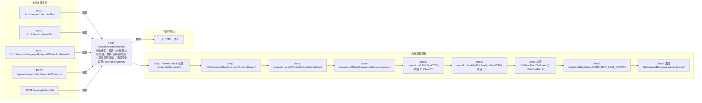

# POST /rcc/classroom/seat/edit

> 修改座位：校验 VDI 配置与权限后，先执行编辑前校验（提前提示错误），再提交批任务异步执行座位编辑（主机名/模式/网络配置变更） ｜ @EnableAuthority ｜ 异步批处理任务（BatchTask，EditSeatBatchTaskHandler，enableParallel 单任务项）

## 依赖关系全景图

## 接口基本信息

| 项目 | 内容 |
|---|---|
| URL | /rcc/classroom/seat/edit |
| Controller | RccSeatConfigController |
| 方法名 | editSeat |
| 权限注解 | @EnableAuthority |
| 执行方式 | 异步批处理任务（BatchTask，EditSeatBatchTaskHandler，enableParallel 单任务项） |
| 业务含义 | 修改座位：校验 VDI 配置与权限后，先执行编辑前校验（提前提示错误），再提交批任务异步执行座位编辑（主机名/模式/网络配置变更） |

## 入参详情

### EditSeatWebRequest

| 参数名 | 类型 | 必填 | 约束 | 说明 |
|---|---|---|---|---|
| classroomId | UUID | 是 | @NotNull | 教室ID |
| seatId | UUID | 是 | @NotNull | 座位ID |
| desktopName | String | 是 | @NotNull + @Size(max=8) | 云桌面主机名 |
| studentModeArr | TerminalTypeEnum[] | 是 | @NotNull | 学生机工作模式数组 |
| vdiDesktopIp | String | 否 | @Nullable | VDI 云桌面IP |
| networkId | UUID | 否 | @Nullable | VDI 网络策略ID |
| clusterId | UUID | 否 | @Nullable | 计算节点ID |
| platformId | UUID | 否 | @Nullable | 云平台ID |
| idvDesktopIp | String | 否 | @Nullable | IDV 云桌面IP |
| idvDesktopMask | String | 否 | @Nullable | IDV 云桌面掩码 |
| idvDesktopGateway | String | 否 | @Nullable | IDV 云桌面网关 |
| idvDesktopDns | String | 否 | @Nullable | IDV 云桌面DNS |

## 出参详情

| 返回类型 | DefaultWebResponse（data=BatchTaskSubmitResult） |
|---|---|

| 字段 | 类型 | 说明 |
|---|---|---|
| taskId | UUID | 提交成功的批处理任务标识 |
| taskStatus | String | 批任务初始状态 |

## 上游前置业务

### 前置1：POST /rcc/classroom/terminal/list

教室ID在创建教室(POST /rcc/classroom/create)后经教室终端列表查询获得（ViewClassroomInfoEntity.classroomId）（由 field_map 契约映射）

### 前置2：POST /rcc/classroom/seat/list

座位ID来自座位列表查询出参（SeatInfoDTO.id），座位由/rcc/classroom/seat/batchCreate创建（由 field_map 契约映射）

### 前置3：POST /rcc/classroom/image/getAssignedClusterAndNetwork

推断：VDI网络ID来源，字段名为推断（由 field_map 契约映射）

### 前置4：POST /space/cluster/obtainComputeClusterList

推断：计算集群ID来源，字段名为推断（由 field_map 契约映射）

### 前置5：POST /space/platform/list

推断：云平台ID来源，字段名为推断（由 field_map 契约映射）
## 内部处理流程

### 批量处理器：EditSeatBatchTaskHandler

| 步骤 | 说明 |
|---|---|
| 1 | 从 EditSeatBatchTaskItem 取 EditSeatDTO |
| 2 | seatAPI.editSeat(editSeatDTO) 执行编辑 |
| 3 | 成功：auditLogAPI.recordLog(RCDC_RCC_SEAT_OPERATE_EDIT_SINGLE_SUC_LOG) 返回 SUCCESS |
| 4 | BusinessException：recordLog(EDIT_SINGLE_FAIL_LOG) 返回 FAILURE |

### 处理流程

1. Assert.notNull 校验 request/builder/sessionContext
2. rccPermissionChecker.checkTerminalGroupPermissionByClassroomId 校验权限
3. request.checkVdiCloudDesktopConfigError() 校验 VDI 配置成对
4. classroomAPI.getClassroomName(classroomId) 取教室名
5. request.buildEditSeatDTO() 构造 EditSeatDTO
6. seatAPI.checkForEditSeat(editSeatDTO) 编辑前预校验
7. 构造 EditSeatBatchTaskItem 与 EditSeatBatchTaskHandler（注入 classroomName）
8. builder.setTaskName(RCDC_RCC_SEAT_OPERATE_EDIT_SINGLE_TASK_NAME).enableParallel().registerHandler().start()
9. 返回 DefaultWebResponse.success(result)

## 下游消费方

（本接口数据主要被自身/关联接口消费，或经 SPI 通知）
## 接口参数约束分析

| 层级 | 参数 | 规则 | 失败结果 |
|---|---|---|---|
| PARAM | seatId | @NotNull | 为空参数校验失败 |
| PARAM | desktopName | @NotNull + @Size(max=8) | 为空/超长参数校验失败 |
| PARAM | studentModeArr | @NotNull | 为空参数校验失败 |
| BIZ | VDI配置组 | vdiDesktopIp/networkId/clusterId/platformId 成对出现 | 不完整抛 RCDC_RCC_VDI_CLOUD_DESKTOP_CONFIG_ERROR |
| BIZ | seatId | 座位必须存在 | RCDC_RCC_SEAT_NOT_FOUND |
| BIZ | seat状态 | 上课中/运行中不可编辑 | RCDC_RCC_SEAT_IN_LESSON / RCDC_RCC_SEAT_IN_RUNNING |
| BIZ | desktopName/vdiDesktopIp | 不可与其它桌面冲突 | RCDC_RCC_SEAT_DESKTOP_NAME_DUPLICATE / RCDC_RCC_SEAT_DESKTOP_IP_DUPLICATE |

## 参数取值策略

| 参数 | 策略 | 说明 |
|---|---|---|
| classroomId | user_input/from_query | 按业务构造 |
| seatId | user_input/from_query | 按业务构造 |
| desktopName | user_input/from_query | 按业务构造 |
| studentModeArr | user_input/from_query | 按业务构造 |
| vdiDesktopIp | user_input/from_query | 按业务构造 |
| networkId | user_input/from_query | 按业务构造 |
| clusterId | user_input/from_query | 按业务构造 |
| platformId | user_input/from_query | 按业务构造 |
| idvDesktopIp | user_input/from_query | 按业务构造 |
| idvDesktopMask | user_input/from_query | 按业务构造 |
| idvDesktopGateway | user_input/from_query | 按业务构造 |
| idvDesktopDns | user_input/from_query | 按业务构造 |

## 成功/失败断言基准

### 成功场景

| 场景 | 断言点 |
|---|---|
| 教室空闲且配置合法 | $.status=="SUCCESS" 且 $.content.taskId 非空；批任务执行编辑并审计成功；轮询 content.taskId（2000ms 间隔）至终态 batchTaskItemStatus∈["SUCCESS"] |

### 失败场景

| 场景 | 触发条件 | 断言点 |
|---|---|---|
| 座位上课中/运行中 | checkForEditSeat 预校验抛错 | $.status=="ERROR" 且 $.msgKey∈["rcdc_rcc_seat_in_lesson","rcdc_rcc_seat_in_running"]；无任务提交 |
| 主机名/IP冲突 | 预校验抛冲突错误 | $.status=="ERROR" 且 $.msgKey∈["rcdc_rcc_seat_desktop_name_duplicate","rcdc_rcc_desktop_network_ip_conflict_with_desktop"]（以实际预校验 key 为准） |
| VDI配置不完整 | checkVdiCloudDesktopConfigError | $.status=="ERROR" 且 $.msgKey=="rcdc_rcc_vdi_cloud_desktop_config_error" |

## 环境清理机制

| 接口 | 说明 |
|---|---|
| 本接口创建的资源 | 通过对应 delete 接口清理 |

## 前置状态和幂等性标注

| 维度 | 结论 |
|---|---|
| 幂等性 | LOW |
| 说明 | 重复提交按相同配置编辑无实际变化，但每次都会重新下发编辑命令 |
