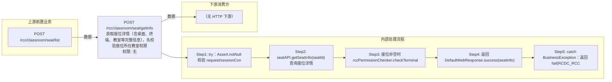

# POST /rcc/classroom/seat/getInfo

> 获取座位详情（含桌面、终端、教室等完整信息），先校验座位所在教室权限 ｜ 无特殊权限 ｜ 同步

## 依赖关系全景图

## 接口基本信息

| 项目 | 内容 |
|---|---|
| URL | /rcc/classroom/seat/getInfo |
| Controller | RccSeatConfigController |
| 方法名 | getSeatInfo |
| 权限注解 | 无 |
| 执行方式 | 同步 |
| 业务含义 | 获取座位详情（含桌面、终端、教室等完整信息），先校验座位所在教室权限 |

## 入参详情

### SeatIdRequest

| 参数名 | 类型 | 必填 | 约束 | 说明 |
|---|---|---|---|---|
| seatId | UUID | 是 | @NotNull | 座位ID |

## 出参详情

| 返回类型 | DefaultWebResponse（data=SeatInfoDTO） |
|---|---|

| 字段 | 类型 | 说明 |
|---|---|---|
| id | UUID | 座位ID |
| classroomId | UUID | 教室ID |
| classroomName | String | 教室名称 |
| desktopName | String | 云桌面主机名 |
| studentModeArr | TerminalTypeEnum[] | 学生机工作模式 |
| terminalModeArr | TerminalTypeEnum[] | 终端工作模式 |
| imageTemplateName | String | 镜像模板名称 |
| vdiDesktopId | UUID | VDI桌面ID |
| vdiDesktopIp | String | VDI桌面IP |
| vdiDesktopGateway | String | VDI桌面网关 |
| vdiDesktopMask | String | VDI桌面掩码 |
| vdiDesktopDnsPrimary | String | VDI桌面首选DNS |
| vdiDesktopDnsSecondary | String | VDI桌面备用DNS |
| idvDesktopId | UUID | IDV桌面ID |
| idvDesktopIp | String | IDV桌面IP |
| idvDesktopGateway | String | IDV桌面网关 |
| idvDesktopMask | String | IDV桌面掩码 |
| idvDesktopDns | String | IDV桌面DNS |
| idvDesktopState | CbbCloudDeskState | IDV桌面状态 |
| seatNum | Integer | 座位号 |
| disableNetwork | Boolean | 是否禁网 |
| terminalId | String | 终端ID |
| terminalName | String | 终端名称 |
| terminalRainOsVersion | String | 终端RainOS版本 |
| terminalHardwareVersion | String | 终端硬件版本 |
| terminalUpgradeVersion | String | 终端升级版本 |
| terminalMac | String | 终端MAC |
| terminalIp | String | 终端IP |
| terminalCpu | String | 终端CPU型号 |
| terminalMemory | Long | 终端内存大小 |
| terminalProductModel | String | 终端产品型号 |
| terminalSerialNum | String | 终端序列号 |
| terminalPlatform | CbbTerminalPlatformEnums | 终端平台 |
| terminalState | CbbTerminalStateEnums | 终端状态 |
| desktopState | CbbCloudDeskState | 桌面状态 |
| classroomState | ClassroomLessonStatusEnum | 教室状态 |
| terminalType | String | 终端类型 |
| productId | String | 产品ID |
| terminalStartMode | CbbTerminalStartMode | 终端启动模式 |
| terminalResolution | String | 终端分辨率 |
| isTerminalLocked | Boolean | 终端是否锁定 |
| lastOnlineTime | Date | 最后上线时间 |
| seatDownloadState | SeatDownloadStateEnum | 座位下载状态 |
| vdiDesktopState | CbbCloudDeskState | VDI桌面状态 |
| bootManageMode | CbbTerminalBootManageModeEnums | 终端引导管理模式 |
| seatStatus | SeatStateEnums | 座位状态 |
| vdiLocalDiskId | UUID | VDI本地磁盘ID |
| terminalNeedUpgrade | Boolean | 终端是否需要升级 |
| deployMode | String | 部署模式 |
| canTerminalInit | Boolean | 是否支持终端初始化 |
| softwareVersion | String | 软件版本 |
| sourceIp | String | 来源IP |
| platformStatus | CloudPlatformStatus | 云平台状态 |

## 上游前置业务

### 前置1：POST /rcc/classroom/seat/list

座位ID来自座位列表查询出参（SeatInfoDTO.id），座位由/rcc/classroom/seat/batchCreate创建（由 field_map 契约映射）
## 内部处理流程

### 处理流程

1. try：Assert.notNull 校验 request/sessionContext
2. seatAPI.getSeatInfo(seatId) 查询座位详情
3. 座位非空时 rccPermissionChecker.checkTerminalGroupPermissionByClassroomId(seatInfo.getClassroomId) 校验权限
4. 返回 DefaultWebResponse.success(seatInfo)
5. catch BusinessException：返回 fail(RCDC_RCC_MODULE_OPERATE_FAIL, e.getI18nMessage())

## 下游消费方

（本接口数据主要被自身/关联接口消费，或经 SPI 通知）
## 接口参数约束分析

| 层级 | 参数 | 规则 | 失败结果 |
|---|---|---|---|
| PARAM | seatId | @NotNull | 为空参数校验失败 |
| PERM | seatId | 座位所在教室终端组权限 | 座位存在时无权限抛业务异常 |
| BIZ | seatId | 座位必须存在 | getSeatInfo 抛错返回 fail |

## 参数取值策略

| 参数 | 策略 | 说明 |
|---|---|---|
| seatId | user_input/from_query | 按业务构造 |

## 成功/失败断言基准

### 成功场景

| 场景 | 断言点 |
|---|---|
| 传入有效座位ID且有权限 | $.status=="SUCCESS" 且 $.content.id 非空 |

### 失败场景

| 场景 | 触发条件 | 断言点 |
|---|---|---|
| 座位不存在 | getSeatInfo 抛错 | $.status=="ERROR" 且 $.msgKey=="rcdc_rcc_module_operate_fail" |
| 无权限 | 权限校验抛错 | $.status=="ERROR"（数据权限校验失败） |

## 环境清理机制

| 接口 | 说明 |
|---|---|
| 本接口创建的资源 | 通过对应 delete 接口清理 |

## 前置状态和幂等性标注

| 维度 | 结论 |
|---|---|
| 幂等性 | HIGH |
| 说明 | 纯查询，无副作用 |
