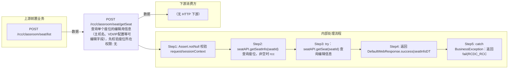

# POST /rcc/classroom/seat/getSeat

> 查询单个座位的编辑用信息（主机名、VDI/IP配置等可编辑字段），先校验座位所在教室权限 ｜ 无特殊权限 ｜ 同步

## 依赖关系全景图

## 接口基本信息

| 项目 | 内容 |
|---|---|
| URL | /rcc/classroom/seat/getSeat |
| Controller | RccSeatConfigController |
| 方法名 | getSeat |
| 权限注解 | 无 |
| 执行方式 | 同步 |
| 业务含义 | 查询单个座位的编辑用信息（主机名、VDI/IP配置等可编辑字段），先校验座位所在教室权限 |

## 入参详情

### SeatIdRequest

| 参数名 | 类型 | 必填 | 约束 | 说明 |
|---|---|---|---|---|
| seatId | UUID | 是 | @NotNull | 座位ID |

## 出参详情

| 返回类型 | DefaultWebResponse（data=EditSeatInfoDTO） |
|---|---|

| 字段 | 类型 | 说明 |
|---|---|---|
| desktopName | String | 云桌面主机名（可编辑字段） |
| vdiDesktopIp | String | VDI 云桌面IP（可编辑字段） |
| idvDesktopIp | String | IDV 云桌面IP（可编辑字段） |
| idvDesktopMask | String | IDV 云桌面掩码（可编辑字段） |
| idvDesktopGateway | String | IDV 云桌面网关（可编辑字段） |
| idvDesktopDns | String | IDV 云桌面DNS（可编辑字段） |

## 上游前置业务

### 前置1：POST /rcc/classroom/seat/list

座位ID来自座位列表查询出参（SeatInfoDTO.id），座位由/rcc/classroom/seat/batchCreate创建（由 field_map 契约映射）
## 内部处理流程

### 处理流程

1. Assert.notNull 校验 request/sessionContext
2. seatAPI.getSeatInfo(seatId) 查询座位，非空时 rccPermissionChecker.checkTerminalGroupPermissionByClassroomId(seatInfo.getClassroomId) 校验权限
3. try：seatAPI.getSeat(seatId) 查询编辑信息
4. 返回 DefaultWebResponse.success(seatInfoDTO)
5. catch BusinessException：返回 fail(RCDC_RCC_MODULE_OPERATE_FAIL, e.getI18nMessage())

## 下游消费方

（本接口数据主要被自身/关联接口消费，或经 SPI 通知）
## 接口参数约束分析

| 层级 | 参数 | 规则 | 失败结果 |
|---|---|---|---|
| PARAM | seatId | @NotNull | 为空参数校验失败 |
| PERM | seatId | 座位所在教室终端组权限 | 座位存在时无权限抛业务异常 |
| BIZ | seatId | 座位必须存在 | getSeat 抛 RCDC_RCC_SEAT_NOT_FOUND 返回 fail |

## 参数取值策略

| 参数 | 策略 | 说明 |
|---|---|---|
| seatId | user_input/from_query | 按业务构造 |

## 成功/失败断言基准

### 成功场景

| 场景 | 断言点 |
|---|---|
| 传入有效座位ID且有权限 | 返回 EditSeatInfoDTO（主机名与网络配置） |

### 失败场景

| 场景 | 触发条件 | 断言点 |
|---|---|---|
| 座位不存在 | getSeat 抛错 | 接口返回 fail |
| 无权限 | 权限校验抛错 | 业务异常 |
| seatId 为空 | 请求缺参 | 参数校验失败 |

## 环境清理机制

| 接口 | 说明 |
|---|---|
| 本接口创建的资源 | 通过对应 delete 接口清理 |

## 前置状态和幂等性标注

| 维度 | 结论 |
|---|---|
| 幂等性 | HIGH |
| 说明 | 纯查询，无副作用 |
