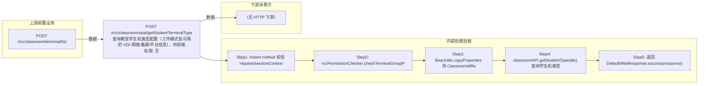

# POST /rcc/classroom/seat/getStudentTerminalType

> 查询教室学生机类型配置（工作模式及可用的 VDI 网络/集群/平台信息），供前端配置学生机类型 ｜ 无特殊权限 ｜ 同步

## 依赖关系全景图

## 接口基本信息

| 项目 | 内容 |
|---|---|
| URL | /rcc/classroom/seat/getStudentTerminalType |
| Controller | RccSeatConfigController |
| 方法名 | getStudentTerminalType |
| 权限注解 | 无 |
| 执行方式 | 同步 |
| 业务含义 | 查询教室学生机类型配置（工作模式及可用的 VDI 网络/集群/平台信息），供前端配置学生机类型 |

## 入参详情

### ClassroomIdRequest

| 参数名 | 类型 | 必填 | 约束 | 说明 |
|---|---|---|---|---|
| classroomId | UUID | 是 | @NotNull | 教室ID |

## 出参详情

| 返回类型 | DefaultWebResponse（data=StudentModeResponse） |
|---|---|

| 字段 | 类型 | 说明 |
|---|---|---|
| studentModeArr | TerminalTypeEnum[] | 学生机工作模式数组（PC/VDI/IDV/VOI等） |
| networkIpList | List<IpPoolDTO> | 可用网络IP池列表（元素字段见下） |
| ipSegment | String | IP池网段（IpPoolDTO 元素字段） |
| refCount | Integer | 已用IP数（IpPoolDTO 元素字段） |
| totalCount | Integer | IP总数（IpPoolDTO 元素字段） |
| networkId | UUID | VDI网络策略ID |
| clusterId | UUID | 计算节点ID |
| platformId | UUID | 云平台ID |

## 上游前置业务

### 前置1：POST /rcc/classroom/terminal/list

教室ID在创建教室(POST /rcc/classroom/create)后经教室终端列表查询获得（ViewClassroomInfoEntity.classroomId）（由 field_map 契约映射）
## 内部处理流程

### 处理流程

1. Assert.notNull 校验 request/sessionContext
2. rccPermissionChecker.checkTerminalGroupPermissionByClassroomId 校验权限
3. BeanUtils.copyProperties 将 ClassroomIdRequest 转为 StudentTerminalTypeDTO
4. classroomAPI.getStudentType(dto) 查询学生机类型
5. 返回 DefaultWebResponse.success(response)

## 下游消费方

（本接口数据主要被自身/关联接口消费，或经 SPI 通知）
## 接口参数约束分析

| 层级 | 参数 | 规则 | 失败结果 |
|---|---|---|---|
| PARAM | classroomId | @NotNull | 为空时参数校验失败 |
| PERM | classroomId | 教室终端组权限 | 无权限抛业务异常 |

## 参数取值策略

| 参数 | 策略 | 说明 |
|---|---|---|
| classroomId | user_input/from_query | 按业务构造 |

## 成功/失败断言基准

### 成功场景

| 场景 | 断言点 |
|---|---|
| 传入有效教室ID | $.status=="SUCCESS" 且 $.content.studentModeArr 非空 |

### 失败场景

| 场景 | 触发条件 | 断言点 |
|---|---|---|
| classroomId 为空 | 请求缺参 | $.status=="ERROR"（参数校验失败，Assert.notNull） |
| 无权限 | 权限校验抛错 | $.status=="ERROR"（数据权限校验失败） |

## 环境清理机制

| 接口 | 说明 |
|---|---|
| 本接口创建的资源 | 通过对应 delete 接口清理 |

## 前置状态和幂等性标注

| 维度 | 结论 |
|---|---|
| 幂等性 | HIGH |
| 说明 | 纯查询，无副作用 |
