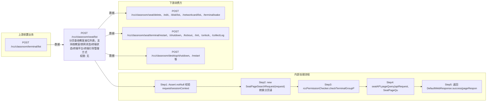

# POST /rcc/classroom/seat/list

> 分页查询教室座位列表，支持按教室/禁网状态/终端状态/终端平台/终端引导管理方式等精确过滤与排序，并按数据权限过滤 ｜ 无特殊权限 ｜ 同步分页查询（PageSearch + 数据权限过滤）

## 依赖关系全景图

## 接口基本信息

| 项目 | 内容 |
|---|---|
| URL | /rcc/classroom/seat/list |
| Controller | RccSeatConfigController |
| 方法名 | getSeatList |
| 权限注解 | 无 |
| 执行方式 | 同步分页查询（PageSearch + 数据权限过滤） |
| 业务含义 | 分页查询教室座位列表，支持按教室/禁网状态/终端状态/终端平台/终端引导管理方式等精确过滤与排序，并按数据权限过滤 |

## 入参详情

### PageWebRequest（转换为 SeatPageSearchRequest）

| 参数名 | 类型 | 必填 | 约束 | 说明 |
|---|---|---|---|---|
| exactMatchArr[].name | String | 否 | 支持字段 | classroomId / disableNetwork / desktopState(忽略) / terminalState / terminalPlatform / terminalBootManageMode |
| exactMatchArr[].valueArr | String[] | 否 | 过滤值 | 对应字段的取值数组 |
| sortArr | Sort[] | 否 | 排序 | 支持 QUERY_ID(id) 等排序字段 |
| limit | Integer | 否 |  | 分页页码与每页条数（limit） |
| page | Integer | 否 |  | 分页页码与每页条数（page） |## 出参详情

| 返回类型 | DefaultWebResponse（data=DefaultPageResponse<SeatInfoDTO>） |
|---|---|

| 字段 | 类型 | 说明 |
|---|---|---|
| itemArr | SeatInfoDTO[] | 座位信息数组（元素字段见下） |
| total | Integer | 符合条件记录数 |
| id | UUID | 座位ID |
| classroomId | UUID | 教室ID |
| classroomName | String | 教室名称 |
| desktopName | String | 云桌面主机名 |
| studentModeArr | TerminalTypeEnum[] | 学生机工作模式（PC/VDI/IDV/VOI等） |
| terminalModeArr | TerminalTypeEnum[] | 终端工作模式 |
| imageTemplateName | String | 镜像模板名称 |
| vdiDesktopId | UUID | VDI桌面ID |
| vdiDesktopIp | String | VDI桌面IP |
| vdiDesktopGateway | String | VDI桌面网关 |
| vdiDesktopMask | String | VDI桌面掩码 |
| vdiDesktopDnsPrimary | String | VDI桌面首选DNS |
| vdiDesktopDnsSecondary | String | VDI桌面备用DNS |
| idvDesktopId | UUID | IDV桌面ID |
| idvDesktopIp | String | IDV桌面IP |
| idvDesktopGateway | String | IDV桌面网关 |
| idvDesktopMask | String | IDV桌面掩码 |
| idvDesktopDns | String | IDV桌面DNS |
| idvDesktopState | CbbCloudDeskState | IDV桌面状态 |
| seatNum | Integer | 座位号 |
| disableNetwork | Boolean | 是否禁网 |
| terminalId | String | 终端ID |
| terminalName | String | 终端名称 |
| terminalRainOsVersion | String | 终端RainOS版本 |
| terminalHardwareVersion | String | 终端硬件版本 |
| terminalUpgradeVersion | String | 终端升级版本 |
| terminalMac | String | 终端MAC |
| terminalIp | String | 终端IP |
| terminalCpu | String | 终端CPU型号 |
| terminalMemory | Long | 终端内存大小 |
| terminalProductModel | String | 终端产品型号 |
| terminalSerialNum | String | 终端序列号 |
| terminalPlatform | CbbTerminalPlatformEnums | 终端平台 |
| terminalState | CbbTerminalStateEnums | 终端状态 |
| desktopState | CbbCloudDeskState | 桌面状态 |
| classroomState | ClassroomLessonStatusEnum | 教室状态 |
| terminalType | String | 终端类型 |
| productId | String | 产品ID |
| terminalStartMode | CbbTerminalStartMode | 终端启动模式 |
| terminalResolution | String | 终端分辨率 |
| isTerminalLocked | Boolean | 终端是否锁定 |
| lastOnlineTime | Date | 最后上线时间 |
| seatDownloadState | SeatDownloadStateEnum | 座位下载状态 |
| vdiDesktopState | CbbCloudDeskState | VDI桌面状态 |
| bootManageMode | CbbTerminalBootManageModeEnums | 终端引导管理模式 |
| seatStatus | SeatStateEnums | 座位状态 |
| vdiLocalDiskId | UUID | VDI本地磁盘ID |
| terminalNeedUpgrade | Boolean | 终端是否需要升级 |
| deployMode | String | 部署模式 |
| canTerminalInit | Boolean | 是否支持终端初始化 |
| softwareVersion | String | 软件版本 |
| sourceIp | String | 来源IP |
| platformStatus | CloudPlatformStatus | 云平台状态 |

## 上游前置业务

### 前置1：POST /rcc/classroom/terminal/list

推断：教室ID作为分页查询过滤条件，字段名为推断（由 field_map 契约映射）
## 内部处理流程

### 处理流程

1. Assert.notNull 校验 request/sessionContext
2. new SeatPageSearchRequest(request) 转换分页请求（exactMatchConvert/sortConditionConvert）
3. rccPermissionChecker.checkTerminalGroupPermissionByQueryRequest(apiRequest, sessionContext) 按查询教室做数据权限过滤
4. seatAPI.pageQuery(apiRequest, SeatPageQueryTypeEnum.QUERY_BY_CLASSROOM) 分页查询
5. 返回 DefaultWebResponse.success(pageResponse)

## 下游消费方

### 消费1：POST /rcc/classroom/seat/delete、/edit、/disk/list、/networkcard/list、/terminal/wake

座位列表出参SeatInfoDTO.id（由 field_map 契约映射）

### 消费2：POST /rcc/classroom/seat/terminal/restart、/shutdown、/kickout、/init、/unlock、/collectLog

座位列表出参SeatInfoDTO.terminalId（由 field_map 契约映射）

### 消费3：POST /rcc/classroom/desktop/shutdown、/restart等

座位列表出参SeatInfoDTO.vdiDesktopId（由 field_map 契约映射）
## 接口参数约束分析

| 层级 | 参数 | 规则 | 失败结果 |
|---|---|---|---|
| PARAM | exactMatchArr | exactMatchArr 不可为 null | exactMatchConvert 内部 Assert.notNull |
| PERM | classroomId | 查询教室的数据权限 | 无权限教室的记录被过滤/抛权限异常 |
| PARAM | terminalState | 取值须为 CbbTerminalStateEnums | 非法值转换后置 null |

## 参数取值策略

| 参数 | 策略 | 说明 |
|---|---|---|
| page/limit | user_input/from_query | 按业务构造 |
| exactMatchArr[].name | user_input/from_query | 按业务构造 |
| exactMatchArr[].valueArr | user_input/from_query | 按业务构造 |
| sortArr | user_input/from_query | 按业务构造 |

## 成功/失败断言基准

### 成功场景

| 场景 | 断言点 |
|---|---|
| 传入带教室过滤的分页请求 | $.status=="SUCCESS" 且 $.content.itemArr 非空（已做数据权限过滤） |

### 失败场景

| 场景 | 触发条件 | 断言点 |
|---|---|---|
| exactMatchArr 为 null | exactMatchConvert 触发 | $.status=="ERROR"（Assert 抛 IllegalArgumentException） |
| 无数据权限 | 非超管查询无权限教室 | $.status=="SUCCESS"（数据权限过滤后无权限教室记录不返回） |

## 环境清理机制

| 接口 | 说明 |
|---|---|
| 本接口创建的资源 | 通过对应 delete 接口清理 |

## 前置状态和幂等性标注

| 维度 | 结论 |
|---|---|
| 幂等性 | HIGH |
| 说明 | 纯查询，无副作用 |
