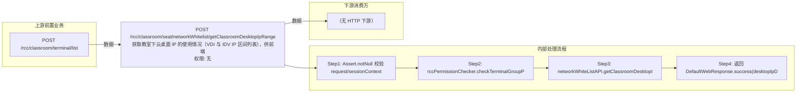

# POST /rcc/classroom/seat/networkWhitelist/getClassroomDesktopIpRange

> 获取教室下云桌面 IP 的使用情况（VDI 与 IDV IP 区间列表），供前端网络白名单配置展示 ｜ 无特殊权限 ｜ 同步

## 依赖关系全景图

## 接口基本信息

| 项目 | 内容 |
|---|---|
| URL | /rcc/classroom/seat/networkWhitelist/getClassroomDesktopIpRange |
| Controller | RccSeatManageController |
| 方法名 | getClassroomDesktopIpRange |
| 权限注解 | 无 |
| 执行方式 | 同步 |
| 业务含义 | 获取教室下云桌面 IP 的使用情况（VDI 与 IDV IP 区间列表），供前端网络白名单配置展示 |

## 入参详情

### ClassroomIdRequest

| 参数名 | 类型 | 必填 | 约束 | 说明 |
|---|---|---|---|---|
| classroomId | UUID | 是 | @NotNull | 教室ID |

## 出参详情

| 返回类型 | DefaultWebResponse（data=ClassroomDesktopIpDTO） |
|---|---|

| 字段 | 类型 | 说明 |
|---|---|---|
| vdiIpList | List<IpIntervalDTO> | VDI 云桌面 IP 区间使用列表（元素字段见下，IpIntervalDTO） |
| ipStart | String | 起始IP（IpIntervalDTO 元素字段） |
| ipEnd | String | 结束IP（IpIntervalDTO 元素字段） |
| idvIpList | List<IpIntervalDTO> | IDV 云桌面 IP 区间使用列表（元素字段同 vdiIpList） |

## 上游前置业务

### 前置1：POST /rcc/classroom/terminal/list

教室ID在创建教室(POST /rcc/classroom/create)后经教室终端列表查询获得（ViewClassroomInfoEntity.classroomId）（由 field_map 契约映射）
## 内部处理流程

### 处理流程

1. Assert.notNull 校验 request/sessionContext
2. rccPermissionChecker.checkTerminalGroupPermissionByClassroomId(classroomId) 校验权限
3. networkWhiteListAPI.getClassroomDesktopIpRange(classroomId) 查询 IP 使用情况
4. 返回 DefaultWebResponse.success(desktopIpDTO)

## 下游消费方

（本接口数据主要被自身/关联接口消费，或经 SPI 通知）
## 接口参数约束分析

| 层级 | 参数 | 规则 | 失败结果 |
|---|---|---|---|
| PARAM | classroomId | @NotNull | 为空时参数校验失败 |
| PERM | classroomId | 教室终端组权限 | 无权限抛业务异常 |

## 参数取值策略

| 参数 | 策略 | 说明 |
|---|---|---|
| classroomId | user_input/from_query | 按业务构造 |

## 成功/失败断言基准

### 成功场景

| 场景 | 断言点 |
|---|---|
| 传入有效教室ID | $.status=="SUCCESS" 且（$.content.vdiIpList 或 $.content.idvIpList 非空） |

### 失败场景

| 场景 | 触发条件 | 断言点 |
|---|---|---|
| classroomId 为空 | 请求缺参 | $.status=="ERROR"（参数校验失败，Assert.notNull） |
| 无教室权限 | 权限校验抛错 | $.status=="ERROR"（数据权限校验失败） |

## 环境清理机制

| 接口 | 说明 |
|---|---|
| 本接口创建的资源 | 通过对应 delete 接口清理 |

## 前置状态和幂等性标注

| 维度 | 结论 |
|---|---|
| 幂等性 | HIGH |
| 说明 | 纯查询，无副作用 |
