# POST /rcc/classroom/seat/network/disable

> 批量禁网：将教室座位终端网络禁用，按全局参数配置并行线程数，批处理逐台调用禁网命令 ｜ @EnableAuthority ｜ 异步批处理任务（BatchTask，DisableSeatNetworkBatchTaskHandler，enableParallel + enablePerformanceMode 性能模式）

## 依赖关系全景图

```mermaid
graph LR
    subgraph 上游前置业务
        A1["POST /rcc/classroom/seat/list"]
    end
    B["POST /rcc/classroom/seat/network/disable<br>批量禁网：将教室座位终端网络禁用，按全局参数配置并行线程数，批处理逐台调用禁网命<br>权限: @EnableAuthority"]
    A1 -->|数据| B
    subgraph 内部处理流程
        C1["Step1: Assert.notNull 校验 request/builder/sessio"]
        C2["Step2: doDisableNetwork：NetStateEnum.getNotify("]
        C3["Step3: seatAPI.getClassroomIdBySeatId(seatIdArr"]
        C4["Step4: rccPermissionChecker.checkTerminalGroupP"]
        C5["Step5: classroomAPI.getClassroomName(classroomI"]
        C6["Step6: netStateEnum=DISABLE_NETWORK → getBatchD"]
        C1 --> C2
        C7["Step7: builder.setTaskName(RCDC_RCC_SEAT_OPERAT"]
        C8["Step8: 返回 DefaultWebResponse.success(result)"]
        C6 --> C7
        C7 --> C8
        C2 --> C3
        C3 --> C4
        C4 --> C5
        C5 --> C6
    end
    B --> C1
    subgraph 下游消费方
        D1["（无 HTTP 下游）"]
    end
    B -->|数据| D1
```

## 接口基本信息

| 项目 | 内容 |
|---|---|
| URL | /rcc/classroom/seat/network/disable |
| Controller | RccSeatManageController |
| 方法名 | disableSeatNetwork |
| 权限注解 | @EnableAuthority |
| 执行方式 | 异步批处理任务（BatchTask，DisableSeatNetworkBatchTaskHandler，enableParallel + enablePerformanceMode 性能模式） |
| 业务含义 | 批量禁网：将教室座位终端网络禁用，按全局参数配置并行线程数，批处理逐台调用禁网命令 |

## 入参详情

### DisableNetworkRequest

| 参数名 | 类型 | 必填 | 约束 | 说明 |
|---|---|---|---|---|
| seatIdArr | UUID[] | 是 | @NotEmpty 至少一个座位 | 待禁网的座位ID数组 |
| disableNetwork | Boolean | 是 | @NotNull | 禁网状态：true=禁网，false=联网 |

## 出参详情

| 返回类型 | DefaultWebResponse（data=BatchTaskSubmitResult） |
|---|---|

| 字段 | 类型 | 说明 |
|---|---|---|
| taskId | UUID | 提交成功的批处理任务标识 |
| taskStatus | String | 批任务初始状态 |

## 上游前置业务

### 前置1：POST /rcc/classroom/seat/list

座位ID数组来自座位列表查询出参（SeatInfoDTO.id），座位由/rcc/classroom/seat/batchCreate创建（由 field_map 契约映射）
## 内部处理流程

### 批量处理器：DisableSeatNetworkBatchTaskHandler

| 步骤 | 说明 |
|---|---|
| 1 | seatAPI.getSeatInfo(seatId) 取座位与桌面名 |
| 2 | seatAPI.disableSingleSeatNetwork(seatId, NetStateEnum.DISABLE_NETWORK) 下发禁网 |
| 3 | 成功：auditLogAPI.recordLog(RCDC_RCC_SEAT_OPERATE_DISABLE_NETWORK_SINGLE_SUC_LOG) 返回 SUCCESS |
| 4 | BusinessException：recordLog(DISABLE_NETWORK_SINGLE_FAIL_LOG) 返回 FAILURE |

### 处理流程

1. Assert.notNull 校验 request/builder/sessionContext
2. doDisableNetwork：NetStateEnum.getNotify(disableNetwork) 转换禁网状态枚举
3. seatAPI.getClassroomIdBySeatId(seatIdArr) 反查教室ID
4. rccPermissionChecker.checkTerminalGroupPermissionByClassroomId 校验权限
5. classroomAPI.getClassroomName(classroomIdArr[0]) 取教室名
6. netStateEnum=DISABLE_NETWORK → getBatchDisableDefaultWebResponse：读取全局线程数，构造 DisableSeatNetworkBatchTaskHandler（disableSeat=true）
7. builder.setTaskName(RCDC_RCC_SEAT_OPERATE_DISABLE_NETWORK_SINGLE_TASK_NAME).enableParallel().enablePerformanceMode(...) 启动
8. 返回 DefaultWebResponse.success(result)

## 下游消费方

（本接口数据主要被自身/关联接口消费，或经 SPI 通知）
## 接口参数约束分析

| 层级 | 参数 | 规则 | 失败结果 |
|---|---|---|---|
| PARAM | seatIdArr | @NotEmpty | 为空时参数校验失败 |
| PARAM | disableNetwork | @NotNull | 为空时参数校验失败（getNotify 内部 Assert） |
| PERM | classroomId | 教室终端组权限 | 无权限抛业务异常 |
| BIZ | seatId | 座位必须存在 | 批任务项 FAILURE（RCDC_RCC_SEAT_OPERATE_DISABLE_NETWORK_SINGLE_FAIL_LOG） |

## 参数取值策略

| 参数 | 策略 | 说明 |
|---|---|---|
| seatIdArr | user_input/from_query | 按业务构造 |
| disableNetwork | user_input/from_query | 按业务构造 |

## 成功/失败断言基准

### 成功场景

| 场景 | 断言点 |
|---|---|
| 传入有效座位ID且 disableNetwork=true | $.status=="SUCCESS" 且 $.content.taskId 非空；逐台下发禁网命令并审计成功；轮询 content.taskId（2000ms 间隔）至终态 batchTaskItemStatus∈["SUCCESS"] |

### 失败场景

| 场景 | 触发条件 | 断言点 |
|---|---|---|
| disableNetwork 为空 | NetStateEnum.getNotify Assert | $.status=="ERROR"（Assert 抛 IllegalArgumentException） |
| 座位不存在/禁网命令失败 | disableSingleSeatNetwork 抛错 | $.status=="SUCCESS" 且 $.content.taskId 非空；轮询 content.taskId 至终态 batchTaskItemStatus==FAILURE 并审计失败日志 |

## 环境清理机制

| 接口 | 说明 |
|---|---|
| 本接口创建的资源 | 通过对应 delete 接口清理 |

## 前置状态和幂等性标注

| 维度 | 结论 |
|---|---|
| 幂等性 | LOW |
| 说明 | 重复调用会再次下发禁网命令（重复禁网） |
