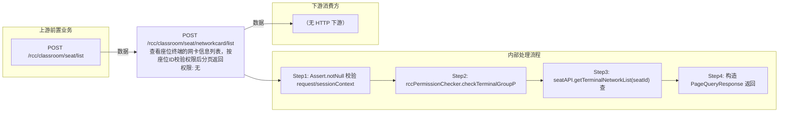

# POST /rcc/classroom/seat/networkcard/list

> 查看座位终端的网卡信息列表，按座位ID校验权限后分页返回 ｜ 无特殊权限 ｜ 同步（分页查询）

## 依赖关系全景图

## 接口基本信息

| 项目 | 内容 |
|---|---|
| URL | /rcc/classroom/seat/networkcard/list |
| Controller | RccSeatManageController |
| 方法名 | getSeatNetworkCardList |
| 权限注解 | 无 |
| 执行方式 | 同步（分页查询） |
| 业务含义 | 查看座位终端的网卡信息列表，按座位ID校验权限后分页返回 |

## 入参详情

### StudentSeatDetailInfoRequest

| 参数名 | 类型 | 必填 | 约束 | 说明 |
|---|---|---|---|---|
| seatId | UUID | 是 | @NotNull | 座位ID |
| page | Integer | 否 | @Range(min=0) | 页码（继承） |
| limit | Integer | 否 | @Range(min=1,max=2000) | 每页条数（继承） |
| matchArr | Match[] | 否 | @NotNull | 匹配条件（继承） |
| sortArr | Sort[] | 否 | @NotNull | 排序条件（继承） |

## 出参详情

| 返回类型 | DefaultWebResponse（data=PageQueryResponse<CbbTerminalNetworkInfoDTO>） |
|---|---|

| 字段 | 类型 | 说明 |
|---|---|---|
| itemArr | CbbTerminalNetworkInfoDTO[] | 网卡信息数组（元素字段见下） |
| total | Integer | 网卡条数 |
| networkAccessMode | CbbNetworkModeEnums | 网络接入方式 |
| getIpMode | CbbGetNetworkModeEnums | IP获取方式（静态/DHCP） |
| getDnsMode | CbbGetNetworkModeEnums | DNS获取方式 |
| macAddr | String | 网卡MAC地址 |
| ip | String | 网卡IP |
| subnetMask | String | 子网掩码 |
| gateway | String | 网关 |
| mainDns | String | 首选DNS |
| secondDns | String | 备用DNS |
| ssid | String | 无线SSID |
| maxSpeed | String | 网卡最大速率 |
| product | String | 网卡产品型号 |
| businessCard | CbbNetworkCardEnums | 业务网卡标识 |
| businessCardIndex | Integer | 业务网卡序号 |
| inUse | Boolean | 是否正在使用 |
| iface | String | 网卡接口名 |
| wirelessAuthMode | CbbTerminalWirelessAuthModeEnums | 无线认证方式 |

## 上游前置业务

### 前置1：POST /rcc/classroom/seat/list

座位ID来自座位列表查询出参（SeatInfoDTO.id），座位由/rcc/classroom/seat/batchCreate创建（由 field_map 契约映射）
## 内部处理流程

### 处理流程

1. Assert.notNull 校验 request/sessionContext
2. rccPermissionChecker.checkTerminalGroupPermissionBySeatId(seatId) 校验权限
3. seatAPI.getTerminalNetworkList(seatId) 查询网卡列表
4. 构造 PageQueryResponse 返回

## 下游消费方

（本接口数据主要被自身/关联接口消费，或经 SPI 通知）
## 接口参数约束分析

| 层级 | 参数 | 规则 | 失败结果 |
|---|---|---|---|
| PARAM | seatId | @NotNull | 为空时参数校验失败 |
| PERM | seatId | 座位所在教室终端组权限 | 无权限抛业务异常 |
| PARAM | limit | @Range(min=1,max=2000) | 越界参数校验失败 |

## 参数取值策略

| 参数 | 策略 | 说明 |
|---|---|---|
| seatId | user_input/from_query | 按业务构造 |
| page | user_input/from_query | 按业务构造 |
| limit | user_input/from_query | 按业务构造 |
| matchArr | user_input/from_query | 按业务构造 |
| sortArr | user_input/from_query | 按业务构造 |

## 成功/失败断言基准

### 成功场景

| 场景 | 断言点 |
|---|---|
| 传入有效座位ID | $.status=="SUCCESS" 且 $.content.itemArr 非空 |

### 失败场景

| 场景 | 触发条件 | 断言点 |
|---|---|---|
| seatId 为空 | 请求缺参 | $.status=="ERROR"（参数校验失败，Assert.notNull） |
| 无权限 | 权限校验抛错 | $.status=="ERROR"（数据权限校验失败） |

## 环境清理机制

| 接口 | 说明 |
|---|---|
| 本接口创建的资源 | 通过对应 delete 接口清理 |

## 前置状态和幂等性标注

| 维度 | 结论 |
|---|---|
| 幂等性 | HIGH |
| 说明 | 纯查询，无副作用 |
