# POST /rcc/classroom/seat/terminal/collectLog

> 触发指定座位终端收集日志，校验终端合法与权限后，按全局日志保留策略设置日志过期清理天数并异步下发收集指令，返回空成功响应 ｜ @EnableAuthority ｜ 同步

## 依赖关系全景图

```mermaid
graph LR
    subgraph 上游前置业务
        A1["POST /rcc/classroom/seat/list"]
    end
    B["POST /rcc/classroom/seat/terminal/collectLog<br>触发指定座位终端收集日志，校验终端合法与权限后，按全局日志保留策略设置日志过期清<br>权限: @EnableAuthority"]
    A1 -->|数据| B
    subgraph 内部处理流程
        C1["Step1: Assert.notNull 校验 request/sessionContext"]
        C2["Step2: rccPermissionChecker.checkTerminalGroupP"]
        C3["Step3: seatAPI.validSeatByterminalIdArr 校验终端合法"]
        C4["Step4: cbbTerminalOperatorAPI.findBasicInfoByTe"]
        C5["Step5: rccGlobalStrategyAPI.findRccTerminalLogC"]
        C6["Step6: 构造 CollectLogRequest 调 cbbTerminalLogAPI"]
        C1 --> C2
        C7["Step7: 成功：auditLogAPI.recordLog(RCDC_RCC_TERMIN"]
        C8["Step8: 返回 DefaultWebResponse.Builder.success()"]
        C6 --> C7
        C7 --> C8
        C2 --> C3
        C3 --> C4
        C4 --> C5
        C5 --> C6
    end
    B --> C1
    subgraph 下游消费方
        D1["（无 HTTP 下游）"]
    end
    B -->|数据| D1
```

## 接口基本信息

| 项目 | 内容 |
|---|---|
| URL | /rcc/classroom/seat/terminal/collectLog |
| Controller | RccSeatManageController |
| 方法名 | collectLog |
| 权限注解 | @EnableAuthority |
| 执行方式 | 同步 |
| 业务含义 | 触发指定座位终端收集日志，校验终端合法与权限后，按全局日志保留策略设置日志过期清理天数并异步下发收集指令，返回空成功响应 |

## 入参详情

### TerminalIdWebRequest

| 参数名 | 类型 | 必填 | 约束 | 说明 |
|---|---|---|---|---|
| terminalId | String | 是 | @NotBlank | 终端ID（MAC 或终端SN） |

## 出参详情

| 返回类型 | DefaultWebResponse（成功，无 data） |
|---|---|
| 说明 | 成功返回 SUCCESS；失败返回 status/msgKey |

## 上游前置业务

### 前置1：POST /rcc/classroom/seat/list

学生终端ID来自座位列表查询出参（SeatInfoDTO.terminalId）（由 field_map 契约映射）
## 内部处理流程

### 处理流程

1. Assert.notNull 校验 request/sessionContext
2. rccPermissionChecker.checkTerminalGroupPermissionByTerminalId 校验权限
3. seatAPI.validSeatByterminalIdArr 校验终端合法
4. cbbTerminalOperatorAPI.findBasicInfoByTerminalId 取 upperMacAddrOrTerminalId 作为审计 key
5. rccGlobalStrategyAPI.findRccTerminalLogConfigMustPrescent().getExpireCleanDay() 取过期天数
6. 构造 CollectLogRequest 调 cbbTerminalLogAPI.collectLog
7. 成功：auditLogAPI.recordLog(RCDC_RCC_TERMINAL_COLLECT_LOG_SUC_LOG)；失败：记录 FAIL_LOG 后重新抛出
8. 返回 DefaultWebResponse.Builder.success()

## 下游消费方

（本接口数据主要被自身/关联接口消费，或经 SPI 通知）
## 接口参数约束分析

| 层级 | 参数 | 规则 | 失败结果 |
|---|---|---|---|
| PARAM | terminalId | @NotBlank | 为空时参数校验失败 |
| PERM | terminalId | 终端组数据权限 | 无权限抛业务异常 |
| BIZ | terminalId | 终端必须为座位终端 | validSeatByterminalIdArr 抛错 |
| BIZ | globalStrategy | 全局日志策略必须已配置 | findRccTerminalLogConfigMustPrescent 无配置时抛错 |

## 参数取值策略

| 参数 | 策略 | 说明 |
|---|---|---|
| terminalId | user_input/from_query | 按业务构造 |

## 成功/失败断言基准

### 成功场景

| 场景 | 断言点 |
|---|---|
| 终端存在且有权限 | $.status=="SUCCESS"；content 为空（Builder.success() 无参）；审计 RCDC_RCC_TERMINAL_COLLECT_LOG_SUC_LOG |

### 失败场景

| 场景 | 触发条件 | 断言点 |
|---|---|---|
| 无终端组权限 | checkTerminalGroupPermissionByTerminalId 失败 | $.status=="ERROR"（数据权限校验失败，msgKey 由权限框架决定） |
| 终端不合法 | validSeatByterminalIdArr 失败 | $.status=="ERROR" 且 $.msgKey=="rcdc_rcc_terminal_not_seat" |
| 收集日志异常 | cbbTerminalLogAPI.collectLog 抛 BusinessException | $.status=="ERROR"（throw 原始 BusinessException key）；审计 RCDC_RCC_TERMINAL_COLLECT_LOG_FAIL_LOG |

## 环境清理机制

| 接口 | 说明 |
|---|---|
| 本接口创建的资源 | 通过对应 delete 接口清理 |

## 前置状态和幂等性标注

| 维度 | 结论 |
|---|---|
| 幂等性 | LOW |
| 说明 | 重复调用会重复下发日志收集指令 |
