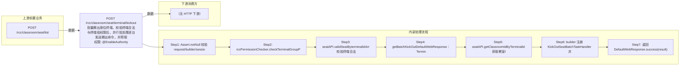

# POST /rcc/classroom/seat/terminal/kickout

> 批量踢出座位终端，校验终端合法与终端组权限后，并行批处理逐台发送踢出命令，并预取各终端所属教室ID ｜ @EnableAuthority ｜ 异步批处理任务（BatchTask，KickOutSeatBatchTaskHandler，enableParallel 并行）

## 依赖关系全景图

## 接口基本信息

| 项目 | 内容 |
|---|---|
| URL | /rcc/classroom/seat/terminal/kickout |
| Controller | RccSeatManageController |
| 方法名 | kickOutTerminal |
| 权限注解 | @EnableAuthority |
| 执行方式 | 异步批处理任务（BatchTask，KickOutSeatBatchTaskHandler，enableParallel 并行） |
| 业务含义 | 批量踢出座位终端，校验终端合法与终端组权限后，并行批处理逐台发送踢出命令，并预取各终端所属教室ID |

## 入参详情

### TerminalIdArrWebRequest

| 参数名 | 类型 | 必填 | 约束 | 说明 |
|---|---|---|---|---|
| idArr | String[] | 是 | @NotEmpty + @Size(min=1) | 终端ID数组（MAC 或终端SN） |

## 出参详情

| 返回类型 | DefaultWebResponse（data=BatchTaskSubmitResult） |
|---|---|

| 字段 | 类型 | 说明 |
|---|---|---|
| taskId | UUID | 提交成功的批处理任务标识 |
| taskStatus | String | 批任务初始状态 |

## 上游前置业务

### 前置1：POST /rcc/classroom/seat/list

终端ID数组来自座位列表查询出参（SeatInfoDTO.terminalId）（由 field_map 契约映射）
## 内部处理流程

### 批量处理器：KickOutSeatBatchTaskHandler

| 步骤 | 说明 |
|---|---|
| 1 | idMap 取 terminalId |
| 2 | seatAPI.kickOutTerminal(terminalId) 发送踢出命令 |
| 3 | 成功：auditLogAPI.recordLog(RCDC_RCC_SEAT_KICK_OUT_SUC_LOG) 返回 SUCCESS |
| 4 | BusinessException：recordLog(RCDC_RCC_SEAT_KICK_OUT_FAIL_LOG) 返回 FAILURE |

### 处理流程

1. Assert.notNull 校验 request/builder/sessionContext
2. rccPermissionChecker.checkTerminalGroupPermissionByTerminalId 校验权限
3. seatAPI.validSeatByterminalIdArr 校验终端合法
4. getBatchKickOutDefaultWebResponse：TerminalIdMappingUtils.mapping 构建 idMap 与迭代器
5. seatAPI.getClassroomIdByTerminalId 获取教室ID数组并 handler.setClassroomIdArr
6. builder 注册 KickOutSeatBatchTaskHandler 并行启动
7. 返回 DefaultWebResponse.success(result)

## 下游消费方

（本接口数据主要被自身/关联接口消费，或经 SPI 通知）
## 接口参数约束分析

| 层级 | 参数 | 规则 | 失败结果 |
|---|---|---|---|
| PARAM | idArr | @NotEmpty + @Size(min=1) | 为空时参数校验失败 |
| PERM | idArr | 终端组数据权限 | 无权限抛业务异常 |
| BIZ | idArr | 终端必须为座位终端 | validSeatByterminalIdArr 抛 RCDC_RCC_SEAT_NOT_FOUND 类错误 |
| BIZ | terminalId | 踢出命令可下发 | 失败批任务项 FAILURE（RCDC_RCC_SEAT_KICK_OUT_FAIL_LOG） |

## 参数取值策略

| 参数 | 策略 | 说明 |
|---|---|---|
| idArr | user_input/from_query | 按业务构造 |

## 成功/失败断言基准

### 成功场景

| 场景 | 断言点 |
|---|---|
| 传入合法座位终端ID | $.status=="SUCCESS" 且 $.content.taskId 非空；逐台踢出终端；轮询 content.taskId（2000ms 间隔）至终态 batchTaskItemStatus∈["SUCCESS"] |

### 失败场景

| 场景 | 触发条件 | 断言点 |
|---|---|---|
| 终端非法 | validSeatByterminalIdArr 抛错 | $.status=="ERROR" 且 $.msgKey=="rcdc_rcc_terminal_not_seat"；无任务提交 |
| 踢出失败 | kickOutTerminal 抛错 | $.status=="SUCCESS" 且 $.content.taskId 非空；轮询 content.taskId 至终态 batchTaskItemStatus==FAILURE（审计 RCDC_RCC_SEAT_KICK_OUT_FAIL_LOG） |

## 环境清理机制

| 接口 | 说明 |
|---|---|
| 本接口创建的资源 | 通过对应 delete 接口清理 |

## 前置状态和幂等性标注

| 维度 | 结论 |
|---|---|
| 幂等性 | LOW |
| 说明 | 重复调用会重复下发踢出命令 |
