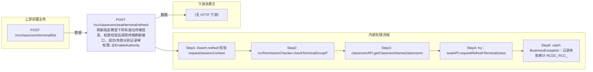

# POST /rcc/classroom/seat/terminal/refresh

> 刷新指定教室下所有座位终端信息，权限校验后调用终端刷新接口，成功/失败分别记录审计并返回结果 ｜ @EnableAuthority ｜ 同步

## 依赖关系全景图

## 接口基本信息

| 项目 | 内容 |
|---|---|
| URL | /rcc/classroom/seat/terminal/refresh |
| Controller | RccSeatManageController |
| 方法名 | refreshTerminal |
| 权限注解 | @EnableAuthority |
| 执行方式 | 同步 |
| 业务含义 | 刷新指定教室下所有座位终端信息，权限校验后调用终端刷新接口，成功/失败分别记录审计并返回结果 |

## 入参详情

### ClassroomIdRequest

| 参数名 | 类型 | 必填 | 约束 | 说明 |
|---|---|---|---|---|
| classroomId | UUID | 是 | @NotNull | 教室ID |

## 出参详情

| 返回类型 | DefaultWebResponse（data=SuccessResultResponse） |
|---|---|

| 字段 | 类型 | 说明 |
|---|---|---|
| result | Boolean | 操作结果，成功为 true |

## 上游前置业务

### 前置1：POST /rcc/classroom/terminal/list

教室ID在创建教室(POST /rcc/classroom/create)后经教室终端列表查询获得（ViewClassroomInfoEntity.classroomId）（由 field_map 契约映射）
## 内部处理流程

### 处理流程

1. Assert.notNull 校验 request/sessionContext
2. rccPermissionChecker.checkTerminalGroupPermissionByClassroomId 校验权限
3. classroomAPI.getClassroomName(classroomId) 取教室名称
4. try：seatAPI.requestRefreshTerminal(classroomId) 下发刷新，成功后 auditLogAPI.recordLog(RCDC_RCC_REFRESH_TERMINAL_SUCCESS_LOG) 返回 success(SuccessResultResponse)
5. catch BusinessException：记录失败审计 RCDC_RCC_REFRESH_TERMINAL_FAIL_LOG，返回 fail(ex.getI18nMessage())

## 下游消费方

（本接口数据主要被自身/关联接口消费，或经 SPI 通知）
## 接口参数约束分析

| 层级 | 参数 | 规则 | 失败结果 |
|---|---|---|---|
| PARAM | classroomId | @NotNull | 为空时参数校验失败 |
| PERM | classroomId | 教室终端组权限 | 无权限抛业务异常 |
| BIZ | classroomId | 教室必须存在 | 教室不存在时 getClassroomName/requestRefreshTerminal 抛错并返回 fail |

## 参数取值策略

| 参数 | 策略 | 说明 |
|---|---|---|
| classroomId | user_input/from_query | 按业务构造 |

## 成功/失败断言基准

### 成功场景

| 场景 | 断言点 |
|---|---|
| 传入有效教室ID | $.status=="SUCCESS" 且 $.content.result==true；审计成功日志 |

### 失败场景

| 场景 | 触发条件 | 断言点 |
|---|---|---|
| 教室无终端/刷新失败 | requestRefreshTerminal 抛 BusinessException | $.status=="ERROR" 且 $.msgKey=="rcdc_rcc_module_operate_fail"；审计失败日志 |
| 无教室权限 | 权限校验抛错 | $.status=="ERROR"（数据权限校验失败） |

## 环境清理机制

| 接口 | 说明 |
|---|---|
| 本接口创建的资源 | 通过对应 delete 接口清理 |

## 前置状态和幂等性标注

| 维度 | 结论 |
|---|---|
| 幂等性 | MEDIUM |
| 说明 | 重复调用会再次向教室终端下发刷新指令，无数据破坏但有重复下发 |
