# POST /rcc/classroom/seat/terminal/restart

> 批量重启教室座位终端，校验终端为合法座位终端并做终端组权限校验后，提交并行批处理任务逐台重启；若终端所在教室当前有课，会把当前上课镜像ID注入 Handler 供后续逻辑使用 ｜ @EnableAuthority ｜ 异步批处理任务（BatchTask，RestartTerminalBatchTaskHandler，enableParallel 并行）

## 依赖关系全景图

```mermaid
graph LR
    subgraph 上游前置业务
        A1["POST /rcc/classroom/seat/list"]
    end
    B["POST /rcc/classroom/seat/terminal/restart<br>批量重启教室座位终端，校验终端为合法座位终端并做终端组权限校验后，提交并行批处理<br>权限: @EnableAuthority"]
    A1 -->|数据| B
    subgraph 内部处理流程
        C1["Step1: Assert.notNull 校验 request/optLogRecorder"]
        C2["Step2: rccPermissionChecker.checkTerminalGroupP"]
        C3["Step3: seatAPI.validSeatByterminalIdArr(idArr) "]
        C4["Step4: TerminalIdMappingUtils.mapping/extractUU"]
        C5["Step5: 构造 DefaultBatchTaskItem 迭代器（itemName=RCD"]
        C6["Step6: 通过 seatAPI.getClassroomIdByTerminalId 获取"]
        C1 --> C2
        C7["Step7: builder.setTaskName(RCDC_RCC_TERMINAL_RE"]
        C8["Step8: 返回 DefaultWebResponse.Builder.success(re"]
        C6 --> C7
        C7 --> C8
        C2 --> C3
        C3 --> C4
        C4 --> C5
        C5 --> C6
    end
    B --> C1
    subgraph 下游消费方
        D1["（无 HTTP 下游）"]
    end
    B -->|数据| D1
```

## 接口基本信息

| 项目 | 内容 |
|---|---|
| URL | /rcc/classroom/seat/terminal/restart |
| Controller | RccSeatManageController |
| 方法名 | restartTerminal |
| 权限注解 | @EnableAuthority |
| 执行方式 | 异步批处理任务（BatchTask，RestartTerminalBatchTaskHandler，enableParallel 并行） |
| 业务含义 | 批量重启教室座位终端，校验终端为合法座位终端并做终端组权限校验后，提交并行批处理任务逐台重启；若终端所在教室当前有课，会把当前上课镜像ID注入 Handler 供后续逻辑使用 |

## 入参详情

### TerminalIdArrWebRequest

| 参数名 | 类型 | 必填 | 约束 | 说明 |
|---|---|---|---|---|
| idArr | String[] | 是 | @NotEmpty + @Size(min=1) 至少一台终端 | 终端ID数组（终端标识，支持 MAC 或终端SN） |

## 出参详情

| 返回类型 | DefaultWebResponse（data=BatchTaskSubmitResult） |
|---|---|

| 字段 | 类型 | 说明 |
|---|---|---|
| taskId | UUID | 提交成功的批处理任务标识 |
| taskStatus | String | 批任务初始状态（IN_PROGRESS 等） |

## 上游前置业务

### 前置1：POST /rcc/classroom/seat/list

终端ID数组来自座位列表查询出参（SeatInfoDTO.terminalId）（由 field_map 契约映射）
## 内部处理流程

### 批量处理器：RestartTerminalBatchTaskHandler

| 步骤 | 说明 |
|---|---|
| 1 | idMap 取出当前任务的终端ID terminalId |
| 2 | cbbTerminalOperatorAPI.findBasicInfoByTerminalId 查询终端信息并取 terminalIdForOptLog 作为审计标识 |
| 3 | cbbTerminalOperatorAPI.restart(terminalId) 下发重启命令 |
| 4 | 成功：optLogRecorder.saveOptLog(RCDC_RCC_TERMINAL_RESTART_SUCCESS_LOG) 并返回 SUCCESS |
| 5 | BusinessException：saveOptLog(RCDC_RCC_TERMINAL_RESTART_FAIL_LOG) 返回 FAILURE；其他异常抛 IllegalStateException |

### 处理流程

1. Assert.notNull 校验 request/optLogRecorder/builder/sessionContext 非空
2. rccPermissionChecker.checkTerminalGroupPermissionByTerminalId(idArr) 校验终端组数据权限（超管直接放行）
3. seatAPI.validSeatByterminalIdArr(idArr) 校验终端必须属于座位
4. TerminalIdMappingUtils.mapping/extractUUID 构建 terminalId→UUID 映射与UUID数组
5. 构造 DefaultBatchTaskItem 迭代器（itemName=RCDC_RCC_TERMINAL_RESTART_ITEM_NAME）
6. 通过 seatAPI.getClassroomIdByTerminalId 获取首台终端教室，若存在则取当前上课镜像并 handler.setEndLessonId
7. builder.setTaskName(RCDC_RCC_TERMINAL_RESTART_TASK_NAME).enableParallel().registerHandler(handler).start()
8. 返回 DefaultWebResponse.Builder.success(result)（含 BatchTaskSubmitResult）

## 下游消费方

（本接口数据主要被自身/关联接口消费，或经 SPI 通知）
## 接口参数约束分析

| 层级 | 参数 | 规则 | 失败结果 |
|---|---|---|---|
| PARAM | idArr | @NotEmpty + @Size(min=1) | 为空时 Spring 参数校验失败/Assert 抛 IllegalArgumentException |
| PERM | idArr | 终端组数据权限 | 无权限时 checkTerminalGroupPermissionByTerminalId 抛业务异常 |
| BIZ | idArr | 终端必须为座位终端 | validSeatByterminalIdArr 校验失败抛 RCDC_RCC_SEAT_NOT_FOUND 类错误 |
| BIZ | terminalId | 终端必须在线可操作 | 终端离线时平台重启接口抛错，批任务项记为失败 RCDC_RCC_TERMINAL_RESTART_FAIL_LOG |

## 参数取值策略

| 参数 | 策略 | 说明 |
|---|---|---|
| idArr | user_input/from_query | 按业务构造 |

## 成功/失败断言基准

### 成功场景

| 场景 | 断言点 |
|---|---|
| 传入属于座位的有效终端ID数组 | $.status=="SUCCESS" 且 $.content.taskId 非空；批任务逐台重启终端；轮询 content.taskId（2000ms 间隔）至终态 batchTaskItemStatus∈["SUCCESS"] |

### 失败场景

| 场景 | 触发条件 | 断言点 |
|---|---|---|
| 终端不属于任何座位 | validSeatByterminalIdArr 校验失败 | $.status=="ERROR" 且 $.msgKey=="rcdc_rcc_terminal_not_seat"；无批任务提交 |
| 无终端组权限 | checkTerminalGroupPermissionByTerminalId 抛错 | $.status=="ERROR"（数据权限校验失败） |
| 部分终端重启失败 | 平台重启接口抛错 | $.status=="SUCCESS" 且 $.content.taskId 非空；轮询 content.taskId 至终态 batchTaskItemStatus==FAILURE（onFinish 返回失败/部分成功结果） |

## 环境清理机制

| 接口 | 说明 |
|---|---|
| 本接口创建的资源 | 通过对应 delete 接口清理 |

## 前置状态和幂等性标注

| 维度 | 结论 |
|---|---|
| 幂等性 | LOW |
| 说明 | 每次调用都会向终端重新下发重启命令，重复调用导致终端反复重启，无去重 |
