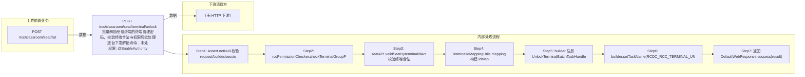

# POST /rcc/classroom/seat/terminal/unlock

> 批量解锁座位终端的终端管理密码，校验终端合法与权限后批处理逐台下发解锁命令；未处于锁定状态的终端直接判失败，离线终端不可解锁 ｜ @EnableAuthority ｜ 异步批处理任务（BatchTask，UnlockTerminalBatchTaskHandler，串行）

## 依赖关系全景图

## 接口基本信息

| 项目 | 内容 |
|---|---|
| URL | /rcc/classroom/seat/terminal/unlock |
| Controller | RccSeatManageController |
| 方法名 | unlockSeat |
| 权限注解 | @EnableAuthority |
| 执行方式 | 异步批处理任务（BatchTask，UnlockTerminalBatchTaskHandler，串行） |
| 业务含义 | 批量解锁座位终端的终端管理密码，校验终端合法与权限后批处理逐台下发解锁命令；未处于锁定状态的终端直接判失败，离线终端不可解锁 |

## 入参详情

### UnlockTerminalRequest

| 参数名 | 类型 | 必填 | 约束 | 说明 |
|---|---|---|---|---|
| idArr | String[] | 是 | @NotEmpty + @Size(min=1) | 终端ID数组 |

## 出参详情

| 返回类型 | DefaultWebResponse（data=BatchTaskSubmitResult） |
|---|---|

| 字段 | 类型 | 说明 |
|---|---|---|
| taskId | UUID | 提交成功的批处理任务标识 |
| taskStatus | String | 批任务初始状态 |

## 上游前置业务

### 前置1：POST /rcc/classroom/seat/list

终端ID数组来自座位列表查询出参（SeatInfoDTO.terminalId）（由 field_map 契约映射）
## 内部处理流程

### 批量处理器：UnlockTerminalBatchTaskHandler

| 步骤 | 说明 |
|---|---|
| 1 | idMap 取 terminalId，findBasicInfoByTerminalId 获取 realTerminalId 与终端状态 |
| 2 | certificationStrategyParameterAPI.getTerminalLockedStatusById 判断是否锁定 |
| 3 | 未锁定：recordLog(RCDC_RCC_TERMINAL_HAVE_NOT_CLOCK) 返回 FAILURE |
| 4 | 终端 OFFLINE：抛 RCDC_RCC_TERMINAL_UNLOCK_TERMINAL_OFFLINE |
| 5 | certificationStrategyParameterAPI.unlockTerminalManagePwd(terminalId) 下发解锁命令 |
| 6 | 成功：recordLog(RCDC_RCC_TERMINAL_UNLOCK_SUCCESS_LOG) 返回 SUCCESS；失败：recordLog(FAIL_LOG) 返回 FAILURE |

### 处理流程

1. Assert.notNull 校验 request/builder/sessionContext
2. rccPermissionChecker.checkTerminalGroupPermissionByTerminalId 校验权限
3. seatAPI.validSeatByterminalIdArr 校验终端合法
4. TerminalIdMappingUtils.mapping 构建 idMap 与迭代器（RCDC_RCC_TERMINAL_UNLOCK_ITEM_NAME）
5. builder 注册 UnlockTerminalBatchTaskHandler（注入 certificationStrategyParameterAPI、cbbTerminalOperatorAPI、auditLogAPI）
6. builder.setTaskName(RCDC_RCC_TERMINAL_UNLOCK_TASK_NAME) 启动任务
7. 返回 DefaultWebResponse.success(result)

## 下游消费方

（本接口数据主要被自身/关联接口消费，或经 SPI 通知）
## 接口参数约束分析

| 层级 | 参数 | 规则 | 失败结果 |
|---|---|---|---|
| PARAM | idArr | @NotEmpty + @Size(min=1) | 为空时参数校验失败 |
| PERM | idArr | 终端组数据权限 | 无权限抛业务异常 |
| BIZ | idArr | 终端必须为座位终端 | validSeatByterminalIdArr 抛错 |
| BIZ | terminal.lockedStatus | 终端必须处于锁定状态 | 未锁定判 FAILURE（RCDC_RCC_TERMINAL_HAVE_NOT_CLOCK） |
| BIZ | terminal.state | 终端必须在线 | 离线抛 RCDC_RCC_TERMINAL_UNLOCK_TERMINAL_OFFLINE |

## 参数取值策略

| 参数 | 策略 | 说明 |
|---|---|---|
| idArr | user_input/from_query | 按业务构造 |

## 成功/失败断言基准

### 成功场景

| 场景 | 断言点 |
|---|---|
| 传入处于锁定状态的在线座位终端 | $.status=="SUCCESS" 且 $.content.taskId 非空；逐台下发解锁命令并审计成功；轮询 content.taskId（2000ms 间隔）至终态 batchTaskItemStatus∈["SUCCESS"] |

### 失败场景

| 场景 | 触发条件 | 断言点 |
|---|---|---|
| 终端未锁定 | getTerminalLockedStatusById 返回 false | $.status=="SUCCESS" 且 $.content.taskId 非空；轮询 content.taskId 至终态 batchTaskItemStatus==FAILURE（审计 rcdc_rcc_terminal_have_not_clock） |
| 终端离线 | 终端状态为 OFFLINE | $.status=="SUCCESS" 且 $.content.taskId 非空；轮询 content.taskId 至终态 batchTaskItemStatus==FAILURE（rcdc_rcc_terminal_unlock_terminal_offline） |
| 解锁命令下发失败 | unlockTerminalManagePwd 抛错 | $.status=="SUCCESS" 且 $.content.taskId 非空；轮询 content.taskId 至终态 batchTaskItemStatus==FAILURE（审计 rcdc_rcc_terminal_unlock_fail_log） |

## 环境清理机制

| 接口 | 说明 |
|---|---|
| 本接口创建的资源 | 通过对应 delete 接口清理 |

## 前置状态和幂等性标注

| 维度 | 结论 |
|---|---|
| 幂等性 | MEDIUM |
| 说明 | 解锁操作本身幂等，但离线/未锁定终端会重复判定失败 |
