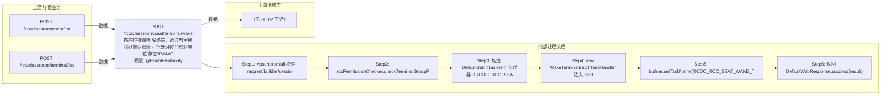

# POST /rcc/classroom/seat/terminal/wake

> 按座位批量唤醒终端，通过教室校验终端组权限，批处理逐台校验座位存在/IP/MAC 后发送网络唤醒（WOL）命令 ｜ @EnableAuthority ｜ 异步批处理任务（BatchTask，WakeTerminalBatchTaskHandler，enableParallel 并行）

## 依赖关系全景图

## 接口基本信息

| 项目 | 内容 |
|---|---|
| URL | /rcc/classroom/seat/terminal/wake |
| Controller | RccSeatManageController |
| 方法名 | wakeTerminal |
| 权限注解 | @EnableAuthority |
| 执行方式 | 异步批处理任务（BatchTask，WakeTerminalBatchTaskHandler，enableParallel 并行） |
| 业务含义 | 按座位批量唤醒终端，通过教室校验终端组权限，批处理逐台校验座位存在/IP/MAC 后发送网络唤醒（WOL）命令 |

## 入参详情

### WakeTerminalWebRequest

| 参数名 | 类型 | 必填 | 约束 | 说明 |
|---|---|---|---|---|
| seatIdArr | UUID[] | 是 | @NotEmpty 至少一个座位 | 待唤醒终端对应的座位ID数组 |
| classroomId | UUID | 是 | @NotNull | 座位所属教室ID |

## 出参详情

| 返回类型 | DefaultWebResponse（data=BatchTaskSubmitResult） |
|---|---|

| 字段 | 类型 | 说明 |
|---|---|---|
| taskId | UUID | 提交成功的批处理任务标识 |
| taskStatus | String | 批任务初始状态 |

## 上游前置业务

### 前置1：POST /rcc/classroom/seat/list

座位ID数组来自座位列表查询出参（SeatInfoDTO.id），座位由/rcc/classroom/seat/batchCreate创建（由 field_map 契约映射）

### 前置2：POST /rcc/classroom/terminal/list

教室ID在创建教室(POST /rcc/classroom/create)后经教室终端列表查询获得（ViewClassroomInfoEntity.classroomId）（由 field_map 契约映射）
## 内部处理流程

### 批量处理器：WakeTerminalBatchTaskHandler

| 步骤 | 说明 |
|---|---|
| 1 | seatAPI.getSeatInfo(seatId) 查询座位，seatInfo 为空则记录审计并返回 FAILURE（RCDC_RCC_SEAT_WAKE_FAIL_NOT_FIND_SEAT） |
| 2 | terminalIp 为空返回 FAILURE（RCDC_RCC_SEAT_WAKE_FAIL_NOT_FIND_TERMINAL_IP） |
| 3 | terminalMac 为空返回 FAILURE（RCDC_RCC_SEAT_WAKE_FAIL_NOT_FIND_TERMINAL_MAC） |
| 4 | 构造 TerminaOperatorReqInfoDTO{terminalId, srcPort, destPort} 调 terminalOperatorAPI.wakeupTerminal |
| 5 | 成功：auditLogAPI.recordLog(RCDC_RCC_SEAT_WAKE_SUC_LOG, terminalMac) 返回 SUCCESS |
| 6 | BusinessException：recordLog(RCDC_RCC_SEAT_WAKE_FAIL_LOG) 返回 FAILURE |

### 处理流程

1. Assert.notNull 校验 request/builder/sessionContext
2. rccPermissionChecker.checkTerminalGroupPermissionByClassroomId(classroomId) 校验教室权限
3. 构造 DefaultBatchTaskItem 迭代器（RCDC_RCC_SEAT_WAKE_ITEM_NAME，itemId=seatId）
4. new WakeTerminalBatchTaskHandler 注入 seatAPI/auditLogAPI 等依赖
5. builder.setTaskName(RCDC_RCC_SEAT_WAKE_TASK_NAME).enableParallel().registerHandler().start()
6. 返回 DefaultWebResponse.success(result)

## 下游消费方

（本接口数据主要被自身/关联接口消费，或经 SPI 通知）
## 接口参数约束分析

| 层级 | 参数 | 规则 | 失败结果 |
|---|---|---|---|
| PARAM | seatIdArr | @NotEmpty | 为空时参数校验失败 |
| PARAM | classroomId | @NotNull | 为空时参数校验失败 |
| PERM | classroomId | 教室终端组权限 | 无权限抛业务异常 |
| BIZ | seatId | 座位必须存在 | 批任务项失败 RCDC_RCC_SEAT_WAKE_FAIL_NOT_FIND_SEAT |
| BIZ | seat.terminalIp/terminalMac | 座位必须关联终端IP与MAC | 缺失时批任务项失败 RCDC_RCC_SEAT_WAKE_FAIL_NOT_FIND_TERMINAL_IP / _MAC |

## 参数取值策略

| 参数 | 策略 | 说明 |
|---|---|---|
| seatIdArr | user_input/from_query | 按业务构造 |
| classroomId | user_input/from_query | 按业务构造 |

## 成功/失败断言基准

### 成功场景

| 场景 | 断言点 |
|---|---|
| 传入存在且配置了终端IP/MAC的座位 | $.status=="SUCCESS" 且 $.content.taskId 非空；批任务逐台下发 WOL 唤醒命令；轮询 content.taskId（2000ms 间隔）至终态 batchTaskItemStatus∈["SUCCESS"] |

### 失败场景

| 场景 | 触发条件 | 断言点 |
|---|---|---|
| 座位ID不存在 | getSeatInfo 返回空 | $.status=="SUCCESS" 且 $.content.taskId 非空；轮询 content.taskId 至终态 batchTaskItemStatus==FAILURE（审计 rcdc_rcc_seat_wake_fail_not_find_seat） |
| 座位未绑定终端/无MAC | terminalIp/terminalMac 为空 | $.status=="SUCCESS" 且 $.content.taskId 非空；轮询 content.taskId 至终态 batchTaskItemStatus==FAILURE |
| 全部失败 | wakeupTerminal 全部抛错 | $.status=="SUCCESS" 且 $.content.taskId 非空；轮询 content.taskId 至终态 batchTaskItemStatus==FAILURE（任务结果 rcdc_rcc_seat_wake_fail） |

## 环境清理机制

| 接口 | 说明 |
|---|---|
| 本接口创建的资源 | 通过对应 delete 接口清理 |

## 前置状态和幂等性标注

| 维度 | 结论 |
|---|---|
| 幂等性 | LOW |
| 说明 | 重复调用会重复下发唤醒命令（终端已开机时唤醒无实际影响） |
