# POST /rcc/classroom/seat/vdiLocalDisk/clear

> 清空座位 VDI 数据盘：校验教室已开启学生 VDI 本地盘策略后，批处理逐台对 VDI 数据盘执行快照并清空 ｜ @EnableAuthority ｜ 异步批处理任务（BatchTask，ClearLocalDiskBatchTaskHandler，enableParallel + setUniqueId 防重复提交）

## 依赖关系全景图

```mermaid
graph LR
    subgraph 上游前置业务
        A1["POST /rcc/classroom/seat/list"]
    end
    B["POST /rcc/classroom/seat/vdiLocalDisk/clear<br>清空座位 VDI 数据盘：校验教室已开启学生 VDI 本地盘策略后，批处理逐台对<br>权限: @EnableAuthority"]
    A1 -->|数据| B
    subgraph 内部处理流程
        C1["Step1: Assert.notNull 校验 idArrWebRequest/builde"]
        C2["Step2: 构造 DefaultBatchTaskItem 列表（RCDC_RCC_VDI_"]
        C3["Step3: seatAPI.findClassroomIdById(首个座位ID) 反查教室"]
        C4["Step4: rccPermissionChecker.checkTerminalGroupP"]
        C5["Step5: classroomAPI.getClassroomName 取教室名；getSt"]
        C6["Step6: studentVdiLocalDiskConfig 为空抛 RCDC_RCC_C"]
        C1 --> C2
        C7["Step7: 构造 ClearLocalDiskBatchTaskHandler(enable"]
        C8["Step8: builder.setTaskName(...).setUniqueId(idA"]
        C9["Step9: 返回 DefaultWebResponse.success(result)"]
        C6 --> C7
        C7 --> C8
        C8 --> C9
        C2 --> C3
        C3 --> C4
        C4 --> C5
        C5 --> C6
    end
    B --> C1
    subgraph 下游消费方
        D1["（无 HTTP 下游）"]
    end
    B -->|数据| D1
```

## 接口基本信息

| 项目 | 内容 |
|---|---|
| URL | /rcc/classroom/seat/vdiLocalDisk/clear |
| Controller | RccSeatManageController |
| 方法名 | clearLocalDisk |
| 权限注解 | @EnableAuthority |
| 执行方式 | 异步批处理任务（BatchTask，ClearLocalDiskBatchTaskHandler，enableParallel + setUniqueId 防重复提交） |
| 业务含义 | 清空座位 VDI 数据盘：校验教室已开启学生 VDI 本地盘策略后，批处理逐台对 VDI 数据盘执行快照并清空 |

## 入参详情

### IdArrWebRequest

| 参数名 | 类型 | 必填 | 约束 | 说明 |
|---|---|---|---|---|
| idArr | UUID[] | 是 | @NotNull + @NotEmpty（框架校验） | 座位ID数组 |

## 出参详情

| 返回类型 | DefaultWebResponse（data=BatchTaskSubmitResult） |
|---|---|

| 字段 | 类型 | 说明 |
|---|---|---|
| taskId | UUID | 提交成功的批处理任务标识 |
| taskStatus | String | 批任务初始状态 |

## 上游前置业务

### 前置1：POST /rcc/classroom/seat/list

座位ID数组来自座位列表查询出参（SeatInfoDTO.id），座位由/rcc/classroom/seat/batchCreate创建（由 field_map 契约映射）
## 内部处理流程

### 批量处理器：ClearLocalDiskBatchTaskHandler（enableTeacher=false 走 clearSeatVdiDisk）

| 步骤 | 说明 |
|---|---|
| 1 | LockableExecutor.executeWithTryLock(resourceId) 按座位ID加分布式锁 |
| 2 | clearSeatVdiDisk：查询教室与座位 VDI 磁盘关系/本地盘策略 |
| 3 | 通过 PlatformDeskDiskAPI 对 VDI 数据盘做快照并清空 |
| 4 | 成功：返回 SUCCESS（RCDC_RCC_VDI_CLEAR_LOCAL_DISK_TASK_SUCCESS_LOG）；未关机等返回 FAILURE（RCDC_RCC_VDI_CLEAR_LOCAL_DISK_NOT_CLOSE_TASK_FAIL） |
| 5 | BusinessException：auditLogAPI.recordLog(FAIL_LOG) 返回 FAILURE |

### 处理流程

1. Assert.notNull 校验 idArrWebRequest/builder/sessionContext
2. 构造 DefaultBatchTaskItem 列表（RCDC_RCC_VDI_CLEAR_LOCAL_DISK_TASK_NAME）
3. seatAPI.findClassroomIdById(首个座位ID) 反查教室
4. rccPermissionChecker.checkTerminalGroupPermissionByClassroomId 校验权限
5. classroomAPI.getClassroomName 取教室名；getStudentTerminalInfo 查学生终端配置
6. studentVdiLocalDiskConfig 为空抛 RCDC_RCC_CLASSROOM_SEAT_NOT_OPEN_LOCAL_DISK
7. 构造 ClearLocalDiskBatchTaskHandler(enableTeacher=false) 并注入依赖
8. builder.setTaskName(...).setUniqueId(idArr[0]).enableParallel().registerHandler().start()
9. 返回 DefaultWebResponse.success(result)

## 下游消费方

（本接口数据主要被自身/关联接口消费，或经 SPI 通知）
## 接口参数约束分析

| 层级 | 参数 | 规则 | 失败结果 |
|---|---|---|---|
| PARAM | idArr | @NotNull + @NotEmpty | 为空时框架参数校验失败 |
| PERM | classroomId | 教室终端组权限 | 无权限抛业务异常 |
| BIZ | classroom.studentVdiLocalDiskConfig | 教室必须开启学生 VDI 本地盘 | 未开启抛 RCDC_RCC_CLASSROOM_SEAT_NOT_OPEN_LOCAL_DISK |
| BIZ | seat.vdiDesktop | 桌面必须可清盘 | VDI 桌面未关机/正在使用时清盘失败（RCDC_RCC_VDI_CLEAR_LOCAL_DISK_NOT_CLOSE_TASK_FAIL） |

## 参数取值策略

| 参数 | 策略 | 说明 |
|---|---|---|
| idArr | user_input/from_query | 按业务构造 |

## 成功/失败断言基准

### 成功场景

| 场景 | 断言点 |
|---|---|
| 教室已开启学生VDI本地盘，传入有效座位ID | $.status=="SUCCESS" 且 $.content.taskId 非空；逐台清空VDI数据盘并审计成功；轮询 content.taskId（2000ms 间隔）至终态 batchTaskItemStatus∈["SUCCESS"] |

### 失败场景

| 场景 | 触发条件 | 断言点 |
|---|---|---|
| 教室未开启VDI本地盘 | studentVdiLocalDiskConfig 为空 | $.status=="ERROR" 且 $.msgKey=="rcdc_rcc_classroom_seat_not_open_local_disk"；无任务提交 |
| 桌面状态不允许清盘 | 桌面运行中/未关机 | $.status=="SUCCESS" 且 $.content.taskId 非空；轮询 content.taskId 至终态 batchTaskItemStatus==FAILURE（rcdc_rcc_vdi_clear_local_disk_not_close_task_fail） |

## 环境清理机制

| 接口 | 说明 |
|---|---|
| 本接口创建的资源 | 通过对应 delete 接口清理 |

## 前置状态和幂等性标注

| 维度 | 结论 |
|---|---|
| 幂等性 | LOW |
| 说明 | 重复调用会再次清空数据盘；setUniqueId 仅防止同一座位同时重复提交批任务 |
