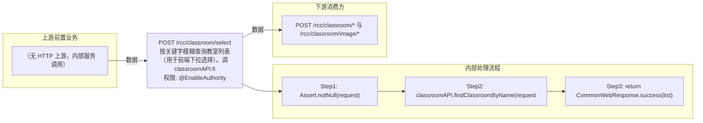

# POST /rcc/classroom/select

> 按关键字模糊查询教室列表（用于前端下拉选择）。调 classroomAPI.findClassroomByName 返回匹配的教室 DTO 列表。 ｜ @EnableAuthority ｜ 同步

## 依赖关系全景图

## 接口基本信息

| 项目 | 内容 |
|---|---|
| URL | /rcc/classroom/select |
| Controller | RccClassroomConfigController |
| 方法名 | getClassroomByName |
| 权限注解 | @EnableAuthority |
| 执行方式 | 同步 |
| 业务含义 | 按关键字模糊查询教室列表（用于前端下拉选择）。调 classroomAPI.findClassroomByName 返回匹配的教室 DTO 列表。 |

## 入参详情

### ClassroomQueryByNameRequest

| 参数名 | 类型 | 必填 | 约束 | 说明 |
|---|---|---|---|---|
| searchKeyword | String | 是 | @NotNull | 教室名称搜索关键字 |

## 出参详情

| 返回类型 | CommonWebResponse（data=List<ClassroomDTO>） |
|---|---|

| 字段 | 类型 | 说明 |
|---|---|---|
| itemArr | ClassroomDTO[] | 匹配教室列表（元素字段见下） |
| classroomId | UUID | 教室ID |
| classroomName | String | 教室名称 |
| timetableId | UUID | 课表ID |
| classroomState | ClassroomLessonStatusEnum | 教室上课状态 |
| currentLessonId | UUID | 当前上课ID |
| startPolicy | DesktopStartPolicyEnum | 上课云桌面启动策略 |

## 上游前置业务

（无上游数据依赖）
## 内部处理流程

### 处理流程

1. Assert.notNull(request)
2. classroomAPI.findClassroomByName(request) 查询
3. return CommonWebResponse.success(list)

## 下游消费方

### 消费1：POST /rcc/classroom/* 与 /rcc/classroom/image/*

出参 ClassroomDTO.classroomId，是 create 异步批任务完成后获取教室ID的关键来源（由 field_map 契约映射）
## 接口参数约束分析

| 层级 | 参数 | 规则 | 失败结果 |
|---|---|---|---|
| PARAM | searchKeyword | @NotNull | 缺失校验失败 |

## 参数取值策略

| 参数 | 策略 | 说明 |
|---|---|---|
| searchKeyword | user_input/from_query | 按业务构造 |

## 成功/失败断言基准

### 成功场景

| 场景 | 断言点 |
|---|---|
| 传入关键字 | $.status=="SUCCESS"；$.content 为匹配教室列表（可能为空） |

### 失败场景

| 场景 | 触发条件 | 断言点 |
|---|---|---|
| searchKeyword 为空 | 请求体缺少 searchKeyword | status==ERROR（参数校验失败） |

## 环境清理机制

| 接口 | 说明 |
|---|---|
| 本接口创建的资源 | 通过对应 delete 接口清理 |

## 前置状态和幂等性标注

| 维度 | 结论 |
|---|---|
| 幂等性 | HIGH |
| 说明 | 纯查询接口，无副作用 |
