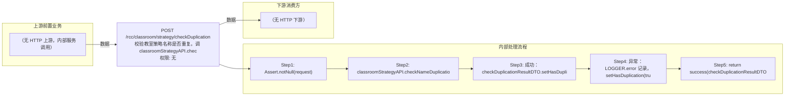

# POST /rcc/classroom/strategy/checkDuplication

> 校验教室策略名称是否重复。调 classroomStrategyAPI.checkNameDuplication(name, id)（id 为空表示创建场景，非空为编辑场景排除自身）；重复时返回 hasDuplication=true 与错误消息。 ｜ 无特殊权限 ｜ 同步

## 依赖关系全景图

## 接口基本信息

| 项目 | 内容 |
|---|---|
| URL | /rcc/classroom/strategy/checkDuplication |
| Controller | RccClassroomStrategyController |
| 方法名 | checkStrategyNameDuplication |
| 权限注解 | 无 |
| 执行方式 | 同步 |
| 业务含义 | 校验教室策略名称是否重复。调 classroomStrategyAPI.checkNameDuplication(name, id)（id 为空表示创建场景，非空为编辑场景排除自身）；重复时返回 hasDuplication=true 与错误消息。 |

## 入参详情

### CheckClassroomStrategyNameDuplicationRequest

| 参数名 | 类型 | 必填 | 约束 | 说明 |
|---|---|---|---|---|
| classroomStrategyName | String | 是 | @NotBlank | 待校验的教室策略名称 |
| id | UUID | 否 | @Nullable | 教室策略ID（编辑场景传，排除自身） |

## 出参详情

| 返回类型 | DefaultWebResponse（data=CheckDuplicationResultDTO） |
|---|---|

| 字段 | 类型 | 说明 |
|---|---|---|
| hasDuplication | Boolean | 名称是否重复（默认 false） |
| errorMsg | String | 重复的 i18n 错误消息 |

## 上游前置业务

> 本接口上游为服务端内部调用（非 HTTP 端点）：
> - 
## 内部处理流程

### 处理流程

1. Assert.notNull(request)
2. classroomStrategyAPI.checkNameDuplication(classroomStrategyName, id) 校验
3. 成功：checkDuplicationResultDTO.setHasDuplication(false)
4. 异常：LOGGER.error 记录，setHasDuplication(true)、setErrorMsg(e.getI18nMessage())
5. return success(checkDuplicationResultDTO)

## 下游消费方

（本接口数据主要被自身/关联接口消费，或经 SPI 通知）
## 接口参数约束分析

| 层级 | 参数 | 规则 | 失败结果 |
|---|---|---|---|
| PARAM | classroomStrategyName | @NotBlank | 空白校验失败 |
| BUSINESS | classroomStrategyName | 不得与其他策略名称重复（编辑时排除自身 id） | 抛 RCDC_RCC_CLASSROOM_STRATEGY_NAME_DUPLICATE，接口以 hasDuplication=true 返回 |

## 参数取值策略

| 参数 | 策略 | 说明 |
|---|---|---|
| classroomStrategyName | user_input/from_query | 按业务构造 |
| id | user_input/from_query | 按业务构造 |

## 成功/失败断言基准

### 成功场景

| 场景 | 断言点 |
|---|---|
| 名称未被占用 | $.content.hasDuplication==false |
### 失败场景

| 场景 | 触发条件 | 断言点 |
|---|---|---|
| 名称已被占用 | classroomStrategyName 与其他策略同名 | $.content.hasDuplication==true 且 $.content.errorMsg 非空 |
## 环境清理机制

| 接口 | 说明 |
|---|---|
| 本接口创建的资源 | 通过对应 delete 接口清理 |

## 前置状态和幂等性标注

| 维度 | 结论 |
|---|---|
| 幂等性 | HIGH |
| 说明 | 只读校验，无副作用 |
