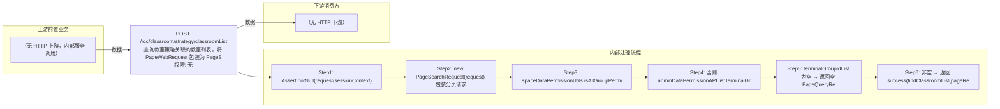

# POST /rcc/classroom/strategy/classroomList

> 查询教室策略关联的教室列表。将 PageWebRequest 包装为 PageSearchRequest；管理员拥有全部终端组权限时直接 findClassroomList(空权限过滤)；否则查询可见终端组ID列表，无任何权限返回空页，有权限则作为权限过滤传入 findClassroomList。返回 DefaultPageResponse<ClassroomStrategyUsedByClassroomDTO>。 ｜ 无特殊权限 ｜ 同步分页查询（PageSearch + 数据权限过滤）

## 依赖关系全景图

## 接口基本信息

| 项目 | 内容 |
|---|---|
| URL | /rcc/classroom/strategy/classroomList |
| Controller | RccClassroomStrategyController |
| 方法名 | getClassroomList |
| 权限注解 | 无 |
| 执行方式 | 同步分页查询（PageSearch + 数据权限过滤） |
| 业务含义 | 查询教室策略关联的教室列表。将 PageWebRequest 包装为 PageSearchRequest；管理员拥有全部终端组权限时直接 findClassroomList(空权限过滤)；否则查询可见终端组ID列表，无任何权限返回空页，有权限则作为权限过滤传入 findClassroomList。返回 DefaultPageResponse<ClassroomStrategyUsedByClassroomDTO>。 |

## 入参详情

### PageWebRequest（sk.webmvc 框架类）

| 参数名 | 类型 | 必填 | 约束 | 说明 |
|---|---|---|---|---|
| page | Integer | 否 | @Range(min=0) | 页码 |
| limit | Integer | 否 | @Range(min=1, max=2000) | 每页条数 |
| matchArr | Match[] | 否 | @NotNull | 查询条件数组 |
| sortArr | Sort[] | 否 | @NotNull | 排序条件数组 |
| customData | String | 否 | @Nullable | 自定义扩展数据 |

## 出参详情

| 返回类型 | DefaultWebResponse（data=DefaultPageResponse<ClassroomStrategyUsedByClassroomDTO>） |
|---|---|

| 字段 | 类型 | 说明 |
|---|---|---|
| itemArr | ClassroomStrategyUsedByClassroomDTO[] | 教室列表项：classroomId, classroomName, teacherHasCited, studentHasCited, studentClassroomStrategyId, teacherClassroomStrategyId |
| total | Integer | 总记录数 |

## 上游前置业务

（无上游数据依赖）
## 内部处理流程

### 处理流程

1. Assert.notNull(request/sessionContext)
2. new PageSearchRequest(request) 包装分页请求
3. spaceDataPermissionUtils.isAllGroupPermission(userId) 为 true → findClassroomList(pageRequest, new ArrayList<>()) 并返回
4. 否则 adminDataPermissionAPI.listTerminalGroupIdByAdminId(new ListTerminalGroupIdRequest(userId)) 查询可见终端组
5. terminalGroupIdList 为空 → 返回空 PageQueryResponse<ViewClassroomInfoEntity>
6. 非空 → 返回 success(findClassroomList(pageRequest, terminalGroupIdList))

## 下游消费方

（本接口数据主要被自身/关联接口消费，或经 SPI 通知）
## 接口参数约束分析

| 层级 | 参数 | 规则 | 失败结果 |
|---|---|---|---|
| BUSINESS | 数据权限 | 非全权限管理员仅返回其可见终端组内教室 | 无可见终端组时返回空列表（非错误） |

## 参数取值策略

| 参数 | 策略 | 说明 |
|---|---|---|
| page | user_input/from_query | 按业务构造 |
| limit | user_input/from_query | 按业务构造 |
| matchArr | user_input/from_query | 按业务构造 |
| sortArr | user_input/from_query | 按业务构造 |
| customData | user_input/from_query | 按业务构造 |

## 成功/失败断言基准

### 成功场景

| 场景 | 断言点 |
|---|---|
| 全权限管理员查询 | $.content.itemArr 非空 |
| 非全权限管理员无可见终端组 | $.content.itemArr 为空 |
### 失败场景

| 场景 | 触发条件 | 断言点 |
|---|---|---|
| 权限不足 | 无授权 | 403 |

## 环境清理机制

| 接口 | 说明 |
|---|---|
| 本接口创建的资源 | 通过对应 delete 接口清理 |

## 前置状态和幂等性标注

| 维度 | 结论 |
|---|---|
| 幂等性 | HIGH |
| 说明 | 纯查询接口，无副作用 |
