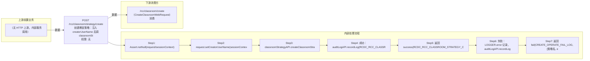

# POST /rcc/classroom/strategy/create

> 创建教室策略：注入 creatorUserName 后调 classroomStrategyAPI.createClassroomStrategy（内部执行 ClassroomStrategyRequest.validate 校验），成功记录创建审计日志并返回成功消息；失败记录失败审计日志并返回失败响应。 ｜ 无特殊权限 ｜ 同步

## 依赖关系全景图

## 接口基本信息

| 项目 | 内容 |
|---|---|
| URL | /rcc/classroom/strategy/create |
| Controller | RccClassroomStrategyController |
| 方法名 | createClassroomStrategy |
| 权限注解 | 无 |
| 执行方式 | 同步 |
| 业务含义 | 创建教室策略：注入 creatorUserName 后调 classroomStrategyAPI.createClassroomStrategy（内部执行 ClassroomStrategyRequest.validate 校验），成功记录创建审计日志并返回成功消息；失败记录失败审计日志并返回失败响应。 |

## 入参详情

### CreateClassroomStrategyRequest（继承 ClassroomStrategyRequest）

| 参数名 | 类型 | 必填 | 约束 | 说明 |
|---|---|---|---|---|
| classroomStrategyName | String | 是 | @NotBlank @Size(min=1, max=32)，且匹配名称规格正则 | 教室策略名称 |
| classroomStrategyDesc | String | 否 | @Nullable @Size(max=128) | 教室策略描述 |
| linkShutdown | Boolean | 是 | @NotNull | 终端联动关机开关（默认 false） |
| startPolicy | DesktopStartPolicyEnum | 是 | @NotNull | 上课云桌面启动策略（START_ALL=启动所有云桌面 / START_ONLINE=仅启动终端连接的云桌面） |
| defaultEnterImageSwitch | Boolean | 是 | @NotNull | 默认进入指定云桌面开关（默认 false） |
| defaultEnterImageSeconds | Integer | 否 | @Nullable @Range(min=1, max=60)；开关开启时逻辑必填 | 默认进入指定云桌面倒计时（秒） |
| defaultDisplayDeskType | DefaultDisplayDeskType | 是 | @NotNull | 默认展示桌面类型（CLASSROOM_MODE=默认课程镜像桌面 / LOCAL_DESK_MODE=公共本地镜像 / PERSONAL_VDI_DESK_MODE=个人云桌面） |
| reservedStoragePolicy | ReservedSpaceType | 是 | @NotNull | 预留空间类型（SYSTEM_DEFAULT=系统默认 / USER_DEFINED=用户自定义，USER_DEFINED 时 reservedStorageSize 必填） |
| reservedStorageSize | Integer | 否 | @Nullable @Range(min=1, max=1024)；预留策略为 USER_DEFINED 时逻辑必填 | 磁盘预留空间大小（GB） |
| creatorUserName | String | 否 | @Nullable；服务端从 sessionContext.getUserName() 注入 | 创建者登录名 |
| createTime | Date | 否 | @Nullable；构造时默认 new Date() | 创建时间 |

## 出参详情

| 返回类型 | DefaultWebResponse（data=成功key，msg=RCDC_RCC_CLASSROOM_STRATEGY_CREATE_OPERATE_LOG + 策略名） |
|---|---|

| 字段 | 类型 | 说明 |
|---|---|---|
| content | null | 纯操作接口：content 为空（成功响应仅 status/message，msgKey=RCDC_RCC_CLASSROOM_STRATEGY_CREATE_OPERATE_LOG） |

## 上游前置业务

（无上游数据依赖）
## 内部处理流程

### 处理流程

1. Assert.notNull(request/sessionContext)
2. request.setCreatorUserName(sessionContext.getUserName())
3. classroomStrategyAPI.createClassroomStrategy(request)（内部 validate：defaultEnterImageSwitch 开启时 seconds 必填、reservedStoragePolicy=USER_DEFINED 时 size 必填、名称规格校验）
4. 成功：auditLogAPI.recordLog(RCDC_RCC_CLASSROOM_STRATEGY_CREATE_OPERATE_LOG, 策略名)
5. 返回 success(RCDC_RCC_CLASSROOM_STRATEGY_CREATE_OPERATE_LOG, [策略名])
6. 失败：LOGGER.error 记录，auditLogAPI.recordLog(CREATE_OPERATE_FAIL_LOG, 策略名, e.getI18nMessage())
7. 返回 fail(CREATE_OPERATE_FAIL_LOG, [策略名, e.getI18nMessage()])

## 下游消费方

### 消费1：/rcc/classroom/create（CreateClassroomWebRequest）消费

消费方（由 field_map 契约映射）
## 接口参数约束分析

| 层级 | 参数 | 规则 | 失败结果 |
|---|---|---|---|
| PARAM | classroomStrategyName | @NotBlank @Size(1-32) + 名称规格正则（^[0-9a-zA-Z\u4e00-\u9fa5\.\-@]...） | 不匹配抛 RCDC_RCC_CLASSROOM_STRATEGY_NAME_NOT_MATCHES_SPECIFICATION |
| PARAM | linkShutdown | @NotNull | 缺失校验失败 |
| PARAM | startPolicy | @NotNull | 缺失校验失败 |
| PARAM | defaultEnterImageSwitch | @NotNull | 缺失校验失败 |
| PARAM | defaultDisplayDeskType | @NotNull | 缺失校验失败 |
| PARAM | reservedStoragePolicy | @NotNull | 缺失校验失败 |
| BUSINESS | defaultEnterImageSeconds | defaultEnterImageSwitch=true 时必须填写 | 抛 RCDC_RCC_CLASSROOM_STRATEGY_DEFAULT_ENTER_IMAGE_SECONDS_IS_NULL |
| BUSINESS | reservedStorageSize | reservedStoragePolicy=USER_DEFINED 时必须填写 | 抛 RCDC_RCC_CLASSROOM_STRATEGY_RESERVED_STORAGE_SIZE_IS_NULL |
| BUSINESS | classroomStrategyName | 名称唯一 | 抛 RCDC_RCC_CLASSROOM_STRATEGY_NAME_DUPLICATE |

## 参数取值策略

| 参数 | 策略 | 说明 |
|---|---|---|
| classroomStrategyName | user_input/from_query | 按业务构造 |
| classroomStrategyDesc | user_input/from_query | 按业务构造 |
| linkShutdown | user_input/from_query | 按业务构造 |
| startPolicy | user_input/from_query | 按业务构造 |
| defaultEnterImageSwitch | user_input/from_query | 按业务构造 |
| defaultEnterImageSeconds | user_input/from_query | 按业务构造 |
| defaultDisplayDeskType | user_input/from_query | 按业务构造 |
| reservedStoragePolicy | user_input/from_query | 按业务构造 |
| reservedStorageSize | user_input/from_query | 按业务构造 |
| creatorUserName | user_input/from_query | 按业务构造 |
| createTime | user_input/from_query | 按业务构造 |

## 成功/失败断言基准

### 成功场景

| 场景 | 断言点 |
|---|---|
| 参数合法且名称唯一 | $.status==SUCCESS |
### 失败场景

| 场景 | 触发条件 | 断言点 |
|---|---|---|
| 名称重复 | classroomStrategyName 已存在 | $.status==ERROR 且 $.msgKey==RCDC_RCC_CLASSROOM_STRATEGY_CREATE_OPERATE_FAIL_LOG |
| 默认进入桌面开关开启但倒计时为空 | defaultEnterImageSwitch=true，defaultEnterImageSeconds 缺省 | $.status==ERROR 且 $.msgKey==RCDC_RCC_CLASSROOM_STRATEGY_CREATE_OPERATE_FAIL_LOG（msgArgArr[1] 为倒计时为空文案） |
## 环境清理机制

| 接口 | 说明 |
|---|---|
| 本接口创建的资源 | 通过对应 delete 接口清理 |

## 前置状态和幂等性标注

| 维度 | 结论 |
|---|---|
| 幂等性 | MEDIUM |
| 说明 | 名称唯一约束兜底，重复提交同名会失败；无显式幂等键 |
