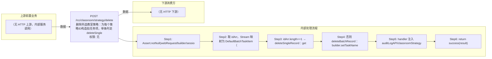

# POST /rcc/classroom/strategy/delete

> 删除所选教室策略：为每个策略ID构造批任务项，单条时走 deleteSingleRecord（先取策略名作为任务描述），多条时走 deleteBatchRecord，提交 DeleteClassroomStrategyHandler 批任务；processItem 校验策略存在并调 classroomStrategyAPI.deleteClassroomStrategy 删除，记录审计日志，接口立即返回 BatchTaskSubmitResult。 ｜ 无特殊权限 ｜ 异步批处理任务（BatchTask，DeleteClassroomStrategyHandler，单条顺序/多条批量）

## 依赖关系全景图

## 接口基本信息

| 项目 | 内容 |
|---|---|
| URL | /rcc/classroom/strategy/delete |
| Controller | RccClassroomStrategyController |
| 方法名 | batchDeleteClassroomStrategy |
| 权限注解 | 无 |
| 执行方式 | 异步批处理任务（BatchTask，DeleteClassroomStrategyHandler，单条顺序/多条批量） |
| 业务含义 | 删除所选教室策略：为每个策略ID构造批任务项，单条时走 deleteSingleRecord（先取策略名作为任务描述），多条时走 deleteBatchRecord，提交 DeleteClassroomStrategyHandler 批任务；processItem 校验策略存在并调 classroomStrategyAPI.deleteClassroomStrategy 删除，记录审计日志，接口立即返回 BatchTaskSubmitResult。 |

## 入参详情

### IdArrWebRequest（sk.webmvc 框架类）

| 参数名 | 类型 | 必填 | 约束 | 说明 |
|---|---|---|---|---|
| idArr | UUID[] | 是 | @NotEmpty | 待删除教室策略ID数组 |

## 出参详情

| 返回类型 | DefaultWebResponse（data=BatchTaskSubmitResult） |
|---|---|

| 字段 | 类型 | 说明 |
|---|---|---|
| taskId | UUID | 批任务ID |
| taskName | String | 删除教室策略任务名称（单条含策略名） |
| taskDesc | String | 删除教室策略任务描述 |

## 上游前置业务

> 本接口上游为服务端内部调用（非 HTTP 端点）：
> - 
## 内部处理流程

### 批量处理器：DeleteClassroomStrategyHandler（extends AbstractBatchTaskHandler，每策略一项）

| 步骤 | 说明 |
|---|---|
| 1 | processItem：Assert item 非空，classroomStrategyId=item.getItemID() |
| 2 | getClassroomStrategyById(id) 取策略名（不存在抛 RCDC_RCC_CLASSROOM_STRATEGY_NOT_FOUND），失败时策略名回退为ID |
| 3 | 构造 DeleteClassroomStrategyRequest(id) 调 classroomStrategyAPI.deleteClassroomStrategy |
| 4 | 成功：auditLogAPI.recordLog(DELETE_OPERATE_SUCCESS_LOG, 策略名)，返回 SUCCESS |
| 5 | 失败：auditLogAPI.recordLog(DELETE_OPERATE_FAIL_LOG, 策略名, e.getI18nMessage())，返回 FAILURE（msgKey=DELETE_OPERATE_FAIL_LOG） |
| 6 | onFinish：条目数>1 → BATCH_DELETE_RESULT（全成功=SUCCESS/全失败=FAILURE/部分=PARTIAL_SUCCESS）；单条成功 → SUCCESS(DELETE_OPERATE_SUCCESS_LOG)；单条失败 → FAILURE(SINGLE_DELETE_FAIL_LOG) |

### 处理流程

1. Assert.notNull(webRequest/builder/sessionContext)
2. 取 idArr，Stream 映射为 DefaultBatchTaskItem（itemName=RCDC_RCC_CLASSROOM_STRATEGY_DELETE_ITEM_NAME）
3. idArr.length==1 → deleteSingleRecord：getClassroomStrategyById(idArr[0]) 取策略名，builder.setTaskName/DESC(SINGLE_DELETE_TASK_NAME/DESC, 策略名).registerHandler(handler).start()
4. 否则 deleteBatchRecord：builder.setTaskName/DESC(BATCH_DELETE_TASK_NAME/DESC).registerHandler(handler).start()
5. handler 注入 auditLogAPI/classroomStrategyAPI/adminId
6. return success(result)

## 下游消费方

（本接口数据主要被自身/关联接口消费，或经 SPI 通知）
## 接口参数约束分析

| 层级 | 参数 | 规则 | 失败结果 |
|---|---|---|---|
| PARAM | idArr | @NotEmpty | 空数组校验失败 |
| BUSINESS | classroomStrategyId | 策略必须存在 | 抛 RCDC_RCC_CLASSROOM_STRATEGY_NOT_FOUND，单项 FAILURE |
| BUSINESS | 策略被引用状态 | 策略关联的教室不得上课中/桌面运行/被使用 | 抛 RCDC_RCC_CLASSROOM_STRATEGY_HAS_CLASSROOM_IN_CLASS / HAS_CLASSROOM_DESKTOP_RUNNING / HAS_CLASSROOM_USED |

## 参数取值策略

| 参数 | 策略 | 说明 |
|---|---|---|
| idArr | user_input/from_query | 按业务构造 |

## 成功/失败断言基准

### 成功场景

| 场景 | 断言点 |
|---|---|
| 有效策略ID数组 | 返回 HTTP 200 + BatchTaskSubmitResult，异步删除并记录成功审计 |

### 失败场景

| 场景 | 触发条件 | 断言点 |
|---|---|---|
| 策略ID不存在 | 传入无效ID | $.status=="SUCCESS"；content.taskId 非空；轮询终态对应项 batchTaskItemStatus==FAILURE；msgKey==RCDC_RCC_CLASSROOM_STRATEGY_DELETE_OPERATE_FAIL_LOG |
| 策略被上课中教室引用 | 关联教室正在上课 | $.status=="SUCCESS"；content.taskId 非空；轮询终态对应项 batchTaskItemStatus==FAILURE；msgKey==RCDC_RCC_CLASSROOM_STRATEGY_HAS_CLASSROOM_IN_CLASS |

## 环境清理机制

| 接口 | 说明 |
|---|---|
| 本接口创建的资源 | 通过对应 delete 接口清理 |

## 前置状态和幂等性标注

| 维度 | 结论 |
|---|---|
| 幂等性 | LOW |
| 说明 | 删除为破坏性非幂等操作；重复删除已删除策略会报不存在；多条时有部分成功场景 |
