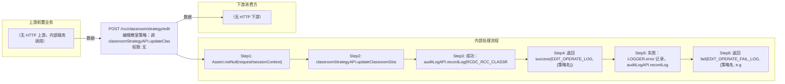

# POST /rcc/classroom/strategy/edit

> 编辑教室策略：调 classroomStrategyAPI.updateClassroomStrategy（内部执行 validate()），成功记录编辑审计日志并返回成功消息；失败记录失败审计日志并返回失败响应。 ｜ 无特殊权限 ｜ 同步

## 依赖关系全景图

## 接口基本信息

| 项目 | 内容 |
|---|---|
| URL | /rcc/classroom/strategy/edit |
| Controller | RccClassroomStrategyController |
| 方法名 | editClassroomStrategy |
| 权限注解 | 无 |
| 执行方式 | 同步 |
| 业务含义 | 编辑教室策略：调 classroomStrategyAPI.updateClassroomStrategy（内部执行 validate()），成功记录编辑审计日志并返回成功消息；失败记录失败审计日志并返回失败响应。 |

## 入参详情

### UpdateClassroomStrategyRequest（继承 ClassroomStrategyRequest）

| 参数名 | 类型 | 必填 | 约束 | 说明 |
|---|---|---|---|---|
| id | UUID | 是 | @NotNull | 教室策略ID |
| classroomStrategyName | String | 是 | @NotBlank @Size(min=1, max=32)，且匹配名称规格正则 | 教室策略名称 |
| classroomStrategyDesc | String | 否 | @Nullable @Size(max=128) | 教室策略描述 |
| linkShutdown | Boolean | 是 | @NotNull | 终端联动关机开关 |
| startPolicy | DesktopStartPolicyEnum | 是 | @NotNull | 上课云桌面启动策略 |
| defaultEnterImageSwitch | Boolean | 是 | @NotNull | 默认进入指定云桌面开关 |
| defaultEnterImageSeconds | Integer | 否 | @Nullable @Range(min=1, max=60)；开关开启时逻辑必填 | 默认进入指定云桌面倒计时（秒） |
| defaultDisplayDeskType | DefaultDisplayDeskType | 是 | @NotNull | 默认展示桌面类型 |
| reservedStoragePolicy | ReservedSpaceType | 是 | @NotNull | 预留空间类型 |
| reservedStorageSize | Integer | 否 | @Nullable @Range(min=1, max=1024)；预留策略为 USER_DEFINED 时逻辑必填 | 磁盘预留空间大小（GB） |
| creatorUserName | String | 否 | @Nullable | 创建者登录名（编辑时沿用） |
| updateTime | Date | 否 | @Nullable；构造时默认 new Date() | 更新时间 |

## 出参详情

| 返回类型 | DefaultWebResponse（data=成功key，msg=RCDC_RCC_CLASSROOM_STRATEGY_EDIT_OPERATE_LOG + 策略名） |
|---|---|

| 字段 | 类型 | 说明 |
|---|---|---|
| content | null | 纯操作接口：content 为空（成功响应仅 status/message，msgKey=RCDC_RCC_CLASSROOM_STRATEGY_EDIT_OPERATE_LOG） |

## 上游前置业务

> 本接口上游为服务端内部调用（非 HTTP 端点）：
> - 
## 内部处理流程

### 处理流程

1. Assert.notNull(request/sessionContext)
2. classroomStrategyAPI.updateClassroomStrategy(request)（内部 validate：defaultEnterImageSwitch 开启时 seconds 必填、reservedStoragePolicy=USER_DEFINED 时 size 必填、名称规格校验）
3. 成功：auditLogAPI.recordLog(RCDC_RCC_CLASSROOM_STRATEGY_EDIT_OPERATE_LOG, 策略名)
4. 返回 success(EDIT_OPERATE_LOG, [策略名])
5. 失败：LOGGER.error 记录，auditLogAPI.recordLog(EDIT_OPERATE_FAIL_LOG, 策略名, e.getI18nMessage())
6. 返回 fail(EDIT_OPERATE_FAIL_LOG, [策略名, e.getI18nMessage()])

## 下游消费方

（本接口数据主要被自身/关联接口消费，或经 SPI 通知）
## 接口参数约束分析

| 层级 | 参数 | 规则 | 失败结果 |
|---|---|---|---|
| PARAM | id | @NotNull | 缺失校验失败 |
| PARAM | classroomStrategyName | @NotBlank @Size(1-32) + 名称规格正则 | 不匹配抛 RCDC_RCC_CLASSROOM_STRATEGY_NAME_NOT_MATCHES_SPECIFICATION |
| PARAM | linkShutdown/startPolicy/defaultEnterImageSwitch/defaultDisplayDeskType/reservedStoragePolicy | @NotNull | 缺失校验失败 |
| BUSINESS | defaultEnterImageSeconds | defaultEnterImageSwitch=true 时必须填写 | 抛 RCDC_RCC_CLASSROOM_STRATEGY_DEFAULT_ENTER_IMAGE_SECONDS_IS_NULL |
| BUSINESS | reservedStorageSize | reservedStoragePolicy=USER_DEFINED 时必须填写 | 抛 RCDC_RCC_CLASSROOM_STRATEGY_RESERVED_STORAGE_SIZE_IS_NULL |
| BUSINESS | id | 策略必须存在 | 抛 RCDC_RCC_CLASSROOM_STRATEGY_NOT_FOUND |
| BUSINESS | classroomStrategyName | 名称唯一（排除自身） | 抛 RCDC_RCC_CLASSROOM_STRATEGY_NAME_DUPLICATE |

## 参数取值策略

| 参数 | 策略 | 说明 |
|---|---|---|
| id | user_input/from_query | 按业务构造 |
| classroomStrategyName | user_input/from_query | 按业务构造 |
| classroomStrategyDesc | user_input/from_query | 按业务构造 |
| linkShutdown | user_input/from_query | 按业务构造 |
| startPolicy | user_input/from_query | 按业务构造 |
| defaultEnterImageSwitch | user_input/from_query | 按业务构造 |
| defaultEnterImageSeconds | user_input/from_query | 按业务构造 |
| defaultDisplayDeskType | user_input/from_query | 按业务构造 |
| reservedStoragePolicy | user_input/from_query | 按业务构造 |
| reservedStorageSize | user_input/from_query | 按业务构造 |
| creatorUserName | user_input/from_query | 按业务构造 |
| updateTime | user_input/from_query | 按业务构造 |

## 成功/失败断言基准

### 成功场景

| 场景 | 断言点 |
|---|---|
| 参数合法且策略存在 | $.status==SUCCESS |
### 失败场景

| 场景 | 触发条件 | 断言点 |
|---|---|---|
| 策略ID不存在 | id 无效 | $.status==ERROR 且 $.msgKey==RCDC_RCC_CLASSROOM_STRATEGY_EDIT_OPERATE_FAIL_LOG |
| 名称与其他策略重复 | classroomStrategyName 被占用 | $.status==ERROR 且 $.msgKey==RCDC_RCC_CLASSROOM_STRATEGY_EDIT_OPERATE_FAIL_LOG（msgArgArr[1] 为名称重复文案） |
## 环境清理机制

| 接口 | 说明 |
|---|---|
| 本接口创建的资源 | 通过对应 delete 接口清理 |

## 前置状态和幂等性标注

| 维度 | 结论 |
|---|---|
| 幂等性 | MEDIUM |
| 说明 | 按 id 整体更新策略，重复提交收敛于最终值；名称冲突时失败 |
