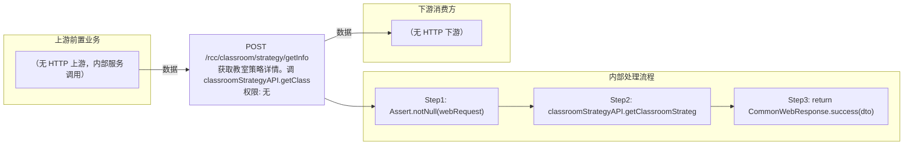

# POST /rcc/classroom/strategy/getInfo

> 获取教室策略详情。调 classroomStrategyAPI.getClassroomStrategyById(id) 返回 ClassroomStrategyDTO。 ｜ 无特殊权限 ｜ 同步

## 依赖关系全景图

## 接口基本信息

| 项目 | 内容 |
|---|---|
| URL | /rcc/classroom/strategy/getInfo |
| Controller | RccClassroomStrategyController |
| 方法名 | getDeskStrategy |
| 权限注解 | 无 |
| 执行方式 | 同步 |
| 业务含义 | 获取教室策略详情。调 classroomStrategyAPI.getClassroomStrategyById(id) 返回 ClassroomStrategyDTO。 |

## 入参详情

### IdWebRequest（sk.webmvc 框架类）

| 参数名 | 类型 | 必填 | 约束 | 说明 |
|---|---|---|---|---|
| id | UUID | 是 | @NotNull | 教室策略ID |

## 出参详情

| 返回类型 | CommonWebResponse（data=ClassroomStrategyDTO） |
|---|---|

| 字段 | 类型 | 说明 |
|---|---|---|
| classroomStrategyId | UUID | 教室策略ID |
| classroomStrategyName | String | 教室策略名称 |
| classroomStrategyDesc | String | 教室策略描述 |
| linkShutdown | Boolean | 终端联动关机开关 |
| startPolicy | DesktopStartPolicyEnum | 上课云桌面启动策略 |
| defaultEnterImageSwitch | Boolean | 单镜像默认进入开关 |
| defaultEnterImageSeconds | Integer | 单镜像自动进入倒计时秒数 |
| defaultDisplayDeskType | DefaultDisplayDeskType | 默认展示桌面类型 |
| creatorUserName | String | 创建者登录名 |
| classroomStrategyState | ClassroomStrategyState | 策略状态 |
| createTime | Date | 创建时间 |
| updateTime | Date | 更新时间 |
| refClassroomNum | Integer | 引用该策略的教室数 |
| reservedStoragePolicy | ReservedSpaceType | 预留空间类型 |
| reservedStorageSize | Integer | 磁盘预留空间大小 |
| startMode | CbbTerminalStartMode | 终端启动模式（默认UEFI） |

## 上游前置业务

> 本接口上游为服务端内部调用（非 HTTP 端点）：
> - 
## 内部处理流程

### 处理流程

1. Assert.notNull(webRequest)
2. classroomStrategyAPI.getClassroomStrategyById(webRequest.getId()) 查询
3. return CommonWebResponse.success(dto)

## 下游消费方

（本接口数据主要被自身/关联接口消费，或经 SPI 通知）
## 接口参数约束分析

| 层级 | 参数 | 规则 | 失败结果 |
|---|---|---|---|
| PARAM | id | @NotNull | 缺失校验失败 |
| BUSINESS | id | 策略必须存在 | 抛 RCDC_RCC_CLASSROOM_STRATEGY_NOT_FOUND |

## 参数取值策略

| 参数 | 策略 | 说明 |
|---|---|---|
| id | user_input/from_query | 按业务构造 |

## 成功/失败断言基准

### 成功场景

| 场景 | 断言点 |
|---|---|
| 传入有效策略ID | $.status=="SUCCESS"；$.content.classroomStrategyId 非空 |

### 失败场景

| 场景 | 触发条件 | 断言点 |
|---|---|---|
| 策略ID不存在 | id 无效 | status==ERROR；msgKey==RCDC_RCC_CLASSROOM_STRATEGY_NOT_FOUND |

## 环境清理机制

| 接口 | 说明 |
|---|---|
| 本接口创建的资源 | 通过对应 delete 接口清理 |

## 前置状态和幂等性标注

| 维度 | 结论 |
|---|---|
| 幂等性 | HIGH |
| 说明 | 纯查询接口，无副作用 |
