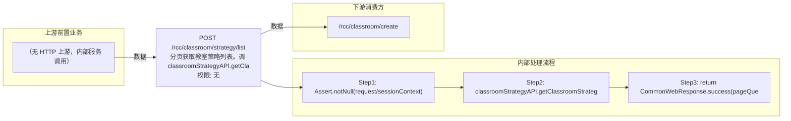

# POST /rcc/classroom/strategy/list

> 分页获取教室策略列表。调 classroomStrategyAPI.getClassroomStrategyList(pageQueryRequest) 返回 PageQueryResponse<ViewClassroomStrategyDTO>。 ｜ 无特殊权限 ｜ 同步分页查询（PageQuery）

## 依赖关系全景图

## 接口基本信息

| 项目 | 内容 |
|---|---|
| URL | /rcc/classroom/strategy/list |
| Controller | RccClassroomStrategyController |
| 方法名 | getPageDeskStrategy |
| 权限注解 | 无 |
| 执行方式 | 同步分页查询（PageQuery） |
| 业务含义 | 分页获取教室策略列表。调 classroomStrategyAPI.getClassroomStrategyList(pageQueryRequest) 返回 PageQueryResponse<ViewClassroomStrategyDTO>。 |

## 入参详情

### PageQueryRequest（sk.pagekit 框架接口）

| 参数名 | 类型 | 必填 | 约束 | 说明 |
|---|---|---|---|---|
| page | Integer | 否 | @Range(min=0) | 页码 |
| limit | Integer | 否 | @Range(min=1, max=2000) | 每页条数 |
| matchArr | Match[] | 否 | @NotNull | 查询条件数组 |
| sortArr | Sort[] | 否 | @NotNull | 排序条件数组 |
| customData | String | 否 | @Nullable | 自定义扩展数据 |

## 出参详情

| 返回类型 | CommonWebResponse（data=PageQueryResponse<ViewClassroomStrategyDTO>） |
|---|---|

| 字段 | 类型 | 说明 |
|---|---|---|
| itemArr | ViewClassroomStrategyDTO[] | 策略列表项：classroomStrategyId, classroomStrategyName, classroomStrategyDesc, linkShutdown, startPolicy, defaultEnterImageSeconds, defaultEnterImageSwitch, defaultDisplayDeskType, creatorUserName, classroomStrategyState, version, createTime, updateTime, refClassroomNum |
| total | Integer | 总记录数 |

## 上游前置业务

（无上游数据依赖）
## 内部处理流程

### 处理流程

1. Assert.notNull(request/sessionContext)
2. classroomStrategyAPI.getClassroomStrategyList(request) 分页查询
3. return CommonWebResponse.success(pageQueryResponse)

## 下游消费方

### 消费1：/rcc/classroom/create

消费方（由 field_map 契约映射）
## 接口参数约束分析

| 层级 | 参数 | 规则 | 失败结果 |
|---|---|---|---|
| PARAM | page | @Range(min=0) | 负数校验失败 |
| PARAM | limit | @Range(min=1, max=2000) | 越界校验失败 |

## 参数取值策略

| 参数 | 策略 | 说明 |
|---|---|---|
| page | user_input/from_query | 按业务构造 |
| limit | user_input/from_query | 按业务构造 |
| matchArr | user_input/from_query | 按业务构造 |
| sortArr | user_input/from_query | 按业务构造 |
| customData | user_input/from_query | 按业务构造 |

## 成功/失败断言基准

### 成功场景

| 场景 | 断言点 |
|---|---|
| 分页查询 | $.content.itemArr 非空 |
### 失败场景

| 场景 | 触发条件 | 断言点 |
|---|---|---|
| limit 超限 | limit>2000 | $.status==ERROR |
## 环境清理机制

| 接口 | 说明 |
|---|---|
| 本接口创建的资源 | 通过对应 delete 接口清理 |

## 前置状态和幂等性标注

| 维度 | 结论 |
|---|---|
| 幂等性 | HIGH |
| 说明 | 纯查询接口，无副作用 |
