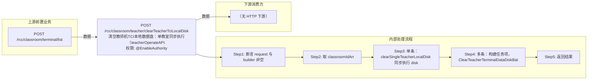

# POST /rcc/classroom/teacher/clearTeacherTciLocalDisk

> 清空教师机TCI本地数据盘：单教室同步执行（teacherOperateAPI.diskClear），多教室提交批量任务异步执行。 ｜ @EnableAuthority ｜ batch

## 依赖关系全景图

## 接口基本信息

| 项目 | 内容 |
|---|---|
| URL | /rcc/classroom/teacher/clearTeacherTciLocalDisk |
| Controller | RccTeacherManageController |
| 方法名 | clearTeacherTciLocalDisk |
| 权限注解 | @EnableAuthority |
| 执行方式 | batch |
| 业务含义 | 清空教师机TCI本地数据盘：单教室同步执行（teacherOperateAPI.diskClear），多教室提交批量任务异步执行。 |

## 入参详情

### ClassroomIdArrWebRequest

| 参数名 | 类型 | 必填 | 约束 | 说明 |
|---|---|---|---|---|
| idArr | UUID[] | 是 | @NotEmpty 非空 | 教室ID数组 |

## 出参详情

| 返回类型 | DefaultWebResponse |
|---|---|

| 字段 | 类型 | 说明 |
|---|---|---|
| content | BatchTaskSubmitResult | 批量场景下的任务提交结果 |

## 上游前置业务

### 前置1：POST /rcc/classroom/terminal/list

教室ID数组（ClassroomIdArrWebRequest.idArr）来自教室终端列表查询出参（ViewClassroomInfoEntity.classroomId）（由 field_map 契约映射）
## 内部处理流程

### 批量处理器：ClearTeacherTerminalDataDiskBatchTaskHandler

| 步骤 | 说明 |
|---|---|
| 1 | teacherOperateAPI.diskClear(classroomId) 清空教师机数据盘 |
| 2 | obtainClassroomName 取教室名 |
| 3 | 成功记 RCDC_RCC_TEACHER_OPERATE_CLEAR_DISK_SUCCESS_LOG，失败记 FAIL_LOG 并返回 FAILURE 项 |

### 处理流程

1. 断言 request 与 builder 非空
2. 取 classroomIdArr
3. 单条：clearSingleTeacherLocalDisk 同步执行 diskClear 并记审计，成功返回业务key
4. 多条：构建任务项，ClearTeacherTerminalDataDiskBatchTaskHandler 提交批量任务
5. 返回结果

## 下游消费方

（本接口数据主要被自身/关联接口消费，或经 SPI 通知）
## 接口参数约束分析

| 层级 | 参数 | 规则 | 失败结果 |
|---|---|---|---|
| PARAM | idArr | 非空 | 参数校验失败（@NotEmpty） |
| BIZ | classroom | 教室必须存在且有教师终端配置且终端类型非PC | RCDC_RCC_TEACHER_OPERATE_CLASSROOM_NOT_FOUND / TEACHER_CONFIG_NOT_FOUND / TERMINAL_NOT_FOUND / CLASSROOM_TEACHER_PC_NOT_SUPPORT / CLASSROOM_TERCHER_TERMINAL_ID_IS_NULL |

## 参数取值策略

| 参数 | 策略 | 说明 |
|---|---|---|
| idArr | user_input/from_query | 按业务构造 |

## 成功/失败断言基准

### 成功场景

| 场景 | 断言点 |
|---|---|
| 教室存在教师终端且清空成功 | 单条返回成功key或批量任务成功 |

### 失败场景

| 场景 | 触发条件 | 断言点 |
|---|---|---|
| 教室无教师终端配置 | classroomTeacherEntity 为空或 terminalId 为空 | 单条返回 RCDC_RCC_TEACHER_OPERATE_CLEAR_DISK_FAIL，批量单项失败 |
| 教师机类型为PC不支持 | teacherType 为 PC | RCDC_RCC_TEACHER_OPERATE_CLASSROOM_TEACHER_PC_NOT_SUPPORT |

## 环境清理机制

| 接口 | 说明 |
|---|---|
| 本接口创建的资源 | 通过对应 delete 接口清理 |

## 前置状态和幂等性标注

| 维度 | 结论 |
|---|---|
| 幂等性 | medium |
| 说明 | 清空数据盘为可重复操作（结果趋于一致），但会删除终端本地数据，需谨慎重复 |
