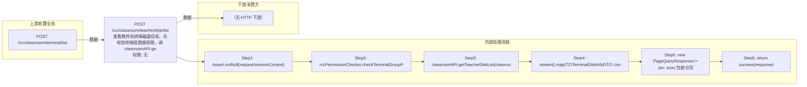

# POST /rcc/classroom/teacher/disk/list

> 查看教师机终端磁盘信息。先校验终端组数据权限，调 classroomAPI.getTeacherDiskList(classroomId) 获取终端磁盘列表，经 TCITerminalDiskInfoDTO::convertFrom 转换为页面 DTO，包装为 PageQueryResponse 返回。 ｜ 无特殊权限 ｜ 同步

## 依赖关系全景图

## 接口基本信息

| 项目 | 内容 |
|---|---|
| URL | /rcc/classroom/teacher/disk/list |
| Controller | RccClassroomConfigController |
| 方法名 | getTeacherTerminalDiskList |
| 权限注解 | 无 |
| 执行方式 | 同步 |
| 业务含义 | 查看教师机终端磁盘信息。先校验终端组数据权限，调 classroomAPI.getTeacherDiskList(classroomId) 获取终端磁盘列表，经 TCITerminalDiskInfoDTO::convertFrom 转换为页面 DTO，包装为 PageQueryResponse 返回。 |

## 入参详情

### TeacherSeatDetailInfoRequest（继承 AbstractClassroomSeatDetailInfoRequest）

| 参数名 | 类型 | 必填 | 约束 | 说明 |
|---|---|---|---|---|
| classroomId | UUID | 是 | @NotNull | 教室ID |
| page | Integer | 否 | @Range(min=0)，默认0 | 页码 |
| limit | Integer | 否 | @Range(min=1, max=2000)，默认1 | 每页条数 |
| matchArr | Match[] | 否 | @NotNull，默认空数组 | 查询条件数组 |
| sortArr | Sort[] | 否 | @NotNull，默认空数组 | 排序条件数组 |
| customData | String | 否 | @Nullable | 自定义扩展数据 |

## 出参详情

| 返回类型 | DefaultWebResponse（data=PageQueryResponse<TCITerminalDiskInfoDTO>） |
|---|---|

| 字段 | 类型 | 说明 |
|---|---|---|
| itemArr | TCITerminalDiskInfoDTO[] | 磁盘信息数组（元素字段见下，TCITerminalDiskInfoDTO 继承 TerminalDeskInfoDTO） |
| total | Integer | 磁盘总数 |
| devName | String | 磁盘名称（设备名） |
| devType | String | 磁盘类型 |
| devForm | String | 磁盘形态 |
| devTotalSize | String | 磁盘空间总大小（单位 byte） |
| devMedia | String | 磁盘介质 |
| devState | String | 磁盘状态 |
| devSn | String | 磁盘序列号 |
| devFirmwareVersion | String | 磁盘固件版本 |
| devHealth | String | 磁盘健康状态 |
| devPowerOnhour | String | 磁盘通电时长 |
| devTotalWritten | String | 磁盘历史写入量 |
| devReadIops | String | 读IOPS |
| devWriteIops | String | 写IOPS |
| devModel | String | 磁盘型号 |
| devAvailSize | String | 磁盘可用空间（TCITerminalDiskInfoDTO 扩展字段） |

## 上游前置业务

### 前置1：POST /rcc/classroom/terminal/list

教室ID在创建教室(POST /rcc/classroom/create)后经教室终端列表查询获得（ViewClassroomInfoEntity.classroomId）（由 field_map 契约映射）
## 内部处理流程

### 处理流程

1. Assert.notNull(request/sessionContext)
2. rccPermissionChecker.checkTerminalGroupPermissionByClassroomId([classroomId], sessionContext)
3. classroomAPI.getTeacherDiskList(classroomId) 获取终端磁盘列表
4. stream().map(TCITerminalDiskInfoDTO::convertFrom) 转换 DTO
5. new PageQueryResponse<>(arr, size) 包装分页
6. return success(response)

## 下游消费方

（本接口数据主要被自身/关联接口消费，或经 SPI 通知）
## 接口参数约束分析

| 层级 | 参数 | 规则 | 失败结果 |
|---|---|---|---|
| PARAM | classroomId | @NotNull | 缺失校验失败 |
| BUSINESS | classroomId | 教室存在且有数据权限 | 不存在抛 RCDC_CLASSROOM_NOT_FIND；权限不足抛权限异常 |

## 参数取值策略

| 参数 | 策略 | 说明 |
|---|---|---|
| classroomId | user_input/from_query | 按业务构造 |
| page | user_input/from_query | 按业务构造 |
| limit | user_input/from_query | 按业务构造 |
| matchArr | user_input/from_query | 按业务构造 |
| sortArr | user_input/from_query | 按业务构造 |
| customData | user_input/from_query | 按业务构造 |

## 成功/失败断言基准

### 成功场景

| 场景 | 断言点 |
|---|---|
| 传入有效教室ID | $.status=="SUCCESS" 且 $.content.itemArr 非空 |

### 失败场景

| 场景 | 触发条件 | 断言点 |
|---|---|---|
| 教室不存在 | classroomId 无效 | $.status=="ERROR" 且 $.msgKey=="rcdc_classroom_not_find" |

## 环境清理机制

| 接口 | 说明 |
|---|---|
| 本接口创建的资源 | 通过对应 delete 接口清理 |

## 前置状态和幂等性标注

| 维度 | 结论 |
|---|---|
| 幂等性 | HIGH |
| 说明 | 纯查询接口，无副作用 |
