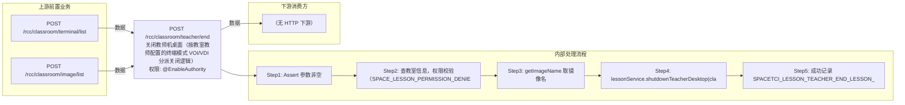

# POST /rcc/classroom/teacher/end

> 关闭教师机桌面（按教室教师配置的终端模式 VOI/VDI 分派关闭逻辑） ｜ @EnableAuthority ｜ sync

## 依赖关系全景图

## 接口基本信息

| 项目 | 内容 |
|---|---|
| URL | /rcc/classroom/teacher/end |
| Controller | RccClassroomLessonController |
| 方法名 | shutdownTeacherDesktop |
| 权限注解 | @EnableAuthority |
| 执行方式 | sync |
| 业务含义 | 关闭教师机桌面（按教室教师配置的终端模式 VOI/VDI 分派关闭逻辑） |

## 入参详情

### OperateTeacherDesktopWebRequest

| 参数名 | 类型 | 必填 | 约束 | 说明 |
|---|---|---|---|---|
| classroomId | UUID | 是 | @NotNull 非空 | 教室ID |
| imageId | UUID | 是 | @NotNull 非空 | 教师机桌面镜像ID（用于审计展示） |

## 出参详情

| 返回类型 | DefaultWebResponse（成功，无 data） |
| 说明 | 纯操作接口：content 为空（仅返回 msgKey，无 content body）；成功返回 SUCCESS；失败返回 status/msgKey |
|---|---|

| 字段 | 类型 | 说明 |
|---|---|---|

## 上游前置业务

### 前置1：POST /rcc/classroom/terminal/list

教室ID在创建教室(POST /rcc/classroom/create)后经教室终端列表查询获得（ViewClassroomInfoEntity.classroomId）（由 field_map 契约映射）

### 前置2：POST /rcc/classroom/image/list

推断：镜像ID来源，字段名为推断（由 field_map 契约映射）
## 内部处理流程

### 处理流程

1. Assert 参数非空
2. 查教室信息，权限校验（SPACE_LESSON_PERMISSION_DENIED）
3. getImageName 取镜像名
4. lessonService.shutdownTeacherDesktop(classroomId)：按 teacherMode 分派 VOI/VDI 关闭
5. 成功记录 SPACETCI_LESSON_TEACHER_END_LESSON_SUCCESS_LOG 并返回；异常记录失败审计并返回 fail

## 下游消费方

（本接口数据主要被自身/关联接口消费，或经 SPI 通知）
## 接口参数约束分析

| 层级 | 参数 | 规则 | 失败结果 |
|---|---|---|---|
| request | classroomId/imageId | @NotNull 非空 | webmvc 参数校验异常 |
| business | terminalGroupId | 管理员需具备教室终端组数据权限 | space_lesson_permission_denied |

## 参数取值策略

| 参数 | 策略 | 说明 |
|---|---|---|
| classroomId | user_input/from_query | 按业务构造 |
| imageId | user_input/from_query | 按业务构造 |

## 成功/失败断言基准

### 成功场景

| 场景 | 断言点 |
|---|---|
| 教师机桌面存在且关闭成功 | status==SUCCESS；content 为空；msgKey==SPACETCI_LESSON_TEACHER_END_LESSON_SUCCESS_LOG |

### 失败场景

| 场景 | 触发条件 | 断言点 |
|---|---|---|
| 关闭桌面异常 | 教师机配置缺失/桌面不存在 | status==ERROR；msgKey==SPACETCI_LESSON_TEACHER_END_LESSON_FAIL_LOG |

## 环境清理机制

| 接口 | 说明 |
|---|---|
| 本接口创建的资源 | 通过对应 delete 接口清理 |

## 前置状态和幂等性标注

| 维度 | 结论 |
|---|---|
| 幂等性 | medium |
| 说明 | 重复关闭通常无害，但无显式防重 |
