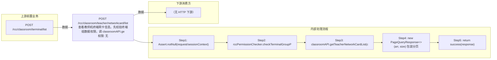

# POST /rcc/classroom/teacher/networkcard/list

> 查看教师机终端网卡信息。先校验终端组数据权限，调 classroomAPI.getTeacherNetworkCardList(classroomId) 获取网卡列表，包装为 PageQueryResponse<CbbTerminalNetworkInfoDTO> 返回。 ｜ 无特殊权限 ｜ 同步

## 依赖关系全景图

## 接口基本信息

| 项目 | 内容 |
|---|---|
| URL | /rcc/classroom/teacher/networkcard/list |
| Controller | RccClassroomConfigController |
| 方法名 | getTeacherTerminalNetworkCardList |
| 权限注解 | 无 |
| 执行方式 | 同步 |
| 业务含义 | 查看教师机终端网卡信息。先校验终端组数据权限，调 classroomAPI.getTeacherNetworkCardList(classroomId) 获取网卡列表，包装为 PageQueryResponse<CbbTerminalNetworkInfoDTO> 返回。 |

## 入参详情

### TeacherSeatDetailInfoRequest（继承 AbstractClassroomSeatDetailInfoRequest）

| 参数名 | 类型 | 必填 | 约束 | 说明 |
|---|---|---|---|---|
| classroomId | UUID | 是 | @NotNull | 教室ID |
| page | Integer | 否 | @Range(min=0)，默认0 | 页码 |
| limit | Integer | 否 | @Range(min=1, max=2000)，默认1 | 每页条数 |
| matchArr | Match[] | 否 | @NotNull，默认空数组 | 查询条件数组 |
| sortArr | Sort[] | 否 | @NotNull，默认空数组 | 排序条件数组 |
| customData | String | 否 | @Nullable | 自定义扩展数据 |

## 出参详情

| 返回类型 | DefaultWebResponse（data=PageQueryResponse<CbbTerminalNetworkInfoDTO>） |
|---|---|

| 字段 | 类型 | 说明 |
|---|---|---|
| itemArr | CbbTerminalNetworkInfoDTO[] | 网卡信息数组（元素字段见下） |
| total | Integer | 网卡总数 |
| networkAccessMode | CbbNetworkModeEnums | 网络接入方式 |
| getIpMode | CbbGetNetworkModeEnums | IP获取方式（静态/DHCP） |
| getDnsMode | CbbGetNetworkModeEnums | DNS获取方式 |
| macAddr | String | 网卡MAC地址 |
| ip | String | 网卡IP |
| subnetMask | String | 子网掩码 |
| gateway | String | 网关 |
| mainDns | String | 首选DNS |
| secondDns | String | 备用DNS |
| ssid | String | 无线SSID |
| maxSpeed | String | 网卡最大速率 |
| product | String | 网卡产品型号 |
| businessCard | CbbNetworkCardEnums | 业务网卡标识 |
| businessCardIndex | Integer | 业务网卡序号 |
| inUse | Boolean | 是否正在使用 |
| iface | String | 网卡接口名 |
| wirelessAuthMode | CbbTerminalWirelessAuthModeEnums | 无线认证方式 |

## 上游前置业务

### 前置1：POST /rcc/classroom/terminal/list

教室ID在创建教室(POST /rcc/classroom/create)后经教室终端列表查询获得（ViewClassroomInfoEntity.classroomId）（由 field_map 契约映射）
## 内部处理流程

### 处理流程

1. Assert.notNull(request/sessionContext)
2. rccPermissionChecker.checkTerminalGroupPermissionByClassroomId([classroomId], sessionContext)
3. classroomAPI.getTeacherNetworkCardList(classroomId) 获取网卡列表
4. new PageQueryResponse<>(arr, size) 包装分页
5. return success(response)

## 下游消费方

（本接口数据主要被自身/关联接口消费，或经 SPI 通知）
## 接口参数约束分析

| 层级 | 参数 | 规则 | 失败结果 |
|---|---|---|---|
| PARAM | classroomId | @NotNull | 缺失校验失败 |
| BUSINESS | classroomId | 教室存在且有数据权限 | 不存在抛 RCDC_CLASSROOM_NOT_FIND；权限不足抛权限异常 |

## 参数取值策略

| 参数 | 策略 | 说明 |
|---|---|---|
| classroomId | user_input/from_query | 按业务构造 |
| page | user_input/from_query | 按业务构造 |
| limit | user_input/from_query | 按业务构造 |
| matchArr | user_input/from_query | 按业务构造 |
| sortArr | user_input/from_query | 按业务构造 |
| customData | user_input/from_query | 按业务构造 |

## 成功/失败断言基准

### 成功场景

| 场景 | 断言点 |
|---|---|
| 传入有效教室ID | $.status=="SUCCESS" 且 $.content.itemArr 非空 |

### 失败场景

| 场景 | 触发条件 | 断言点 |
|---|---|---|
| 教室不存在 | classroomId 无效 | $.status=="ERROR" 且 $.msgKey=="rcdc_classroom_not_find" |

## 环境清理机制

| 接口 | 说明 |
|---|---|
| 本接口创建的资源 | 通过对应 delete 接口清理 |

## 前置状态和幂等性标注

| 维度 | 结论 |
|---|---|
| 幂等性 | HIGH |
| 说明 | 纯查询接口，无副作用 |
