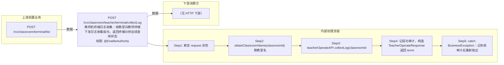

# POST /rcc/classroom/teacher/terminal/collectLog

> 教师机终端日志收集：按教室向教师终端下发日志收集指令，返回终端ID供后续查询状态。 ｜ @EnableAuthority ｜ sync

## 依赖关系全景图

## 接口基本信息

| 项目 | 内容 |
|---|---|
| URL | /rcc/classroom/teacher/terminal/collectLog |
| Controller | RccTeacherManageController |
| 方法名 | collectTeacherTerminalLog |
| 权限注解 | @EnableAuthority |
| 执行方式 | sync |
| 业务含义 | 教师机终端日志收集：按教室向教师终端下发日志收集指令，返回终端ID供后续查询状态。 |

## 入参详情

### IdWebRequest

| 参数名 | 类型 | 必填 | 约束 | 说明 |
|---|---|---|---|---|
| id | UUID | 是 | @NotNull 非空 | 教室ID |

## 出参详情

| 返回类型 | DefaultWebResponse |
|---|---|

| 字段 | 类型 | 说明 |
|---|---|---|
| content | TeacherOperateResponse | 操作响应 |
| content.terminalId | String | 教师终端ID（用于 collectLog/get 查询状态） |

## 上游前置业务

### 前置1：POST /rcc/classroom/terminal/list

教室ID在创建教室(POST /rcc/classroom/create)后经教室终端列表查询获得（ViewClassroomInfoEntity.classroomId）（由 field_map 契约映射）
## 内部处理流程

### 处理流程

1. 断言 request 非空
2. obtainClassroomName(classroomId) 取教室名
3. teacherOperateAPI.collectLog(classroomId)：校验教室/教师终端/终端类型后下发收集指令并返回terminalId
4. 记成功审计，构造 TeacherOperateResponse 返回 terminalId
5. catch BusinessException：记失败审计后重新抛出

## 下游消费方

（本接口数据主要被自身/关联接口消费，或经 SPI 通知）
## 接口参数约束分析

| 层级 | 参数 | 规则 | 失败结果 |
|---|---|---|---|
| PARAM | id | 非空 | 参数校验失败（@NotNull） |
| BIZ | classroom | 教室存在且配置教师终端且类型非PC | RCDC_RCC_TEACHER_OPERATE_CLASSROOM_NOT_FOUND / TEACHER_CONFIG_NOT_FOUND / TERMINAL_NOT_FOUND / CLASSROOM_TEACHER_PC_NOT_SUPPORT |

## 参数取值策略

| 参数 | 策略 | 说明 |
|---|---|---|
| id | user_input/from_query | 按业务构造 |

## 成功/失败断言基准

### 成功场景

| 场景 | 断言点 |
|---|---|
| 教室配置教师终端且下发成功 | $.status=="SUCCESS" 且 $.content.terminalId 非空；审计 RCDC_RCC_TEACHER_COLLECT_LOG_SUCCESS_LOG |

### 失败场景

| 场景 | 触发条件 | 断言点 |
|---|---|---|
| 教室无教师终端配置 | 教师配置或终端缺失 | $.status=="ERROR" 且 $.msgKey∈["rcdc_rcc_teacher_operate_classroom_not_found","rcdc_rcc_teacher_operate_teacher_config_not_found","rcdc_rcc_teacher_operate_classroom_tercher_terminal_id_is_null","rcdc_rcc_teacher_operate_terminal_not_found"]；审计 rcdc_rcc_teacher_collect_log_fail_log |

## 环境清理机制

| 接口 | 说明 |
|---|---|
| 本接口创建的资源 | 通过对应 delete 接口清理 |

## 前置状态和幂等性标注

| 维度 | 结论 |
|---|---|
| 幂等性 | medium |
| 说明 | 重复调用会重复下发日志收集，会产生多条日志记录 |
