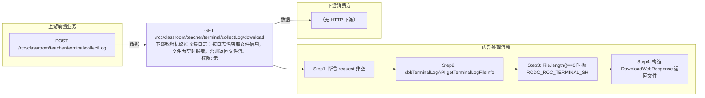

# GET /rcc/classroom/teacher/terminal/collectLog/download

> 下载教师机终端收集日志：按日志名获取文件信息，文件为空时报错，否则返回文件流。 ｜ 无特殊权限 ｜ sync

## 依赖关系全景图

## 接口基本信息

| 项目 | 内容 |
|---|---|
| URL | /rcc/classroom/teacher/terminal/collectLog/download |
| Controller | RccTeacherManageController |
| 方法名 | downloadLog |
| 权限注解 | 无 |
| 执行方式 | sync |
| 业务含义 | 下载教师机终端收集日志：按日志名获取文件信息，文件为空时报错，否则返回文件流。 |

## 入参详情

### TerminalLogDownLoadWebRequest (GET 查询参数)

| 参数名 | 类型 | 必填 | 约束 | 说明 |
|---|---|---|---|---|
| logName | String | 是 | @NotBlank 非空白 | 日志文件名 |

## 出参详情

| 返回类型 | DownloadWebResponse |
|---|---|

| 字段 | 类型 | 说明 |
|---|---|---|
| file | File | 日志文件流 |
| contentType | String | application/octet-stream |
| fileName | String | 日志文件名（取自 CbbTerminalLogFileInfoDTO.logFileName） |
| suffix | String | 文件后缀（取自 CbbTerminalLogFileInfoDTO.suffix） |

## 上游前置业务

### 前置1：POST /rcc/classroom/teacher/terminal/collectLog

推断：日志文件名由教师机日志收集接口产出，需先collectLog再get状态后下载，字段名为推断（由 field_map 契约映射）
## 内部处理流程

### 处理流程

1. 断言 request 非空
2. cbbTerminalLogAPI.getTerminalLogFileInfo(logName) 获取文件信息
3. File.length()==0 时抛 RCDC_RCC_TERMINAL_SHINE_ERROR_GET_SHINE_LOG_FAIL
4. 构造 DownloadWebResponse 返回文件

## 下游消费方

（本接口数据主要被自身/关联接口消费，或经 SPI 通知）
## 接口参数约束分析

| 层级 | 参数 | 规则 | 失败结果 |
|---|---|---|---|
| PARAM | logName | 非空白 | 参数校验失败（@NotBlank） |
| BIZ | logName | 日志文件必须存在且非空 | 文件不存在抛业务异常；文件长度为0抛 rcdc_rcc_terminal_shine_error_get_shine_log_fail |

## 参数取值策略

| 参数 | 策略 | 说明 |
|---|---|---|
| logName | user_input/from_query | 按业务构造 |

## 成功/失败断言基准

### 成功场景

| 场景 | 断言点 |
|---|---|
| 日志文件存在且非空 | HTTP 200；响应为文件流（Content-Disposition: attachment，fileName/suffix 取自 CbbTerminalLogFileInfoDTO） |

### 失败场景

| 场景 | 触发条件 | 断言点 |
|---|---|---|
| 日志文件为空 | 收集的日志文件长度为0 | $.status=="ERROR" 且 $.msgKey=="rcdc_rcc_terminal_shine_error_get_shine_log_fail" |

## 环境清理机制

| 接口 | 说明 |
|---|---|
| 本接口创建的资源 | 通过对应 delete 接口清理 |

## 前置状态和幂等性标注

| 维度 | 结论 |
|---|---|
| 幂等性 | high |
| 说明 | 只读下载接口 |
