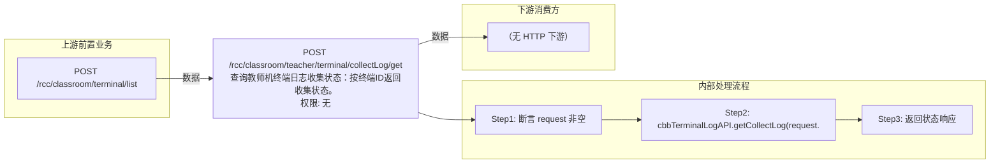

# POST /rcc/classroom/teacher/terminal/collectLog/get

> 查询教师机终端日志收集状态：按终端ID返回收集状态。 ｜ 无特殊权限 ｜ sync

## 依赖关系全景图

## 接口基本信息

| 项目 | 内容 |
|---|---|
| URL | /rcc/classroom/teacher/terminal/collectLog/get |
| Controller | RccTeacherManageController |
| 方法名 | getCollectLog |
| 权限注解 | 无 |
| 执行方式 | sync |
| 业务含义 | 查询教师机终端日志收集状态：按终端ID返回收集状态。 |

## 入参详情

### TerminalIdWebRequest

| 参数名 | 类型 | 必填 | 约束 | 说明 |
|---|---|---|---|---|
| terminalId | String | 是 | @NotBlank 非空白 | 教师终端ID（由 collectLog 接口返回） |

## 出参详情

| 返回类型 | DefaultWebResponse |
|---|---|

| 字段 | 类型 | 说明 |
|---|---|---|
| content | CbbTerminalCollectLogStatusDTO | 终端日志收集状态 |
| content.terminalId | String | 终端ID |
| content.state | enum | 收集状态 |
| content.message | String | 失败信息 |

## 上游前置业务

### 前置1：POST /rcc/classroom/terminal/list

教师终端ID来自教室终端列表查询出参（ViewClassroomInfoEntity.teacherTerminalId）（由 field_map 契约映射）
## 内部处理流程

### 处理流程

1. 断言 request 非空
2. cbbTerminalLogAPI.getCollectLog(request.getTerminalId()) 查询状态
3. 返回状态响应

## 下游消费方

（本接口数据主要被自身/关联接口消费，或经 SPI 通知）
## 接口参数约束分析

| 层级 | 参数 | 规则 | 失败结果 |
|---|---|---|---|
| PARAM | terminalId | 非空白 | 参数校验失败（@NotBlank） |

## 参数取值策略

| 参数 | 策略 | 说明 |
|---|---|---|
| terminalId | user_input/from_query | 按业务构造 |

## 成功/失败断言基准

### 成功场景

| 场景 | 断言点 |
|---|---|
| 终端ID有效 | $.status=="SUCCESS" 且 $.content.state 非空 |

### 失败场景

| 场景 | 触发条件 | 断言点 |
|---|---|---|
| 终端ID无效 | 不存在的终端ID | $.status=="ERROR"（平台终端模块抛 BusinessException，msgKey 由终端模块决定） |

## 环境清理机制

| 接口 | 说明 |
|---|---|
| 本接口创建的资源 | 通过对应 delete 接口清理 |

## 前置状态和幂等性标注

| 维度 | 结论 |
|---|---|
| 幂等性 | high |
| 说明 | 只读查询，可轮询 |
