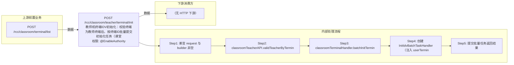

# POST /rcc/classroom/teacher/terminal/init

> 教师机终端IDV初始化：校验终端为教师终端后，按终端ID批量提交初始化任务（课堂默认不保留镜像）。 ｜ @EnableAuthority ｜ batch

## 依赖关系全景图

## 接口基本信息

| 项目 | 内容 |
|---|---|
| URL | /rcc/classroom/teacher/terminal/init |
| Controller | RccTeacherManageController |
| 方法名 | idvInit |
| 权限注解 | @EnableAuthority |
| 执行方式 | batch |
| 业务含义 | 教师机终端IDV初始化：校验终端为教师终端后，按终端ID批量提交初始化任务（课堂默认不保留镜像）。 |

## 入参详情

### InitTerminalIdArrWebRequest

| 参数名 | 类型 | 必填 | 约束 | 说明 |
|---|---|---|---|---|
| idArr | String[] | 是 | @NotEmpty @Size(min=1) | 终端ID数组 |
| enableForceInitPublic | Boolean | 是 | @NotNull 非空 | 是否强制初始化公共终端 |

## 出参详情

| 返回类型 | DefaultWebResponse |
|---|---|

| 字段 | 类型 | 说明 |
|---|---|---|
| content | BatchTaskSubmitResult | 批量任务提交结果 |

## 上游前置业务

### 前置1：POST /rcc/classroom/terminal/list

教师终端ID来自教室终端列表查询出参（ViewClassroomInfoEntity.teacherTerminalId）（由 field_map 契约映射）
## 内部处理流程

### 批量处理器：InitIdvBatchTaskHandler

| 步骤 | 说明 |
|---|---|
| 1 | cbbTerminalOperatorAPI.findBasicInfoByTerminalId 取终端地址 |
| 2 | 构造 InitTerminalRequest{terminalId, 保留镜像=false(课堂默认), enableForceInitPublic} |
| 3 | platformRcoUserTerminalMgmtAPI.initialize(request) 下发终端初始化 |
| 4 | 成功记 RCDC_RCC_TERMINAL_INIT_TERMINAL_SUCCESS；TerminalOperateSuccessBusinessException 记成功带警告；其余异常记失败 |

### 处理流程

1. 断言 request 与 builder 非空
2. classroomTeacherAPI.validTeacherByTerminalIdArr(idArr) 校验终端合法
3. classroomTerminalHandler.batchInitTerminalTask：TerminalIdMappingUtils 映射终端ID->UUID，构建任务项
4. 创建 InitIdvBatchTaskHandler（注入 userTerminalMgmtAPI/cbbTerminalOperatorAPI/auditLogAPI，设置 enableForceInitPublic）
5. 提交批量任务返回结果

## 下游消费方

（本接口数据主要被自身/关联接口消费，或经 SPI 通知）
## 接口参数约束分析

| 层级 | 参数 | 规则 | 失败结果 |
|---|---|---|---|
| PARAM | idArr | 非空且至少1个 | 参数校验失败（@NotEmpty @Size(min=1)） |
| PARAM | enableForceInitPublic | 非空 | 参数校验失败（@NotNull） |
| BIZ | terminal | 终端必须为教师终端 | validTeacherByTerminalIdArr 校验失败抛异常 |

## 参数取值策略

| 参数 | 策略 | 说明 |
|---|---|---|
| idArr | user_input/from_query | 按业务构造 |
| enableForceInitPublic | user_input/from_query | 按业务构造 |

## 成功/失败断言基准

### 成功场景

| 场景 | 断言点 |
|---|---|
| 终端为合法教师终端 | $.status=="SUCCESS" 且 $.content.taskId 非空；逐台初始化成功；轮询 content.taskId（2000ms 间隔）至终态 batchTaskItemStatus∈["SUCCESS"] |

### 失败场景

| 场景 | 触发条件 | 断言点 |
|---|---|---|
| 存在非教师终端 | 终端未配置为教师机 | $.status=="ERROR" 且 $.msgKey=="rcdc_rcc_terminal_not_teacher" |
| 终端离线初始化失败 | 终端离线或平台异常 | $.status=="SUCCESS" 且 $.content.taskId 非空；轮询 content.taskId 至终态 batchTaskItemStatus==FAILURE（rcdc_rcc_terminal_init_terminal_fail） |

## 环境清理机制

| 接口 | 说明 |
|---|---|
| 本接口创建的资源 | 通过对应 delete 接口清理 |

## 前置状态和幂等性标注

| 维度 | 结论 |
|---|---|
| 幂等性 | low |
| 说明 | 初始化会重置终端环境，重复执行影响较大，任务级不幂等 |
