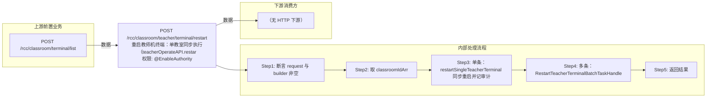

# POST /rcc/classroom/teacher/terminal/restart

> 重启教师机终端：单教室同步执行（teacherOperateAPI.restart），多教室提交批量任务异步重启。 ｜ @EnableAuthority ｜ batch

## 依赖关系全景图

## 接口基本信息

| 项目 | 内容 |
|---|---|
| URL | /rcc/classroom/teacher/terminal/restart |
| Controller | RccTeacherManageController |
| 方法名 | restartTeacherTerminal |
| 权限注解 | @EnableAuthority |
| 执行方式 | batch |
| 业务含义 | 重启教师机终端：单教室同步执行（teacherOperateAPI.restart），多教室提交批量任务异步重启。 |

## 入参详情

### ClassroomIdArrWebRequest

| 参数名 | 类型 | 必填 | 约束 | 说明 |
|---|---|---|---|---|
| idArr | UUID[] | 是 | @NotEmpty 非空 | 教室ID数组 |

## 出参详情

| 返回类型 | DefaultWebResponse |
|---|---|

| 字段 | 类型 | 说明 |
|---|---|---|
| content | BatchTaskSubmitResult | 批量场景下的任务提交结果 |

## 上游前置业务

### 前置1：POST /rcc/classroom/terminal/list

教室ID数组（ClassroomIdArrWebRequest.idArr）来自教室终端列表查询出参（ViewClassroomInfoEntity.classroomId）（由 field_map 契约映射）
## 内部处理流程

### 批量处理器：RestartTeacherTerminalBatchTaskHandler

| 步骤 | 说明 |
|---|---|
| 1 | teacherOperateAPI.restart(classroomId) 下发教师终端重启 |
| 2 | obtainClassroomName 取教室名 |
| 3 | 成功记 RCDC_RCC_TEACHER_OPERATE_TERMINAL_RESTART_SUCCESS_LOG，失败记 FAIL_LOG 并返回 FAILURE 项 |

### 处理流程

1. 断言 request 与 builder 非空
2. 取 classroomIdArr
3. 单条：restartSingleTeacherTerminal 同步重启并记审计
4. 多条：RestartTeacherTerminalBatchTaskHandler 提交批量任务
5. 返回结果

## 下游消费方

（本接口数据主要被自身/关联接口消费，或经 SPI 通知）
## 接口参数约束分析

| 层级 | 参数 | 规则 | 失败结果 |
|---|---|---|---|
| PARAM | idArr | 非空 | 参数校验失败（@NotEmpty） |
| BIZ | classroom | 教室存在且有教师终端配置且类型非PC | RCDC_RCC_TEACHER_OPERATE_TERMINAL_NOT_FOUND / CLASSROOM_TEACHER_PC_NOT_SUPPORT 等 |

## 参数取值策略

| 参数 | 策略 | 说明 |
|---|---|---|
| idArr | user_input/from_query | 按业务构造 |

## 成功/失败断言基准

### 成功场景

| 场景 | 断言点 |
|---|---|
| 教室配置教师终端 | 单教室：$.status=="SUCCESS" 且 $.msgKey=="rcdc_rcc_teacher_operate_terminal_restart_success"；批量：$.status=="SUCCESS" 且 $.content.taskId 非空；轮询 content.taskId（2000ms 间隔）至终态 batchTaskItemStatus∈["SUCCESS"] |

### 失败场景

| 场景 | 触发条件 | 断言点 |
|---|---|---|
| 教室无教师终端配置 | 教师配置或终端缺失 | 单教室：$.status=="ERROR" 且 $.msgKey=="rcdc_rcc_teacher_operate_terminal_restart_fail"；批量：任务已提交，轮询 content.taskId 至终态 batchTaskItemStatus==FAILURE |

## 环境清理机制

| 接口 | 说明 |
|---|---|
| 本接口创建的资源 | 通过对应 delete 接口清理 |

## 前置状态和幂等性标注

| 维度 | 结论 |
|---|---|
| 幂等性 | low |
| 说明 | 重启为有状态操作，重复执行会反复重启教师终端 |
