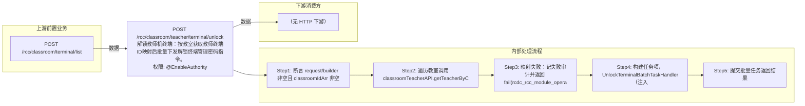

# POST /rcc/classroom/teacher/terminal/unlock

> 解锁教师机终端：按教室获取教师终端ID映射后批量下发解锁终端管理密码指令。 ｜ @EnableAuthority ｜ batch

## 依赖关系全景图

## 接口基本信息

| 项目 | 内容 |
|---|---|
| URL | /rcc/classroom/teacher/terminal/unlock |
| Controller | RccTeacherManageController |
| 方法名 | unlockTeacherTerminal |
| 权限注解 | @EnableAuthority |
| 执行方式 | batch |
| 业务含义 | 解锁教师机终端：按教室获取教师终端ID映射后批量下发解锁终端管理密码指令。 |

## 入参详情

### BatchUnlockTeacherTerminalRequest

| 参数名 | 类型 | 必填 | 约束 | 说明 |
|---|---|---|---|---|
| classroomIdArr | UUID[] | 是 | @NotEmpty 非空 | 教室ID数组 |

## 出参详情

| 返回类型 | DefaultWebResponse |
|---|---|

| 字段 | 类型 | 说明 |
|---|---|---|
| content | BatchTaskSubmitResult | 批量任务提交结果 |

## 上游前置业务

### 前置1：POST /rcc/classroom/terminal/list

教室ID数组（BatchUnlockTeacherTerminalRequest.classroomIdArr）来自教室终端列表查询出参（ViewClassroomInfoEntity.classroomId）（由 field_map 契约映射）
## 内部处理流程

### 批量处理器：UnlockTerminalBatchTaskHandler

| 步骤 | 说明 |
|---|---|
| 1 | 从 idMap 取终端ID，findBasicInfoByTerminalId 获取真实终端信息 |
| 2 | getTerminalLockedStatusById 判断锁定状态；未锁定则记 RCDC_RCC_TERMINAL_HAVE_NOT_CLOCK 并返回 FAILURE |
| 3 | 终端 OFFLINE 则抛 RCDC_RCC_TERMINAL_UNLOCK_TERMINAL_OFFLINE |
| 4 | certificationStrategyParameterAPI.unlockTerminalManagePwd(terminalId) 下发解锁 |
| 5 | 成功记 RCDC_RCC_TERMINAL_UNLOCK_SUCCESS_LOG，失败记 FAIL_LOG 并返回 FAILURE 项 |

### 处理流程

1. 断言 request/builder 非空且 classroomIdArr 非空
2. 遍历教室调用 classroomTeacherAPI.getTeacherByClassroomId 构建 classroomId->teacherTerminalId 映射
3. 映射失败：记失败审计并返回 fail(rcdc_rcc_module_operate_fail)
4. 构建任务项，UnlockTerminalBatchTaskHandler（注入 certificationStrategyParameterAPI/cbbTerminalOperatorAPI/auditLogAPI，设置 idMap）
5. 提交批量任务返回结果

## 下游消费方

（本接口数据主要被自身/关联接口消费，或经 SPI 通知）
## 接口参数约束分析

| 层级 | 参数 | 规则 | 失败结果 |
|---|---|---|---|
| PARAM | classroomIdArr | 非空 | 参数校验失败（@NotEmpty） |
| BIZ | classroom | 教室必须配置教师终端 | getTeacherByClassroomId 失败返回 rcdc_rcc_module_operate_fail |
| STATE | terminal | 终端必须处于锁定状态 | RCDC_RCC_TERMINAL_HAVE_NOT_CLOCK（终端未锁定） |
| STATE | terminal | 终端必须在线 | RCDC_RCC_TERMINAL_UNLOCK_TERMINAL_OFFLINE（终端离线） |

## 参数取值策略

| 参数 | 策略 | 说明 |
|---|---|---|
| classroomIdArr | user_input/from_query | 按业务构造 |

## 成功/失败断言基准

### 成功场景

| 场景 | 断言点 |
|---|---|
| 教师终端锁定且在线 | $.status=="SUCCESS" 且 $.content.taskId 非空；逐台解锁成功；轮询 content.taskId（2000ms 间隔）至终态 batchTaskItemStatus∈["SUCCESS"] |

### 失败场景

| 场景 | 触发条件 | 断言点 |
|---|---|---|
| 教室未配置教师终端 | classroomTeacherAPI 抛异常 | $.status=="ERROR" 且 $.msgKey=="rcdc_rcc_module_operate_fail" |
| 终端未锁定 | 终端当前未锁定 | $.status=="SUCCESS" 且 $.content.taskId 非空；轮询 content.taskId 至终态 batchTaskItemStatus==FAILURE（rcdc_rcc_terminal_have_not_clock） |
| 终端离线 | 终端状态 OFFLINE | $.status=="SUCCESS" 且 $.content.taskId 非空；轮询 content.taskId 至终态 batchTaskItemStatus==FAILURE（rcdc_rcc_terminal_unlock_terminal_offline） |

## 环境清理机制

| 接口 | 说明 |
|---|---|
| 本接口创建的资源 | 通过对应 delete 接口清理 |

## 前置状态和幂等性标注

| 维度 | 结论 |
|---|---|
| 幂等性 | medium |
| 说明 | 对已解锁终端重复调用会报未锁定错误；对锁定终端重复解锁结果一致 |
