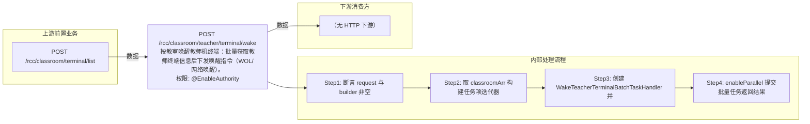

# POST /rcc/classroom/teacher/terminal/wake

> 按教室唤醒教师机终端：批量获取教师终端信息后下发唤醒指令（WOL/网络唤醒）。 ｜ @EnableAuthority ｜ batch

## 依赖关系全景图

## 接口基本信息

| 项目 | 内容 |
|---|---|
| URL | /rcc/classroom/teacher/terminal/wake |
| Controller | RccTeacherManageController |
| 方法名 | wakeTerminalByClassroom |
| 权限注解 | @EnableAuthority |
| 执行方式 | batch |
| 业务含义 | 按教室唤醒教师机终端：批量获取教师终端信息后下发唤醒指令（WOL/网络唤醒）。 |

## 入参详情

### WakeTerminalByClassroomWebRequest

| 参数名 | 类型 | 必填 | 约束 | 说明 |
|---|---|---|---|---|
| classroomArr | UUID[] | 是 | @NotEmpty 非空 | 教室ID数组 |

## 出参详情

| 返回类型 | DefaultWebResponse |
|---|---|

| 字段 | 类型 | 说明 |
|---|---|---|
| content | BatchTaskSubmitResult | 批量任务提交结果 |

## 上游前置业务

### 前置1：POST /rcc/classroom/terminal/list

教室ID数组（WakeTerminalByClassroomWebRequest.classroomArr）来自教室终端列表查询出参（ViewClassroomInfoEntity.classroomId）（由 field_map 契约映射）
## 内部处理流程

### 批量处理器：WakeTeacherTerminalBatchTaskHandler

| 步骤 | 说明 |
|---|---|
| 1 | classroomAPI.getClassroomName(classroomId) 取教室名 |
| 2 | classroomAPI.getTeacherInfo(classroomId)：无教师终端则抛 RCDC_RCC_CLASSROOM_TERMINAL_NOT_FIND_MAC |
| 3 | 构造 TerminaOperatorReqInfoDTO{terminalId, srcPort, destPort} |
| 4 | terminalOperatorAPI.wakeupTerminal 下发唤醒 |
| 5 | 成功记 RCDC_RCC_TEACHER_WAKE_SUC_LOG，失败记 FAIL_LOG（或 COMMON_SIMPLE_FAIL）并返回 FAILURE 项 |

### 处理流程

1. 断言 request 与 builder 非空
2. 取 classroomArr 构建任务项迭代器
3. 创建 WakeTeacherTerminalBatchTaskHandler 并注入 auditLogAPI/cbbPhysicalServerMgmtAPI/rcoGlobalParameterAPI/cbbTerminalOperatorAPI/classroomAPI/terminalOperatorAPI
4. enableParallel 提交批量任务返回结果

## 下游消费方

（本接口数据主要被自身/关联接口消费，或经 SPI 通知）
## 接口参数约束分析

| 层级 | 参数 | 规则 | 失败结果 |
|---|---|---|---|
| PARAM | classroomArr | 非空 | 参数校验失败（@NotEmpty） |
| BIZ | classroom | 教室必须配置教师终端 | RCDC_RCC_CLASSROOM_TERMINAL_NOT_FIND_MAC（未找到教师终端） |

## 参数取值策略

| 参数 | 策略 | 说明 |
|---|---|---|
| classroomArr | user_input/from_query | 按业务构造 |

## 成功/失败断言基准

### 成功场景

| 场景 | 断言点 |
|---|---|
| 教室配置教师终端 | $.status=="SUCCESS" 且 $.content.taskId 非空；逐台唤醒成功；轮询 content.taskId（2000ms 间隔）至终态 batchTaskItemStatus∈["SUCCESS"] |

### 失败场景

| 场景 | 触发条件 | 断言点 |
|---|---|---|
| 教室未配置教师终端 | getTeacherInfo 返回空或终端ID为空 | $.status=="SUCCESS" 且 $.content.taskId 非空；轮询 content.taskId 至终态 batchTaskItemStatus==FAILURE（rcdc_rcc_classroom_terminal_not_find_mac） |

## 环境清理机制

| 接口 | 说明 |
|---|---|
| 本接口创建的资源 | 通过对应 delete 接口清理 |

## 前置状态和幂等性标注

| 维度 | 结论 |
|---|---|
| 幂等性 | medium |
| 说明 | 唤醒对已开机终端重复执行基本无害（状态已一致） |
