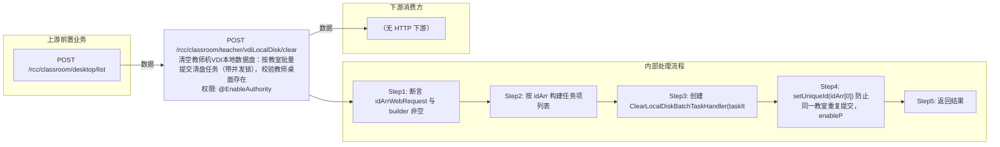

# POST /rcc/classroom/teacher/vdiLocalDisk/clear

> 清空教师机VDI本地数据盘：按教室批量提交清盘任务（带并发锁），校验教师桌面存在、非自由模式、桌面关闭且已开启VDI共享盘策略后清空本地盘。 ｜ @EnableAuthority ｜ batch

## 依赖关系全景图

## 接口基本信息

| 项目 | 内容 |
|---|---|
| URL | /rcc/classroom/teacher/vdiLocalDisk/clear |
| Controller | RccTeacherManageController |
| 方法名 | clearTeacherLocalDisk |
| 权限注解 | @EnableAuthority |
| 执行方式 | batch |
| 业务含义 | 清空教师机VDI本地数据盘：按教室批量提交清盘任务（带并发锁），校验教师桌面存在、非自由模式、桌面关闭且已开启VDI共享盘策略后清空本地盘。 |

## 入参详情

### IdArrWebRequest

| 参数名 | 类型 | 必填 | 约束 | 说明 |
|---|---|---|---|---|
| idArr | UUID[] | 是 | @NotEmpty 非空 | 教室ID数组 |

## 出参详情

| 返回类型 | DefaultWebResponse |
|---|---|

| 字段 | 类型 | 说明 |
|---|---|---|
| content | BatchTaskSubmitResult | 批量任务提交结果 |

## 上游前置业务

### 前置1：POST /rcc/classroom/desktop/list

推断：教师机VDI桌面ID数组来自桌面列表查询出参（ViewDesktopResultDTO.desktopId），字段名为推断（由 field_map 契约映射）
## 内部处理流程

### 批量处理器：ClearLocalDiskBatchTaskHandler

| 步骤 | 说明 |
|---|---|
| 1 | LockableExecutor.executeWithTryLock(resourceId, clearTeacherVdiDisk, 锁超时) 加锁防并发 |
| 2 | classroomTeacherAPI.getClassroomTeacherDesktopId 取教师桌面；为空抛 RCDC_RCC_TEACHER_DESKTOP_NOT_EXIST |
| 3 | classroomAPI.checkIsInFree(classroomId) 校验非自由模式 |
| 4 | 桌面状态非 CLOSE：记 RCDC_RCC_TEACHER_VDI_CLEAR_LOCAL_DISK_NOT_CLOSE_TASK_FAIL 返回失败 |
| 5 | 教师VDI本地盘策略未开启：抛 RCDC_RCC_CLASSROOM_TEACHER_NOT_OPEN_LOCAL_DISK |
| 6 | getTeacherVdiDiskRelation 有关联则 desktopDiskMgmtAPI.clearVdiLocalDisk 清空，无关联视为清盘成功 |
| 7 | 成功记 RCDC_RCC_TEACHER_VDI_CLEAR_LOCAL_DISK_TASK_SUCCESS_LOG |

### 处理流程

1. 断言 idArrWebRequest 与 builder 非空
2. 按 idArr 构建任务项列表
3. 创建 ClearLocalDiskBatchTaskHandler(taskItemList, enableTeacher=true) 并注入 cbbVDIDiskSnapshotMgmtAPI/classroomAPI/desktopDiskMgmtAPI/classroomTeacherAPI/seatAPI/auditLogAPI
4. setUniqueId(idArr[0]) 防止同一教室重复提交，enableParallel 提交批量任务
5. 返回结果

## 下游消费方

（本接口数据主要被自身/关联接口消费，或经 SPI 通知）
## 接口参数约束分析

| 层级 | 参数 | 规则 | 失败结果 |
|---|---|---|---|
| PARAM | idArr | 非空 | 参数校验失败（@NotEmpty） |
| BIZ | classroom | 教师VDI桌面必须存在 | RCDC_RCC_TEACHER_DESKTOP_NOT_EXIST |
| BIZ | classroom | 教室不能处于自由模式 | checkIsInFree 抛异常 |
| STATE | desktop | 教师桌面必须处于关闭（CLOSE）状态 | RCDC_RCC_TEACHER_VDI_CLEAR_LOCAL_DISK_NOT_CLOSE_TASK_FAIL |
| BIZ | classroom | 教室必须已开启教师VDI共享盘策略 | RCDC_RCC_CLASSROOM_TEACHER_NOT_OPEN_LOCAL_DISK |

## 参数取值策略

| 参数 | 策略 | 说明 |
|---|---|---|
| idArr | user_input/from_query | 按业务构造 |

## 成功/失败断言基准

### 成功场景

| 场景 | 断言点 |
|---|---|
| 教师桌面关闭、策略开启且有本地盘关联 | $.status=="SUCCESS" 且 $.content.taskId 非空；清空本地盘成功；轮询 content.taskId（2000ms 间隔）至终态 batchTaskItemStatus∈["SUCCESS"] |
| 策略开启但无本地盘关联（延迟创建未产生盘） | $.status=="SUCCESS" 且 $.content.taskId 非空；视为清盘成功，不执行实际清盘；轮询 content.taskId（2000ms 间隔）至终态 batchTaskItemStatus∈["SUCCESS"] |

### 失败场景

| 场景 | 触发条件 | 断言点 |
|---|---|---|
| 教师桌面不存在 | 教室未创建教师VDI桌面 | $.status=="SUCCESS" 且 $.content.taskId 非空；轮询 content.taskId 至终态 batchTaskItemStatus==FAILURE（rcdc_rcc_teacher_desktop_not_exist） |
| 桌面未关闭 | 桌面状态非 CLOSE | $.status=="SUCCESS" 且 $.content.taskId 非空；轮询 content.taskId 至终态 batchTaskItemStatus==FAILURE（rcdc_rcc_teacher_vdi_clear_local_disk_not_close_task_fail） |
| 未开启VDI共享盘策略 | teacherVdiLocalDiskConfig 为空或未启用 | $.status=="SUCCESS" 且 $.content.taskId 非空；轮询 content.taskId 至终态 batchTaskItemStatus==FAILURE（rcdc_rcc_classroom_teacher_not_open_local_disk） |

## 环境清理机制

| 接口 | 说明 |
|---|---|
| 本接口创建的资源 | 通过对应 delete 接口清理 |

## 前置状态和幂等性标注

| 维度 | 结论 |
|---|---|
| 幂等性 | medium |
| 说明 | 加锁防并发；清空本地盘基于快照重建，重复执行结果趋于一致，但会删除本地数据 |
